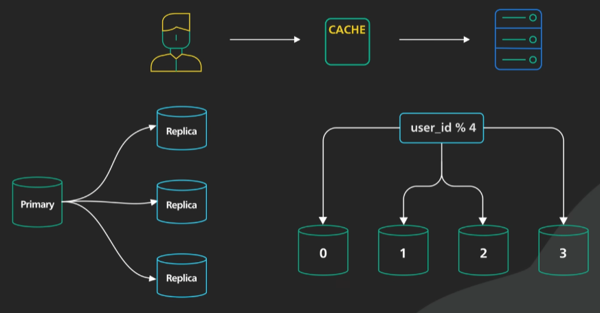

# API gateway để làm gì? Tại sao chúng ta cần sử dụng API gateway?
- API gateway là một dịch vụ trung gian, 1 điểm truy cập duy nhất từ Client đến các microservices. API gateway giúp chúng ta quản lý các request từ client, chuyển tiếp các request đến các microservices, và trả về kết quả cho client.
- API gateway thường cung cấp 1 số chức năng quan trọng:
  - Authentication: API gateway giúp chúng ta xác thực người dùng, đảm bảo rằng người dùng có quyền truy cập vào các API.
  - Load balancing: API gateway giúp chúng ta phân phối tải giữa các microservices.
  - Protocol translation: API gateway giúp chúng ta chuyển đổi giữa các giao thức khác nhau.
  - Monitoring: API gateway giúp chúng ta theo dõi các request, response, và lỗi từ các microservices.
  - Logging: API gateway giúp chúng ta ghi log các request, response, và lỗi từ các microservices.
  - Analytics: API gateway giúp chúng ta phân tích dữ liệu từ các request, response, và lỗi từ các microservices.
  - Billing: API gateway giúp chúng ta tính toán chi phí từ các request, response, và lỗi từ các microservices.
  - Caching: API gateway giúp chúng ta lưu trữ cache từ các request, response, và lỗi từ các microservices.
- Một quy trình thông thường khi sử dụng API gateway:
  - Client gửi request đến API gateway (Thường là HTTP request, RESTful API, GraphQL).
  - API gateway xác thực các yêu cầu HTTP
  - API gateway kiểm tra địa chỉ IP và các HTTP header, kiểm tra danh sách đen trắng, kiểm tra token, kiểm tra chữ ký số, kiểm tra mã xác thực, kiểm tra mật khẩu
  - API gateway Authentication và Authorization(Bản thân cái này cũng là 1 chủ đề khó)
  - API gateway Rate limiting số lượng request từ client, nếu quá nhiều request thì API gateway sẽ từ chối request.
  - API gateway Load balancing giữa các microservices.
  - API gateway protocol translation giữa các giao thức khác nhau.
  - API gateway chuyển tiếp request đến microservices.
  - Microservices xử lý request và trả về kết quả cho API gateway.
  - API gateway trả về kết quả cho client.
- Ngoài luồng chính nếu ok ra thì trả về kết quả cho client, nếu có lỗi thì trả về lỗi cho client, circuit breaker, retry, timeout, fallback, cache, logging, monitoring, analytics, billing, ...
- API gateway là 1 phần quan trọng của infrastructure, giúp chúng ta quản lý các request từ client, chuyển tiếp các request đến các microservices, và trả về kết quả cho client.


# System Design

- Vertical scaling: Thay đổi kích thước của máy chủ, thường là tăng RAM, CPU, hoặc ổ cứng. Nếu trường hợp có nhiều request đến, thì chúng ta cần tăng kích thước của máy chủ.Điều này rất dễ cũng như tiết kiệm chi phí nhưng có rất nhiều hạn chế.

- Horizontal scaling: Thêm máy chủ mới, thường là tăng số lượng máy chủ.Khi có nhiều request đến, chúng ta cần thêm máy chủ mới. Điều này khá phức tạp và tốn kém hơn so với vertical scaling nhưng nó cho phép chúng ta mở rộng hệ thống một cách linh hoạt và cũng không cần đến máy chủ quá mạnh và khả năng bổ sung của chúng gần như là vô hạn. Chúng bổ sung cho chúng ta khả năng dự phòng( Redundancy ) và khả năng chịu lỗi( Fault tolerance ). Khi một máy chủ bị lỗi, chúng ta có thể chuyển request đến máy chủ khác.

- Load balancer: Load balancer giúp chúng ta phân phối tải giữa các máy chủ. Load balancer có thể phân phối tải dựa trên nhiều tiêu chí như round-robin, least connections, least response time, least bandwidth, least requests, và custom. Load balancer giúp chúng ta tăng hiệu suất, tăng khả năng chịu lỗi, và tăng khả năng mở rộng của hệ thống.

# CDN(Content Delivery Network)
- CDN là gì ? Tại sao các dev nên tận dụng CDN ?
- CDN là một mạng phân phối nội dung, giúp chúng ta phân phối nội dung đến người dùng một cách nhanh chóng và hiệu quả. CDN giúp chúng ta giảm độ trễ, tăng tốc độ tải trang, giảm tải cho máy chủ, giảm chi phí băng thông, và tăng khả năng chịu lỗi của hệ thống.
- Ban đầu nó được phát triển để tăng tốc độ phân phối nội dung HTML tĩnh cho người dùng trên toàn thế giới. Nhưng hiện nay, CDN đã phát triển rất nhiều và hỗ trợ nhiều loại nội dung khác nhau như ảnh, video, CSS, JavaScript, font, API, và nhiều loại nội dung khác.
- Ở cấp độ cơ bản, CDN mang content đến gần hơn với người dùng, điều này cải thiện hiệu suất của dịch vụ web theo cảm nhận của người dùng, điều này giúp tăng trải nghiệm người dùng, giữ chân khách hàng và giảm tải cho máy chủ.
- CDN triển khai máy chủ tại hàng trăm điểm trên toàn thế giới, các điểm này được gọi là điểm hiện diện (Point of Presence - PoP). Khi người dùng truy cập vào trang web, CDN sẽ phân phối nội dung từ máy chủ gần nhất với người dùng, điều này giúp giảm độ trễ và tăng tốc độ tải trang.
- CDN khác nhau dùng các cách khác nhau để chuyển yêu cầu đến các PoP gần nhất với người dùng như: Anycast, Unicast, Multicast, và Broadcast. Hai cách phổ biến nhất là DNS và Anycast.Với DNS mỗi PoP có địa chỉ IP riêng, khi người dùng tra cứu địa chỉ IP cho CDN, DNS sẽ trả về địa chỉ IP của PoP gần nhất với người dùng. Với Anycast, mỗi PoP có cùng địa chỉ IP,khi có yêu cầu đến mạng Anycast cho địa chỉ IP đó, mạng sẽ chuyển yêu cầu đến PoP gần nhất với người dùng.
- Mỗi máy chủ hoạt động như 1 Reverse Proxy với nội dung Cache khổng lồ
- CDN hiện đại cũng có thể giúp chúng ta chuyển đổi nội dung tĩnh thành các định dạng khác nhau như WebP, AVIF, và Brotli để tăng tốc độ tải trang.
- Edge server: Máy chủ ở các PoP, giúp chúng ta phân phối nội dung đến người dùng một cách nhanh chóng và hiệu quả, chúng đóng 1 vai trò rất quan trọng trong modern HTTP Stack.
- CDN có tính bảo mật cao, giúp chúng ta bảo vệ trang web khỏi các cuộc tấn công như DDoS, SQL Injection, XSS, CSRF, và nhiều cuộc tấn công khác. Chúng sẽ giúp chúng ta chuyển hướng các cuộc tấn công đến máy chủ CDN thay vì máy chủ chính của chúng ta.
- CDN cũng giúp chúng ta cải thiện tính khả dụng.Về cơ bản CDN có tính phân tán cao và có thể chịu được nhiều lỗi phần cứng hơn so với máy chủ chính của chúng ta. Nếu một máy chủ CDN bị lỗi, chúng ta có thể chuyển yêu cầu đến máy chủ CDN khác.

# Caching
- Bộ nhớ đệm là 1 kĩ thuật phổ biến nhằm nâng cao hiệu suất của hệ thống và giảm thời gian phản hồi. Bộ nhớ đệm giúp chúng ta lưu trữ dữ liệu tạm thời, giảm thời gian truy cập dữ liệu từ ổ cứng hoặc từ mạng, giảm tải cho máy chủ, giảm chi phí băng thông, và tăng khả năng chịu lỗi của hệ thống.
- Có thể cache ở nhiều cấp độ khác nhau như: Client-side caching, CDN caching, Proxy caching, Web server caching, Database caching, Application caching, và Memory caching.
- Kiến trúc điển hình bao gồm nhiều lớp Cache, ở mỗi lớp có nhiều chiến lược và cơ chế lưu Cache khác nhau tùy thuộc vào yêu cầu và ràng buộc của ứng dụng cụ thể
- Bộ nhớ cache trong máy tính: L1, L2, L3 cache, RAM, ổ cứng SSD, ổ cứng HDD, ...L1 là cache nhỏ nhất và nhanh nhất, thường được tính hợp vào chính CPU, L2 là cache lớn hơn và chậm hơn, L3 là cache lớn nhất và chậm nhất. RAM nhanh hơn ổ cứng, ổ cứng SSD nhanh hơn ổ cứng HDD.
- TLB(Translation Lookaside Buffer): TLB là 1 cache nhỏ nằm trong CPU, giúp chúng ta dịch địa chỉ ảo thành địa chỉ vật lý nhanh hơn.
- Ở OS có hệ thống file system cache, page cache.
- Ở Clien App: Trình duyệt có thể lưu vào Cache các phản hồi HTTP để có thể truy xuất dữ liệu nhanh hơn
- Caching ở CDN: CDN có thể lưu trữ cache từ nhiều loại nội dung khác nhau như ảnh, video, CSS, JavaScript, font, API, và nhiều loại nội dung khác. CDN giúp chúng ta phân phối nội dung đến người dùng một cách nhanh chóng và hiệu quả.
- Caching ở Load Balancer
- Caching ở Proxy Server
- Caching ở Messaging infra:Cơ sở hạ tầng nhắn tin: Các nhà môi giới tin nhắn lưu trữ tin nhắn trên đĩa trước, sau đó người dùng sẽ truy xuất chúng theo tốc độ của riêng họ. Tùy thuộc vào chính sách lưu giữ, dữ liệu được lưu vào bộ nhớ đệm trong các cụm Kafka trong một khoảng thời gian nhất định.
- Fulltext Search: Cơ sở dữ liệu full-text search lưu trữ các kết quả tìm kiếm phổ biến trong bộ nhớ đệm để giảm thời gian truy cập dữ liệu từ ổ cứng.
- Cache ở Database: Database có thể lưu trữ cache từ các câu lệnh SQL, kết quả truy vấn, và dữ liệu khác. Database cache giúp chúng ta giảm thời gian truy cập dữ liệu từ ổ cứng, giảm tải cho máy chủ, giảm chi phí băng thông, và tăng khả năng chịu lỗi của hệ thống.

# Chiến lược và Cạm bẫy khi sử dụng Cache
Cache như 1 bộ nhớ lưu trữ bản sao của các dữ liệu được cập nhập thường xuyên, đó là 1 chiến lược để tăng tốc mọi thứ bắng cách giữ cho dữ liệu luôn sẵn có, giảm nhu cầu tìm nạp dữ liệu từ CSDL chậm hơn mỗi khi được yêu cầu
- Cache-Aside: Khi 1 request đến, trước khi trả về kết quả, chúng ta sẽ kiểm tra xem dữ liệu đã được cache chưa, nếu chưa thì chúng ta sẽ lấy dữ liệu từ CSDL, sau đó lưu vào cache, và trả về kết quả cho client. Nếu dữ liệu đã được cache, chúng ta sẽ trả về kết quả từ cache cho client.
- Read-Through: Khi 1 request đến, chúng ta sẽ kiểm tra xem dữ liệu đã được cache chưa, nếu chưa thì chúng ta sẽ lấy dữ liệu từ CSDL, sau đó lưu vào cache, và trả về kết quả cho client. Nếu dữ liệu đã được cache, chúng ta sẽ trả về kết quả từ cache cho client.
- Write-Through: Khi 1 request đến, chúng ta sẽ lưu dữ liệu vào cache, sau đó lưu dữ liệu vào CSDL, và trả về kết quả cho client.
- Write-Behind: Khi 1 request đến, chúng ta sẽ lưu dữ liệu vào cache, sau đó trả về kết quả cho client, và lưu dữ liệu vào CSDL sau đó.


# Cache Stampede
- Cache stampede là 1 hiện tượng xảy ra khi nhiều request đến cùng 1 lúc, và tất cả các request đều không tìm thấy dữ liệu trong cache, điều này dẫn đến tất cả các request đều phải truy cập vào CSDL, làm tăng tải cho CSDL, giảm hiệu suất của hệ thống, và tăng thời gian phản hồi cho người dùng => system down
- Để giải quyết vấn đề này:
  - Locking: Chúng ta có thể sử dụng locking để đảm bảo rằng chỉ có 1 request được phép truy cập vào CSDL, các request khác sẽ phải chờ đợi cho đến khi request đầu tiên hoàn thành.
  - Cache-Aside: Chúng ta có thể sử dụng cache-aside để đảm bảo rằng chỉ có 1 request được phép truy cập vào CSDL, các request khác sẽ truy cập vào cache, và chờ đợi cho đến khi cache được cập nhập.


# IP
- IP là gì? Tại sao chúng ta cần sử dụng IP?
- IP là Internet Protocol, là 1 giao thức mạng dùng để xác định địa chỉ của máy tính trên mạng. IP giúp chúng ta xác định địa chỉ của máy tính, giúp chúng ta truy cập vào máy tính từ xa, giúp chúng ta truyền dữ liệu giữa các máy tính trên mạng, và giúp chúng ta truyền dữ liệu giữa các mạng khác nhau.
- IP có 2 phiên bản chính là IPv4 và IPv6. IPv4 có 32 bit, và IPv6 có 128 bit. IPv4 có 4 phần, mỗi phần có giá trị từ 0 đến 255, và được phân cách bởi dấu chấm. IPv6 có 8 phần, mỗi phần có giá trị từ 0 đến FFFF, và được phân cách bởi dấu hai chấm.

# TCP/IP
- TCP/IP là gì? Tại sao chúng ta cần sử dụng TCP/IP? 
- TCP/IP là 1 bộ giao thức mạng, bao gồm 2 giao thức chính là TCP và IP. TCP/IP giúp chúng ta truyền dữ liệu giữa các máy tính trên mạng, giúp chúng ta truyền dữ liệu giữa các mạng khác nhau, và giúp chúng ta truyền dữ liệu giữa các máy tính sử dụng các hệ điều hành khác nhau.
- TCP/IP có 4 lớp chính là Application, Transport, Internet, và Network Interface. Ở mỗi lớp có nhiều giao thức khác nhau như HTTP, FTP, SMTP, POP3, IMAP, DNS, DHCP, TCP, UDP, IP, ARP, ICMP, IGMP, Ethernet, và nhiều giao thức khác.
- TCP/IP giúp chúng ta truyền dữ liệu giữa các máy tính trên mạng, giúp chúng ta truyền dữ liệu giữa các mạng khác nhau, và giúp chúng ta truyền dữ liệu giữa các máy tính sử dụng các hệ điều hành khác nhau.
- TCP phân chia dữ liệu thành các gói, gửi dữ liệu từ máy gửi đến máy nhận, và đảm bảo rằng dữ liệu được gửi đến đúng địa chỉ, đúng cổng, và đúng thứ tự. TCP cũng đảm bảo rằng dữ liệu được gửi đến đúng địa chỉ, đúng cổng, và đúng thứ tự.
# UDP
- UDP là gì? Tại sao chúng ta cần sử dụng UDP? 
- UDP là User Datagram Protocol, là 1 giao thức mạng dùng để truyền dữ liệu giữa các máy tính trên mạng. UDP giúp chúng ta truyền dữ liệu giữa các máy tính trên mạng, giúp chúng ta truyền dữ liệu giữa các mạng khác nhau, và giúp chúng ta truyền dữ liệu giữa các máy tính sử dụng các hệ điều hành khác nhau.
- UDP không đảm bảo rằng dữ liệu được gửi đến đúng địa chỉ, đúng cổng, và đúng thứ tự. UDP không đảm bảo rằng dữ liệu được gửi đến đúng địa chỉ, đúng cổng, và đúng thứ tự.
- UDP thường được sử dụng cho các ứng dụng cần truyền dữ liệu nhanh như video, audio, game, và nhiều ứng dụng khác. UDP không cần thiết cho các ứng dụng cần truyền dữ liệu chính xác như email, file, và nhiều ứng dụng khác.
- UDP không cần thiết cho các ứng dụng cần truyền dữ liệu chính xác như email, file, và nhiều ứng dụng khác.

# DNS
- DNS là gì? Tại sao chúng ta cần sử dụng DNS?
- DNS là Domain Name System, là 1 hệ thống dùng để chuyển đổi tên miền thành địa chỉ IP. DNS giúp chúng ta truy cập vào trang web từ tên miền, giúp chúng ta truy cập vào trang web từ địa chỉ IP, giúp chúng ta truy cập vào trang web từ máy tính, và giúp chúng ta truy cập vào trang web từ mạng.
- DNS có 2 loại là DNS server và DNS client. DNS server là máy chủ chứa dữ liệu DNS, và DNS client là máy tính truy cập vào dữ liệu DNS. DNS server có nhiều loại như: Root server, TLD server, Authoritative server, và Recursive server.


# GraphQL vs RESTful API
- GraphQL là gì? Tại sao chúng ta cần sử dụng GraphQL?
  - GraphQL là 1 ngôn ngữ truy vấn dùng để truy vấn dữ liệu từ máy chủ. GraphQL giúp chúng ta truy vấn dữ liệu từ máy chủ, giúp chúng ta truy vấn dữ liệu từ nhiều máy chủ, giúp chúng ta truy vấn dữ liệu từ nhiều nguồn dữ liệu, và giúp chúng ta truy vấn dữ liệu từ nhiều nguồn dữ liệu khác nhau.
  - Do Meta phát triển
  - Nó cung cấp sơ đồ dữ liệu và cung cấp cho khách hàng chính xác những gì họ cần
  - GraphQL nằm giữa client và server, nó có thể tổng hợp nhiều yêu cầu tài nguyên thành 1 truy vấn duy nhất
  - Nó cũng hỗ trợ Mutation, Subscription
    - Mutation: Thay đổi dữ liệu
    - Subscription: Theo dõi sự kiện
  - Trong thực tế thì cả GraphQL và RESTful API đều gửi yêu cầu HTTP và nhận phản hồi HTTP
    - Restful API: Rest tập trung vào tài nguyên, mỗi tài nguyên có 1 URI, và các phương thức HTTP như GET, POST, PUT, DELETE
    - GraphQL: GraphQL tập trung vào dữ liệu, mỗi truy vấn GraphQL có 1 URI, và các truy vấn GraphQL như Query, Mutation, Subscription
  - Với GraphQL, chúng ta có thể chỉ định những tài nguyên mà chúng ta muốn cũng như những field mà chúng ta muốn
    VD: 
    ```graphql
    query {
      user(id: 1) {
        id
        name
        email
      }
    }
    ```

  - Chúng ta có thể gửi 1 truy vấn phức tạp để tìm nạp những dữ liệu bổ sung theo các mối quan hệ được xác định trong sơ đồ dữ liệu
    VD:
    ```graphql
    query {
      user(id: 1) {
        id
        name
        email
        posts {
          id
          title
          content
        }
      }
    }
    ``` 
  - Nhược điểm:
    - Yêu cầu các công cụ hỗ trợ nặng hơn ở cả máy khách và máy chủ (Apollo, Relay,GraphiQL) => Cần học thêm nhiều thứ, và các chi phí này đều không đáng có đối với các API CRUD đơn giản
    - Khó khăn trong việc xử lí Cache:
      - REST sử dụng HTTP GET để tìm nạp dữ liệu, nó dễ dàng lưu trữ dữ liệu vào cache và được các trình duyệt, CDN, và các proxy và các máy chủ web tận dụng
      - GraphQL có 1 điểm truy cập duy nhất và nó sử dụng HTTP POST theo mặc định=> Khó khăn trong việc xử lí cache

- REST:
  - Là tiêu chuẩn giao tiếp phổ biến nhất giữa các máy tính thông qua internet
  - API là viêt tắt của Application Programming Interface, là 1 tập hợp các quy tắc và cơ chế mà các phần mềm ứng dụng có thể tuân thủ để giao tiếp với nhau
  - REST là viết tắt của Representational State Transfer, là 1 kiến trúc dựa trên web, nó sử dụng các phương thức HTTP như GET, POST, PUT, DELETE để thực hiện các thao tác CRUD(Create, Read, Update, Delete) trên tài nguyên
  - RESTful API là 1 kiến trúc API dựa trên REST
  - REST là 1 bộ quy tắc:
    - Uniform Interface: Mỗi tài nguyên có 1 URI, và các phương thức HTTP như GET, POST, PUT, DELETE
    - Client-Server: Client và Server độc lập với nhau, và có thể phát triển mà không ảnh hưởng đến nhau
    - Stateless: Mỗi request từ client đều phải chứa đủ thông tin cần thiết, và không cần lưu trạng thái trước đó
    - Cacheable: Dữ liệu từ server có thể được lưu vào cache để tăng tốc độ truy cập dữ liệu
    - Layered System: Có thể sử dụng nhiều lớp trung gian như Proxy, Gateway, và Cache để tăng hiệu suất và bảo mật
    - Code on Demand: Server có thể gửi mã nguồn cho client để thực thi
  - Thiết kết Restful API:
  - Hoạt động tốt khi bạn cần những thứ đơn giản, thống nhất giữa các dịch vụ riêng biệt
  - Cache dễ dàng
  Nhược điểm:
  - REST không thể truy vấn dữ liệu theo nhu cầu
  - Cần nhiều request để lấy dữ liệu, hoặc tập hợp dữ liệu từ nhiều nguồn
  

# Webhook
- Webhook là gì? Tại sao chúng ta cần sử dụng Webhook?
- Webhook là 1 cơ chế để gửi thông báo từ máy chủ đến máy khách, thông báo này được gửi tự động khi có sự kiện xảy ra.
  
  - Stripe: Khi có 1 giao dịch thành công, Stripe sẽ gửi thông báo đến máy khách thông qua Webhook
  - Chúng ta có thể dùng những cách cũ như Polling, Long Polling, nhưng những cách này đều không hiệu quả và tốn kém:
    - Polling: Máy khách gửi yêu cầu đến máy chủ mỗi 1 khoảng thời gian nhất định, và máy chủ trả về kết quả cho máy khách.
    - Long Polling: Máy khách gửi yêu cầu đến máy chủ, và máy chủ giữ kết nối mở cho máy khách cho đến khi có dữ liệu mới, sau đó máy chủ trả về kết quả cho máy khách.
    
    
  - Với Webhook:
  
    - Sau khi Stripe xử lí xong thanh toán nó sẽ gọi lại URL được chỉ định của bạn để gửi bản cập nhập về trạng thái của thanh toán
  - Còn được gọi là Reverse API hoặc HTTP push API: Máy chủ liên hệ với máy khách
  - Tips:
    - Áp dụng cơ chế thăm dò tự động để phát hiện webhook không hoạt động
    - Bảo mật webhook bằng cách sử dụng mã xác thực, mã chữ ký số, mã xác thực, mã chứng thực, mã bảo mật, mã token, mã bí mật, mã khóa, mã hóa, và nhiều cách khác.
    - Make sure that the webhook is idempotent: Đảm bảo rằng webhook là idempotent, nghĩa là nó không thay đổi trạng thái của hệ thống nếu được gọi nhiều lần.
    - Webhook overload: Đảm bảo rằng webhook không quá tải, nghĩa là nó không gửi quá nhiều thông báo trong 1 khoảng thời gian nhất định. Sử dụng hàng đợi để xử lý webhook, giảm tải cho máy chủ, giảm chi phí băng thông, và tăng khả năng chịu lỗi của hệ thống.
    -  Điều gì sẽ xảy ra nếu PSP không bao giờ gọi lại? Chúng ta có thể thiết lập công việc dọn phòng để kiểm tra tình trạng thanh toán hàng giờ.


# API Performance
- Tối ưu hóa hiệu suất API là quá trình tối ưu hóa hiệu suất của API, giúp chúng ta tăng tốc độ tải trang, giảm thời gian phản hồi, giảm tải cho máy chủ, giảm chi phí băng thông, và tăng khả năng chịu lỗi của hệ thống.
- Optimize không phải là bước đầu tiên trong quy trình của bạn. Nó có tính năng mạnh mẽ nhưng có thể dẫn đến những sự phức tạp không cần thiết. Hãy chắc chắn rằng bạn đã xác định rõ vấn đề trước khi tối ưu hóa.
- 7 cách tối ưu:
  - Caching: Caching giúp chúng ta lưu trữ dữ liệu tạm thời, giảm thời gian truy cập dữ liệu từ ổ cứng hoặc từ mạng, giảm tải cho máy chủ, giảm chi phí băng thông, và tăng khả năng chịu lỗi của hệ thống.
    - Nếu bạn truy cập vào 1 endpoint nhiều lần, hãy lưu trữ dữ liệu vào cache để giảm thời gian truy cập dữ liệu từ máy chủ.
  - Connection Pooling: Connection pooling giúp chúng ta tạo ra và duy trì các kết nối đến máy chủ, giúp chúng ta tăng tốc độ tải trang, giảm thời gian phản hồi, giảm tải cho máy chủ, giảm chi phí băng thông, và tăng khả năng chịu lỗi của hệ thống.
    - Tránh tạo các mở đóng kết nối đến máy chủ nhiều lần, hãy sử dụng connection pooling để tạo ra và duy trì các kết nối đến máy chủ (RDS Proxy, PgBouncer, ProxySQL, ...)
  - Avoid N+1 Queries: N+1 queries là 1 vấn đề xảy ra khi chúng ta gửi nhiều truy vấn đến máy chủ, điều này dẫn đến tăng tải cho máy chủ, giảm hiệu suất của hệ thống, và tăng thời gian phản hồi cho người dùng.
    - Tránh gửi nhiều truy vấn đến máy chủ, hãy gửi 1 truy vấn duy nhất chứa tất cả dữ liệu cần thiết.
  - Pagination: Pagination giúp chúng ta phân trang dữ liệu, giúp chúng ta tăng tốc độ tải trang, giảm thời gian phản hồi, giảm tải cho máy chủ, giảm chi phí băng thông, và tăng khả năng chịu lỗi của hệ thống.
    - Tránh gửi tất cả dữ liệu trong 1 truy vấn, hãy phân trang dữ liệu và gửi từng trang dữ liệu mỗi lần.
  - Compression: Compression giúp chúng ta nén dữ liệu trước khi gửi dữ liệu từ máy chủ đến máy khách, giúp chúng ta giảm thời gian truy cập dữ liệu từ mạng, giảm tải cho máy chủ, giảm chi phí băng thông, và tăng khả năng chịu lỗi của hệ thống.
    - Nén dữ liệu trước khi gửi dữ liệu từ máy chủ đến máy khách, giảm tải cho máy chủ, giảm chi phí băng thông, và tăng khả năng chịu lỗi của hệ thống.
  - Lightweight Serialization: Lightweight serialization giúp chúng ta chuyển đổi dữ liệu từ dạng cấu trúc dữ liệu sang dạng chuỗi, giúp chúng ta giảm thời gian truy cập dữ liệu từ ổ cứng hoặc từ mạng, giảm tải cho máy chủ, giảm chi phí băng thông, và tăng khả năng chịu lỗi của hệ thống.
    - Sử dụng các định dạng như JSON, XML, và Protobuf để chuyển đổi dữ liệu từ dạng cấu trúc dữ liệu sang dạng chuỗi.
  - Asynchronous Logging: Đẩy log vào hàng đợi để xử lý sau, giảm thời gian phản hồi, giảm tải cho máy chủ, giảm chi phí băng thông, và tăng khả năng chịu lỗi của hệ thống.
    - Đẩy log vào hàng đợi để xử lý sau, giảm tải cho máy chủ, giảm chi phí băng thông, và tăng khả năng chịu lỗi của hệ thống.
  - Rate Limiting: Rate limiting giúp chúng ta giới hạn số lượng yêu cầu được gửi đến máy chủ, giúp chúng ta giảm tải cho máy chủ, giảm chi phí băng thông, và tăng khả năng chịu lỗi của hệ thống.

# Design API


# Load Balancer

# Top 5 Most Used Architecture Patterns
- Layered Architecture: Kiến trúc lớp là 1 kiến trúc phần mềm mà các thành phần của hệ thống được chia thành các lớp khác nhau, mỗi lớp có 1 trách nhiệm cụ thể, và các lớp giao tiếp với nhau thông qua giao diện cố định.
  - Presentation Layer: Lớp trình bày, hiển thị dữ liệu cho người dùng, và nhận dữ liệu từ người dùng.
  - Business Layer: Lớp kinh doanh, xử lý logic kinh doanh, và gửi dữ liệu đến lớp truy cập dữ liệu.
  - Data Access Layer: Lớp truy cập dữ liệu, truy cập dữ liệu từ cơ sở dữ liệu, và gửi dữ liệu đến lớp kinh doanh.
  - Database Layer: Lớp cơ sở dữ liệu, lưu trữ dữ liệu, và cung cấp dữ liệu cho lớp truy cập dữ liệu.

  

- Event-Driven Architecture: Kiến trúc dựa trên sự kiện là 1 kiến trúc phần mềm mà các thành phần của hệ thống giao tiếp với nhau thông qua sự kiện, và không thông qua giao diện cố định.
  - Publisher: Người xuất bản, tạo ra sự kiện, và gửi sự kiện đến hàng đợi sự kiện.
  - Queue: Hàng đợi, lưu trữ sự kiện, và gửi sự kiện đến người đăng ký.
  - Subscriber: Người đăng ký, nhận sự kiện, xử lý sự kiện, và gửi sự kiện đến hệ thống khác.

  

  - CQRS: Command Query Responsibility Segregation, là 1 kiến trúc phần mềm mà các truy vấn và lệnh được chia thành 2 phần riêng biệt, mỗi phần có 1 trách nhiệm cụ thể, và các phần giao tiếp với nhau thông qua giao diện cố định.
    - Command: Lệnh, thay đổi trạng thái của hệ thống, và gửi dữ liệu đến lớp truy cập dữ liệu.
    - Query: Truy vấn, truy vấn dữ liệu từ hệ thống, và gửi dữ liệu đến lớp trình bày.

    

- Microkernel Architecture: Kiến trúc nhân nhỏ là 1 kiến trúc phần mềm mà các thành phần của hệ thống được chia thành các nhân nhỏ, mỗi nhân nhỏ có 1 trách nhiệm cụ thể, và các nhân nhỏ giao tiếp với nhau thông qua giao diện cố định.
  - Core: Nhân, chứa logic chính của hệ thống, và gửi dữ liệu đến các nhân khác.
  - Plugin: Plugin, chứa logic phụ của hệ thống, và gửi dữ liệu đến nhân.

- Microservices Architecture
- Monolithic Architecture

# How to Choose The Right Databases
- Lựa chọn sai lầm sẽ dẫn đến thời gian ngừng hoạt động kéo dài, tác động tiêu cực đến khách hàng và thậm chí là mất dữ liệu

https://www.youtube.com/watch?v=kkeFE6iRfMM
