# AWS
- AWS là 1 công ty cung cấp dịch vụ đám mây lớn nhất thế giới
- AWS là viết tắt của Amazon Web Services
- A Cloud Computing Service Provider của Amazon
- Chính xác Cloud Computing là gì?
  - Cung cấp tài nguyên theo yêu cầu của các CNTT thông qua Internet với giá cả phải chăng
  - Về cơ bản bạn chỉ cần trả tiền cho những gì bạn sử dụng. Bạn có thể thuê máy chủ, lưu trữ, cơ sở dữ liệu, mạng, phần mềm, và nhiều hơn nữa. Ví dụ bạn muốn thuê 1 máy chủ, bạn chỉ cần trả tiền cho máy chủ đó mà không cần mua máy chủ đó (Elastic Compute Cloud - EC2)
  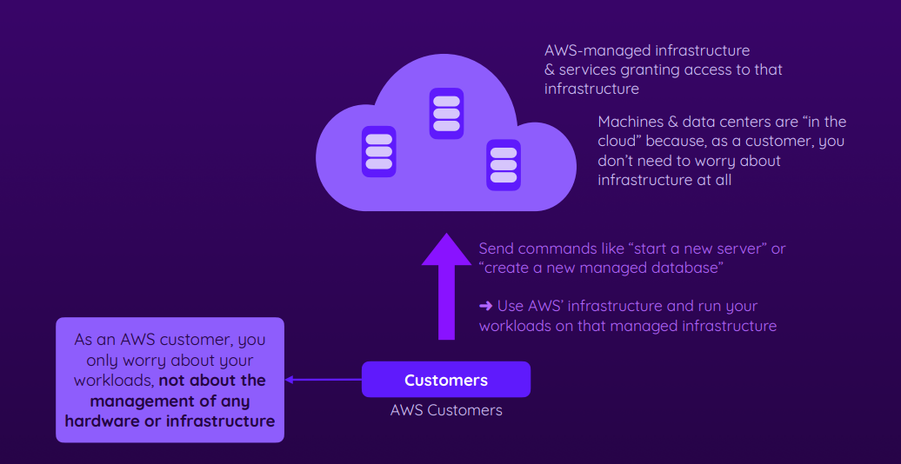
  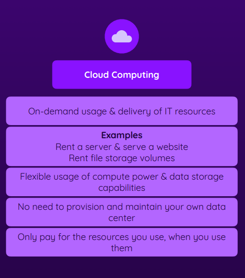
- Ngày xưa khi chưa có Cloud Computing, các công ty phải mua máy chủ, lưu trữ, cơ sở dữ liệu, mạng, phần mềm, và nhiều hơn nữa ( chi phí vận hành chi phí bảo trì...)
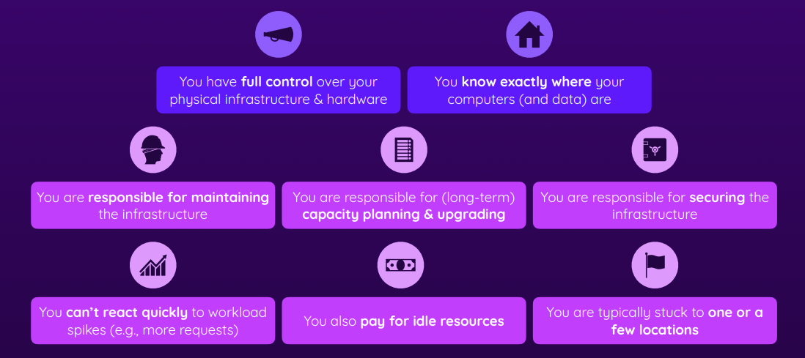
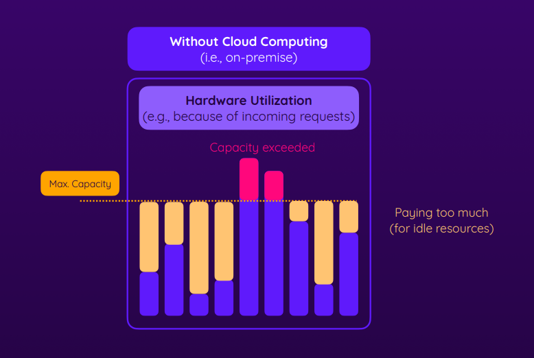
    - Thuận lợi : Bạn có toàn quyền kiểm soát cơ sở hạ tầng vật lí và phần cứng, bạn biết chính xác nơi dữ liệu của bạn đang lưu trữ
    - Nhược điểm : Chi phí cao, cần nhiều thời gian để triển khai, cần nhiều người để quản lý, không linh hoạt, không mở rộng được và bạn phải chịu trách nhiệm về việc bảo trì và nâng cấp cơ sở hạ tầng
- Những lợi ích mà AWS mang lại:
    - AWS chịu trách nhiệm về việc vận hành, bảo trì và nâng cấp cơ sở hạ tầng, bạn sẽ không cần phải lo lắng về việc bảo trì, không cần lo lắng khi cần cập nhập hay bảo vê cơ sở hạ tầng cũng như các vấn đề liên quan đến bảo mật
    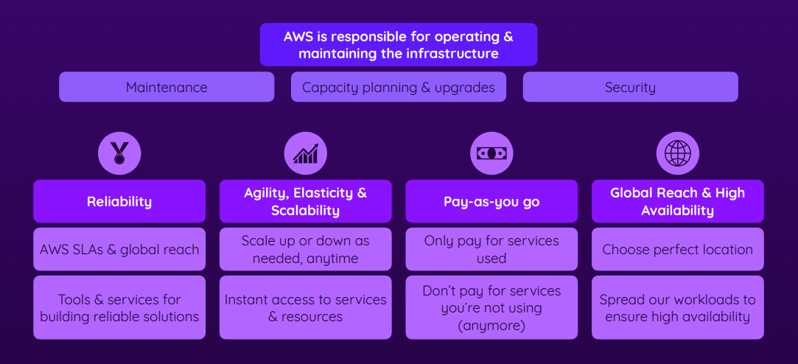
    - Reliability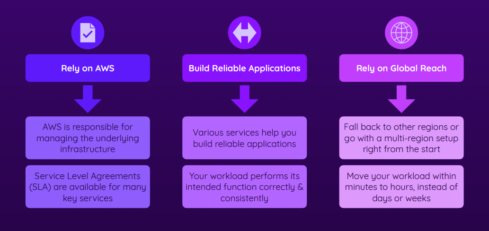
    - Agility, Elasticity & Scalability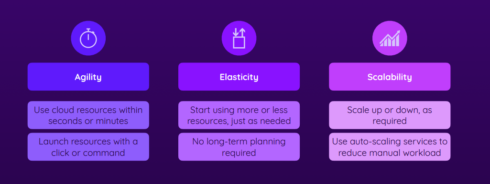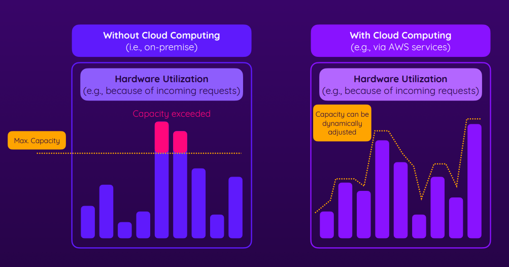
    - Pay-as-you Go 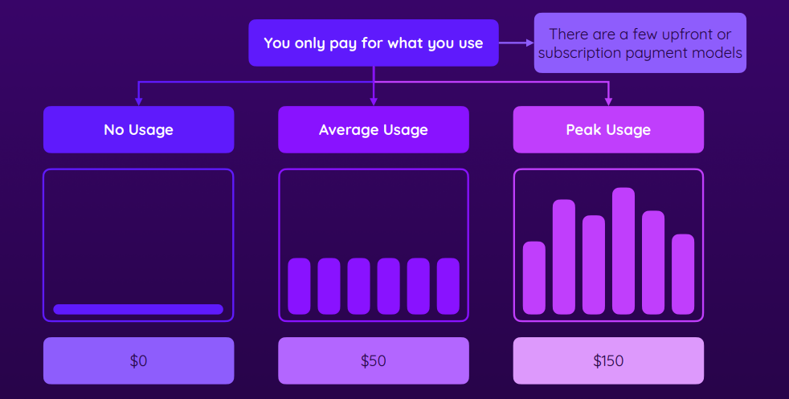
    - Global Reach & High Availability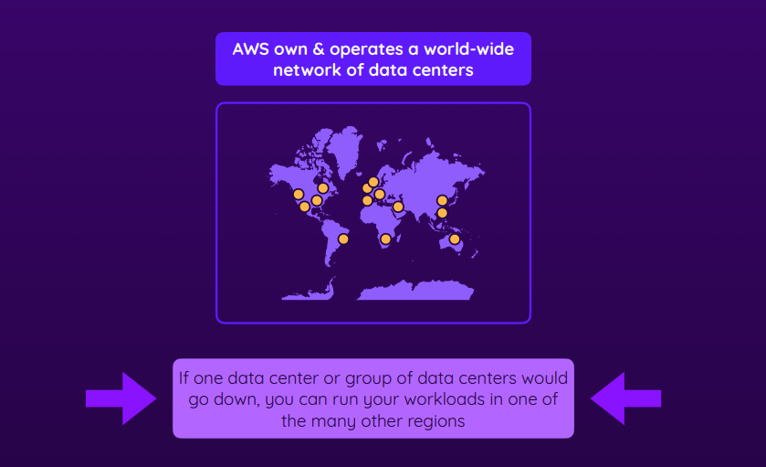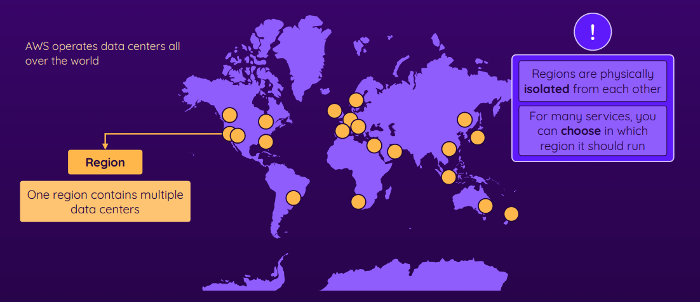
    - https://docs.aws.amazon.com/whitepapers/latest/aws-overview/six-advantages-of-cloud-computing.html
- AWS Global Infrastructure
    - AWS có 24 region trên toàn thế giới và 77 zone . Region là 1 cluster của các data center, zone là 1 data center độc lập với các zone khác
    - Mỗi region có ít nhất 2 zone
    - Mỗi zone là 1 data center độc lập với các zone khác
    - Mỗi region có ít nhất 1 edge location
    - Edge location là nơi lưu trữ cache của CloudFront
    - CloudFront là dịch vụ CDN của AWS
    - https://aws.amazon.com/about-aws/global-infrastructure/
- Regions & Availability Zones (AZs)
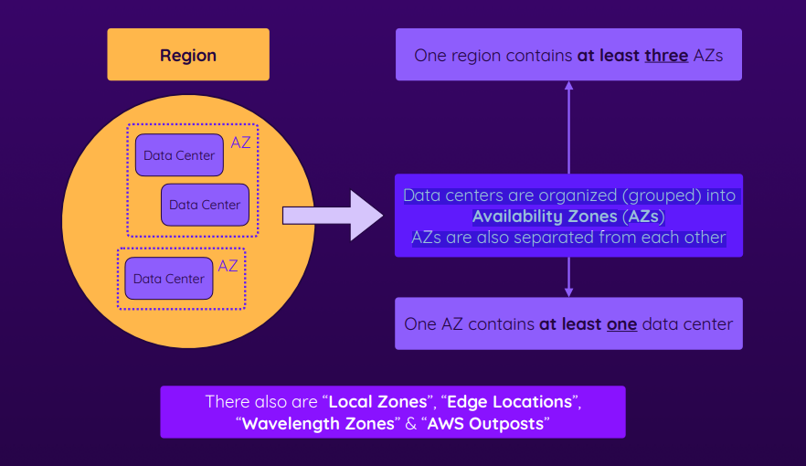
- Reasons For Picking A Certain Region
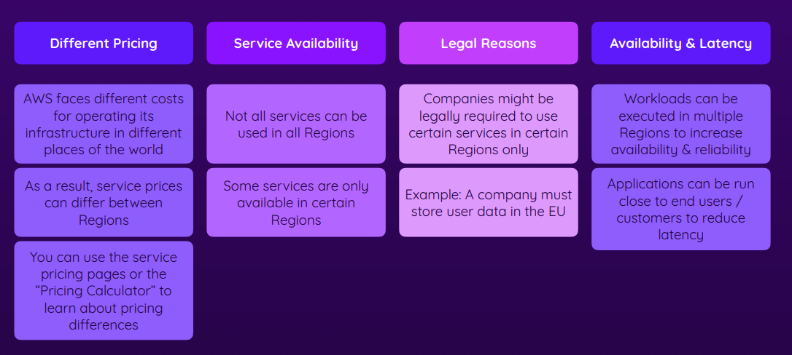
- **AWS also operates a world-wide network to connect all their regions**
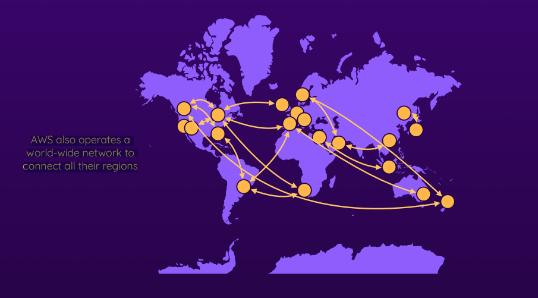
- Self-Service & Managed Services
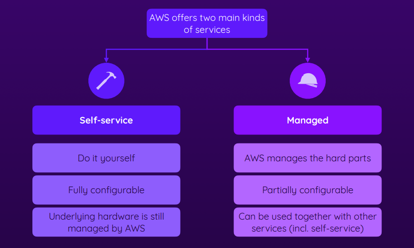
- Which Services Does AWS Offer?
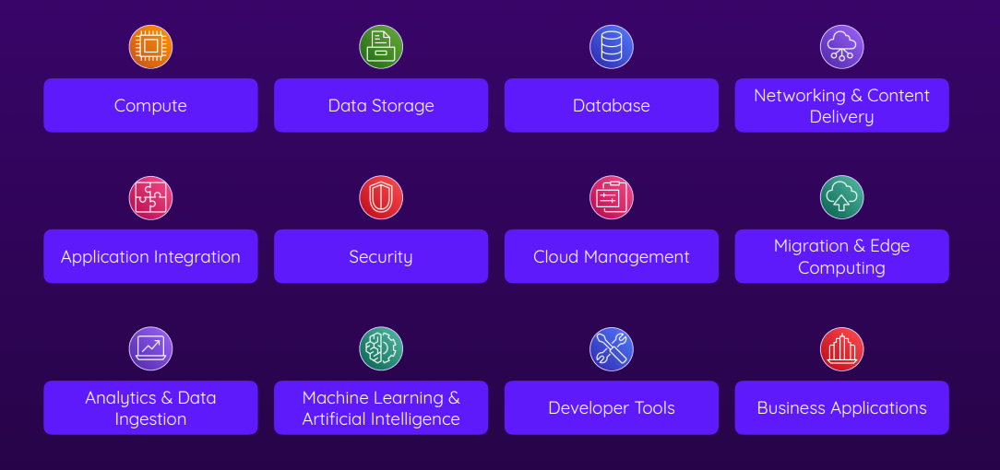