# AWS
- AWS là 1 công ty cung cấp dịch vụ đám mây lớn nhất thế giới
- AWS là viết tắt của Amazon Web Services
- A Cloud Computing Service Provider của Amazon
- Chính xác Cloud Computing là gì?
  - Cung cấp tài nguyên theo yêu cầu của các CNTT thông qua Internet với giá cả phải chăng
  - Về cơ bản bạn chỉ cần trả tiền cho những gì bạn sử dụng. Bạn có thể thuê máy chủ, lưu trữ, cơ sở dữ liệu, mạng, phần mềm, và nhiều hơn nữa. Ví dụ bạn muốn thuê 1 máy chủ, bạn chỉ cần trả tiền cho máy chủ đó mà không cần mua máy chủ đó (Elastic Compute Cloud - EC2)
  
  
- Ngày xưa khi chưa có Cloud Computing, các công ty phải mua máy chủ, lưu trữ, cơ sở dữ liệu, mạng, phần mềm, và nhiều hơn nữa ( chi phí vận hành chi phí bảo trì...)

    - Thuận lợi : Bạn có toàn quyền kiểm soát cơ sở hạ tầng vật lí và phần cứng, bạn biết chính xác nơi dữ liệu của bạn đang lưu trữ
    - Nhược điểm : Chi phí cao, cần nhiều thời gian để triển khai, cần nhiều người để quản lý, không linh hoạt, không mở rộng được và bạn phải chịu trách nhiệm về việc bảo trì và nâng cấp cơ sở hạ tầng
- Những lợi ích mà AWS mang lại:
    - AWS chịu trách nhiệm về việc vận hành, bảo trì và nâng cấp cơ sở hạ tầng, bạn sẽ không cần phải lo lắng về việc bảo trì, không cần lo lắng khi cần cập nhập hay bảo vê cơ sở hạ tầng cũng như các vấn đề liên quan đến bảo mật
    
    - Reliability
    - Agility, Elasticity & Scalability
    - Pay-as-you Go 
    - Global Reach & High Availability
    - https://docs.aws.amazon.com/whitepapers/latest/aws-overview/six-advantages-of-cloud-computing.html
- AWS Global Infrastructure
    - AWS có 24 region trên toàn thế giới và 77 zone . Region là 1 cluster của các data center, zone là 1 data center độc lập với các zone khác
    - Mỗi region có ít nhất 2 zone
    - Mỗi zone là 1 data center độc lập với các zone khác
    - Mỗi region có ít nhất 1 edge location
    - Edge location là nơi lưu trữ cache của CloudFront
    - CloudFront là dịch vụ CDN của AWS
    - https://aws.amazon.com/about-aws/global-infrastructure/
- Regions & Availability Zones (AZs)

- Reasons For Picking A Certain Region

- **AWS also operates a world-wide network to connect all their regions**

- Self-Service & Managed Services

- Which Services Does AWS Offer?

# AWS Account Security, Permissions, and Policies
- AWS Security Model:
    - Shared Responsibility Model : Nguyên tắc cơ bản là bảo mật. Ý tưởng đơn giản là AWS chịu trách nhiệm về việc bảo mật về những thứ bạn có thể kiểm soát. Phần lớn chúng là cơ sở hạ tầng, máy móc vật lí. Bạn chịu trách nhiệm về đơn đăng kí của mình và khối lượng công việc bạn đưa lên đó cũng như bạn sẽ chịu trách nhiệm về việc bảo vệ tài khoản của mình và các thông tin kết nối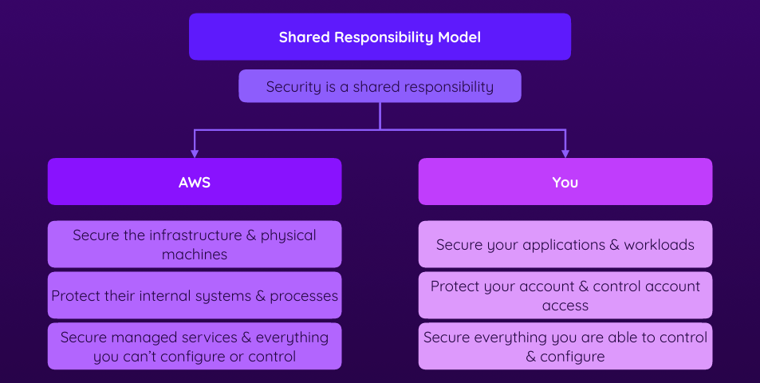
- Protecting Your Account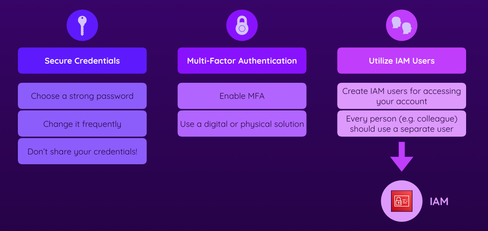
- What Is IAM?
    - IAM là Identity and Access Management
    - IAM là dịch vụ quản lý người dùng, nhóm và quyền truy cập trong AWS
    - IAM cho phép bạn quản lý quyền truy cập vào tài nguyên AWS của bạn
    - IAM là dịch vụ miễn phí
    - https://aws.amazon.com/iam/
    - Indetity chỉ đơn giản là 
    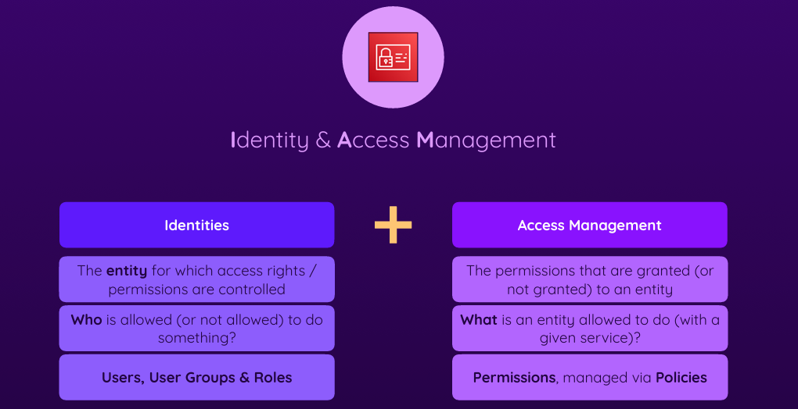
- Users, Groups, Roles, and Policies
    - Users: Người dùng, là những thực thể được tạo trong tk AWS và thường được người dùng tạo ra cho mọi người dùng có thể truy cập tài khoản AWS của họ. Điều đó có thể kiểm soát những gì người dùng có thể làm trong tài khoản AWS của họ
    - Groups: Nhóm, Những người có chung những quyền truy cập vào tài nguyên AWS. Bạn có thể thêm hoặc xóa người dùng từ nhóm, bạn cũng có thể thêm hoặc xóa quyền truy cập từ nhóm. Về cơ bản bạn có thể đặt quyền cho toàn bộ nhóm và mỗi người dùng được thêm vào nhóm sẽ có cùng 1 quyền. Điều này tránh tạo ra việc sao chép lại quá nhiều quyền không cần thiết
    - Roles: Vai trò, là cách bạn cung cấp quyền truy cập vào tài nguyên AWS cho các thực thể khác nhau. Ví dụ bạn có thể cung cấp quyền truy cập vào tài nguyên AWS cho 1 dịch vụ khác như EC2, Lambda, S3, ...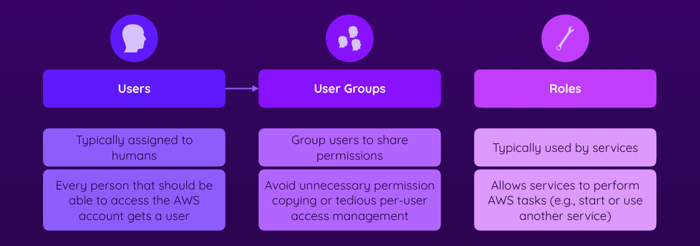
- Understanding Roles

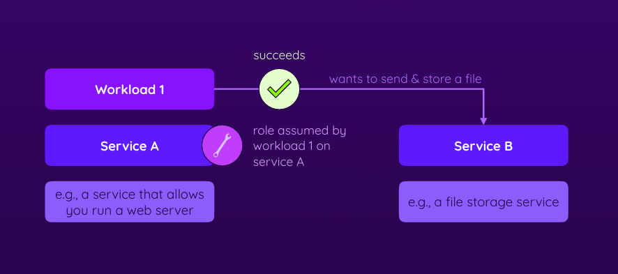

- Policies Are Combined
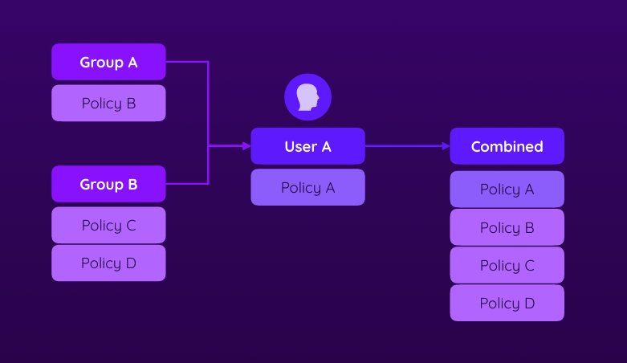
- What Happens If Permissions Clash?
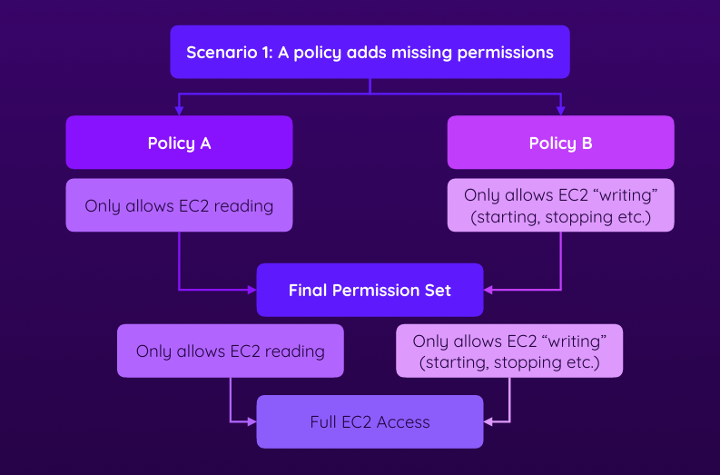
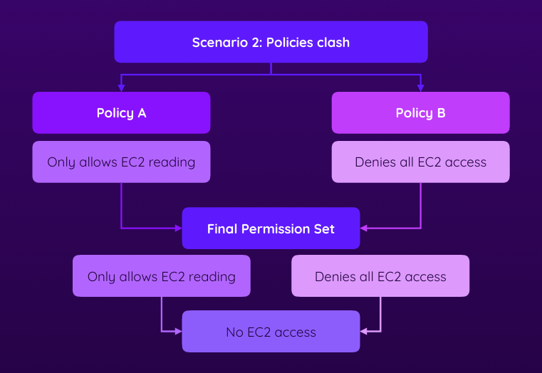
- Explicit DENY Statements Always Win!
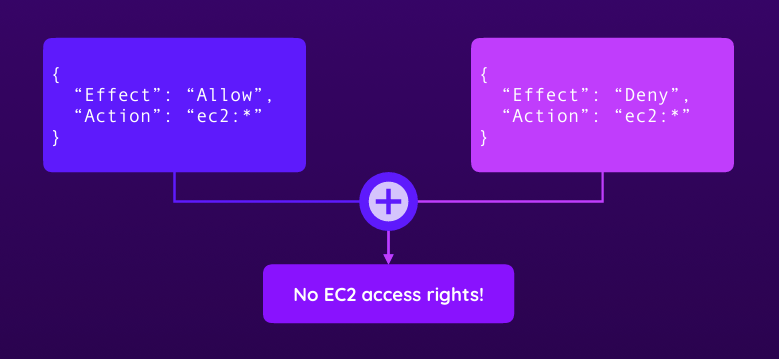
- Core IAM Policy & Permission Rules
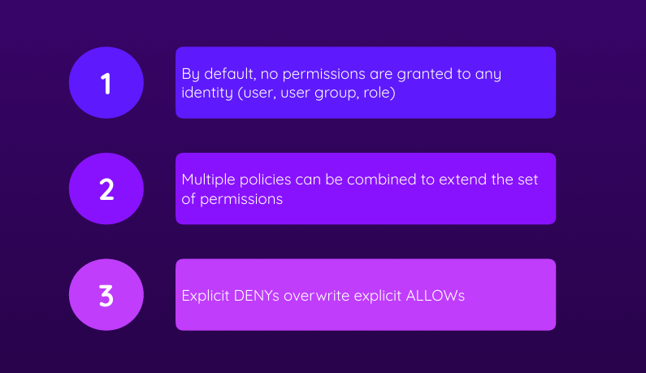
- When Are Permissions Evaluated?

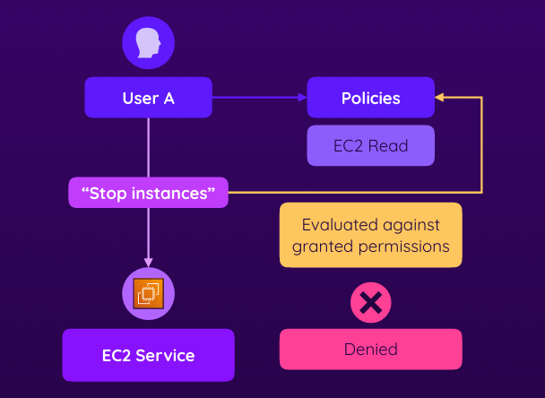
- Summary
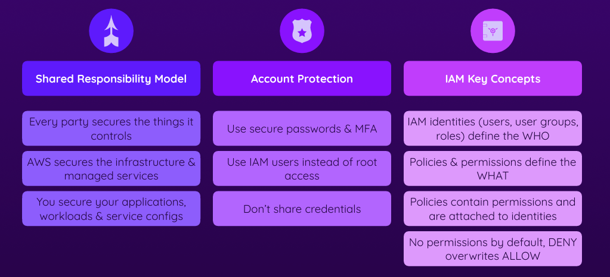
# Compute Services: EC2 
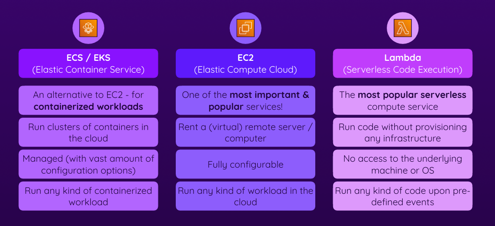
- What Are “Containers”?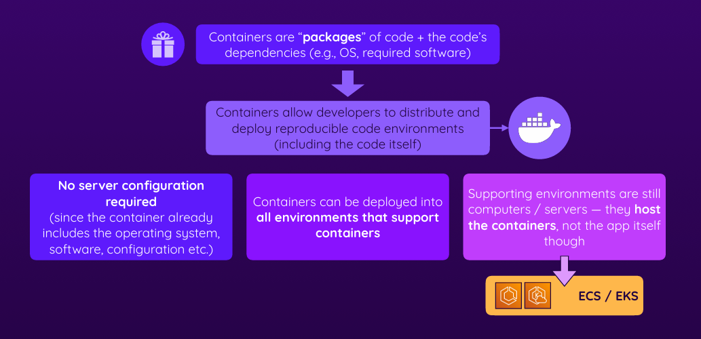
    - Containers là 1 cách để đóng gói ứng dụng và tất cả các phần mềm cần thiết để chạy ứng dụng đó. Containers giúp ứng dụng chạy đúng cách khi chuyển từ môi trường phát triển sang môi trường sản xuất
    - Containers giúp ứng dụng chạy đúng cách khi chuyển từ môi trường phát triển sang môi trường sản xuất
    - ECS/EKS là dịch vụ quản lý containers của AWS. ECS là Elastic Container Service, EKS là Elastic Kubernetes Service
- What Are “Serverless” Services?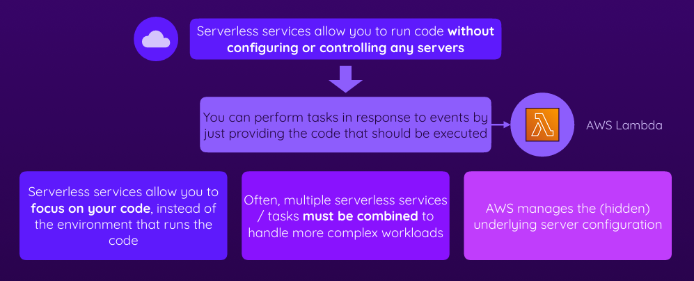
    - Serverless là 1 mô hình tính toán mà bạn không cần quản lý cơ sở hạ tầng. Bạn chỉ cần tập trung vào việc viết mã và chạy mã của bạn
    - Lambda là dịch vụ serverless của AWS
- Understanding EC2
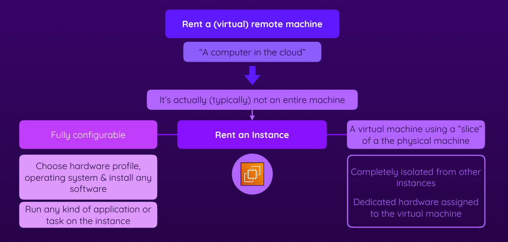
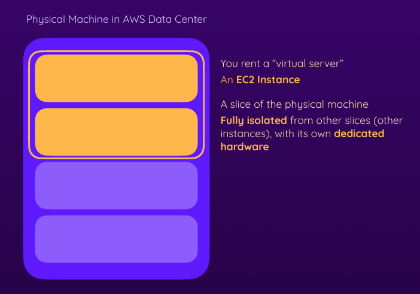
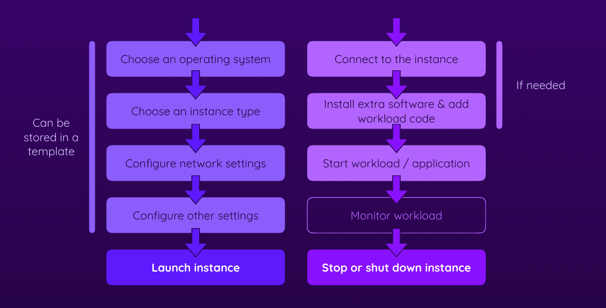
- Amazon Machine Images (AMIs)
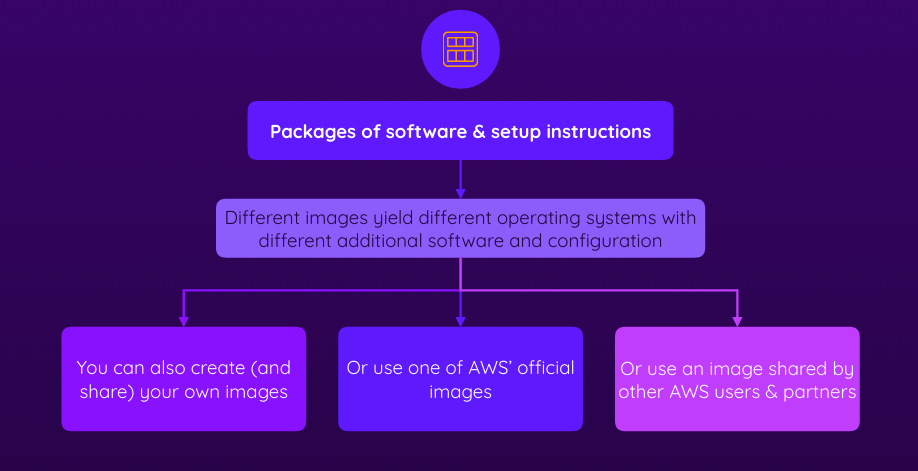
- EC2 Pricing
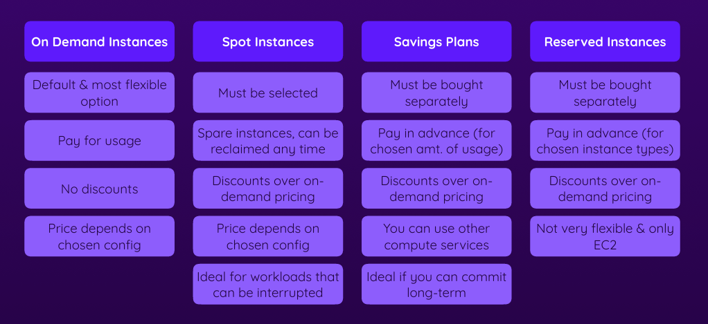
- Summary
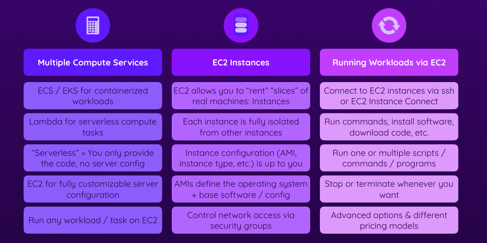

*** Doc cty : ***
*** Doc EC2 Notion : ***

# VPCs & Multiple EC2 Instances

- Để xây dựng 1 ứng dụng phức tạp, bạn cần nhiều EC2 instances. Để chúng có thể giao tiếp với nhau, bạn cần 1 mạng riêng biệt cho chúng. Đó chính là VPC
- Bạn muốn chi tiết trường hợp nào được kết nối với Internet theo cách nào và những trường hợp nào là không nên,
- Khi bạn muốn chạy 1 instance EC2, bạn cần chọn 1 VPC và 1 subnet
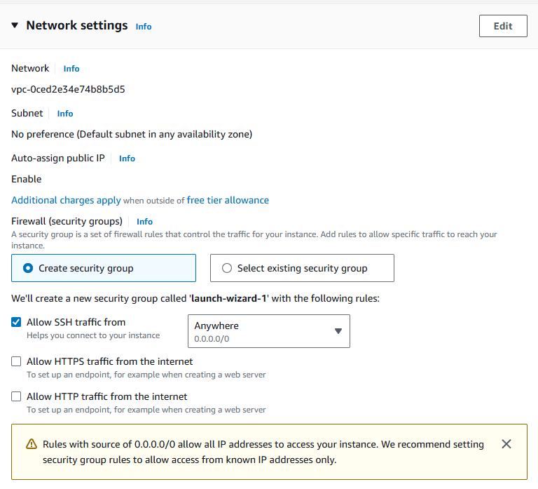
- Những Security Group và Network Access Control List (NACL) là gì?
    - Security Group: Là 1 bảng điều khiển truy cập mạng cho 1 hoặc nhiều instance EC2. Bạn có thể kiểm soát traffic đến và đi từ instance EC2 bằng cách chỉ định các rule trong security group
    - Network Access Control List (NACL): Là 1 bảng điều khiển truy cập mạng cho 1 hoặc nhiều subnet. Bạn có thể kiểm soát traffic đến và đi từ subnet bằng cách chỉ định các rule trong NACL
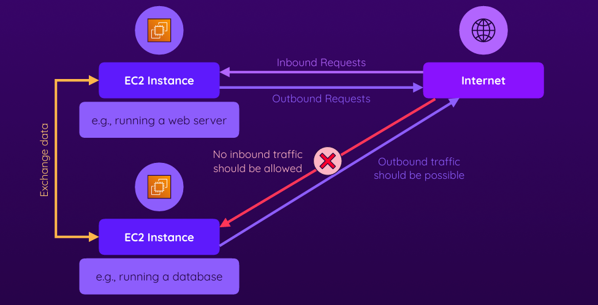
- Ý tưởng là bạn có thể có nhiều các trường hợp mà bạn có thể nhóm thành 1 hoặc nhiều VPC, mỗi VPC có thể chứa nhiều EC2
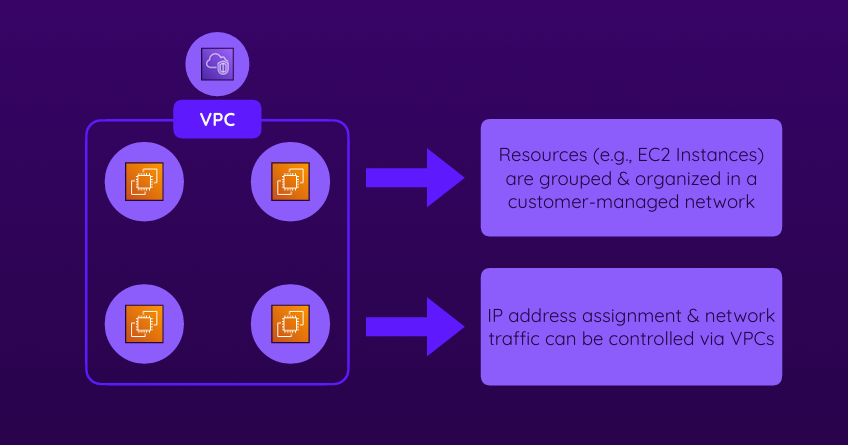
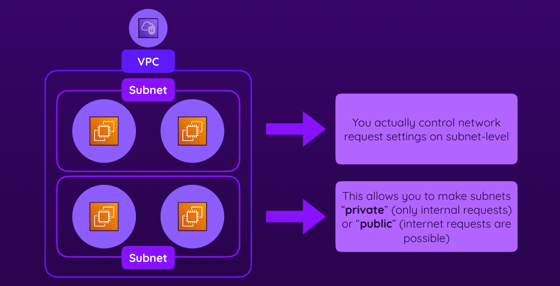
- VPCs & Subnets
    - VPC là Virtual Private Cloud, là 1 môi trường mạng ảo mà bạn tạo trong AWS. Bạn có thể chọn IP address range, tạo subnet, tạo route tables, và cấu hình các rule cho security group và NACL
    - Subnet là 1 phần của VPC mà bạn chia ra để chia sẻ IP address range của VPC. Bạn có thể chia subnet ra thành nhiều subnet nhỏ hơn
    - Trong subnet bạn có thể kiểm soát cài đặt các yêu cầu mạng hay nói chính xác hơn là khả năng kết nối của các mạng con đó
    - Bạn có thể kiểm soát mạng con ở chế độ private or public
    VD: Các công ty tư nhân chỉ có quyền truy cập vào các mạng con nội bộ private,trong khi các mạng con public có thể truy cập từ bên ngoài vào Internet
- Tất cả các phiên bản trong VPC đều có thể giao tiếp với nhau 1 cách độc lập cho dù chúng có nằm trên 1 mạng con hay không, nhưng với mạng con bạn có thể thực sự kiểm soát các phiên bản có thể thực sự kết nối với Internet hay không
- Khi chúng chia thành các mạng con bạn có thể sẵn sàng chọn AZs khác nhau cho mỗi mạng con và các phiên bản trong mạng con đó sẽ cùng nằm trong AZ đó
- Khi chúng ta có 1 mạng con public, chúng ta cần 1 Internet Gateway để kết nối với Internet
- Khi chúng ta có 1 mạng con private, chúng ta cần 1 NAT Gateway để kết nối với Internet
- NAT Gateway là 1 dịch vụ AWS cho phép các phiên bản trong mạng con private kết nối với Internet
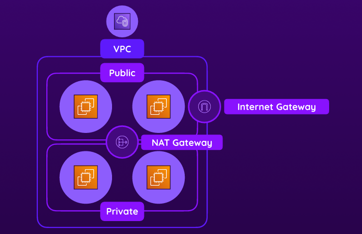
- Việc chọn Region là rất quan trọng, vì nó ảnh hưởng đến việc chọn VPC, Subnet, và các tài nguyên khác
- Tóm lại:
    - VPC là nơi bạn khỏi chạy các phiên bản EC2 và sau đó trong các dịch vụ này bạn sắp xếp các phiên bản vào các mạng con
    - Bạn phải chạy các EC2 instances trong các mạng con và sau đó bạn sẽ kiểm soát các phiên bản đó bằng cách sử dụng Security Group và NACL
- Understanding CIDR IP Ranges
    - CIDR là Classless Inter-Domain Routing
    - CIDR là 1 cách để chỉ định IP address range
    - CIDR sử dụng 1 số và 1 dấu / để chỉ định IP address range
    - VD: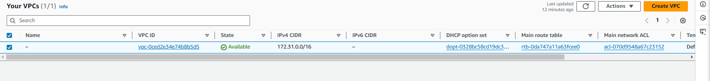
    - IP address range là 1 dãy các IP address mà bạn có thể sử dụng trong VPC, mỗi IP address là 1 số duy nhất và được gắn với 1 máy chủ hoặc 1 thiết bị mạng, mỗi IP address có thể được sử dụng để xác định 1 máy chủ hoặc 1 thiết bị mạng trên mạng Internet
    - IP trong VPC có thể gắn với các instance EC2, Elastic Load Balancer, và các dịch vụ khác
    - Ví dụ gửi dữ liệu từ phiên bản máy chủ EC2 web vào CSDL EC2, bạn có thể sử dụng địa chỉ IP nội bộ và các địa chỉ này đã được tạo khi chúng ta tạo VPC
    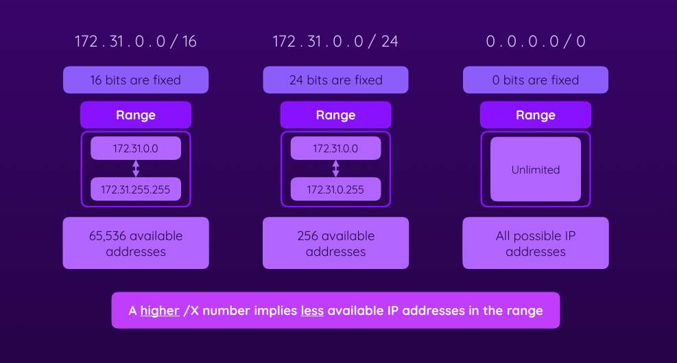

- Understanding Route Tables
    - Route Tables là 1 bảng điều khiển mạng cho 1 hoặc nhiều subnet
    - Route Tables xác định cách mà traffic được điều hướng trong VPC
- IP Public và Private
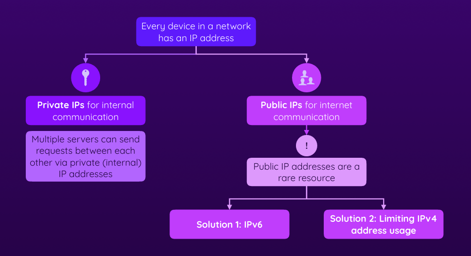
    - IP Public là IP address mà bạn có thể truy cập từ Internet
    - IP Private là IP address mà bạn không thể truy cập từ Internet
    - IP Private được sử dụng để giao tiếp giữa các instance EC2 trong VPC
    - IP Public được sử dụng để giao tiếp với Internet
- Elasstic IP
    - Elastic IP là IP address tĩnh mà bạn có thể gán cho instance EC2
    - Elastic IP giúp bạn giữ IP address không thay đổi khi bạn khởi động lại instance EC2
    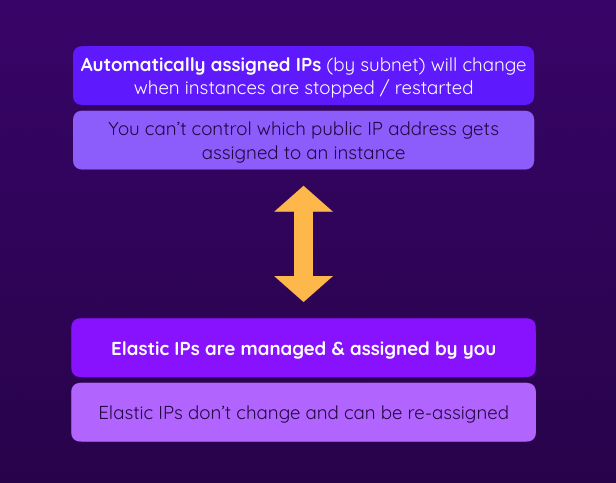
    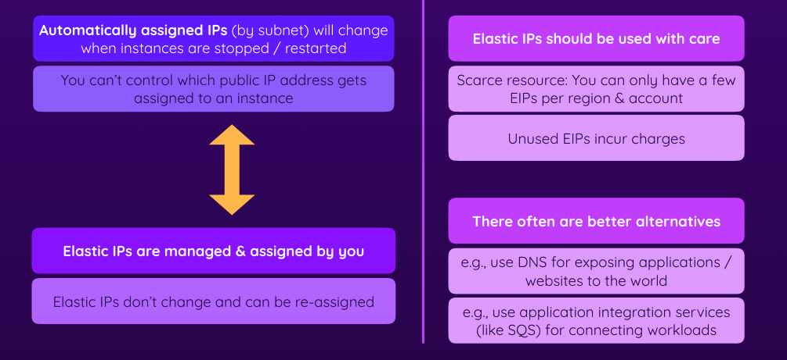
- NACL
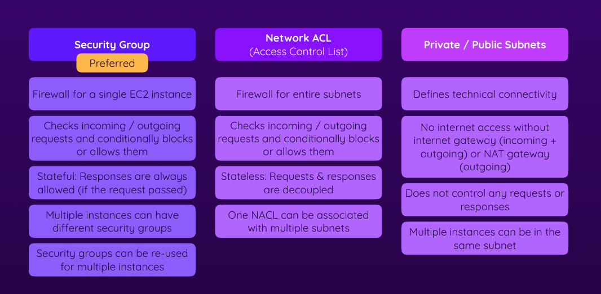

- VPC Peering & Transit Gateways
    - VPC Peering là 1 cách để kết nối 2 VPC với nhau
    - Transit Gateway là 1 cách để kết nối nhiều VPC với nhau
    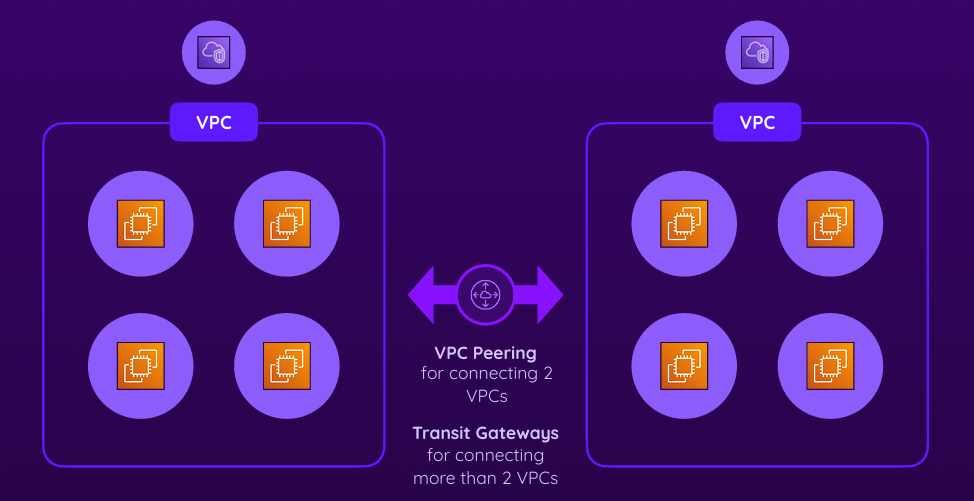
- VPC Endpoints & AWS PrivateLink
    - VPC Endpoints là 1 cách để kết nối VPC với dịch vụ AWS mà không cần sử dụng Internet
    - AWS PrivateLink là 1 cách để kết nối VPC với dịch vụ AWS mà không cần sử dụng Internet
    - Ví dụ khi bạn muốn kết nối VPC với S3, bạn có thể sử dụng VPC Endpoint hoặc AWS PrivateLink để kết nối mà không cần sử dụng Internet
    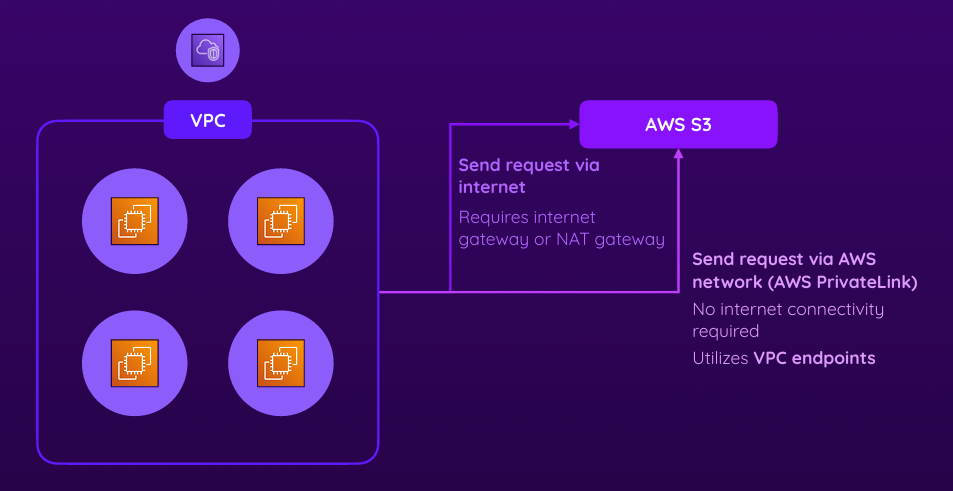
- Summary
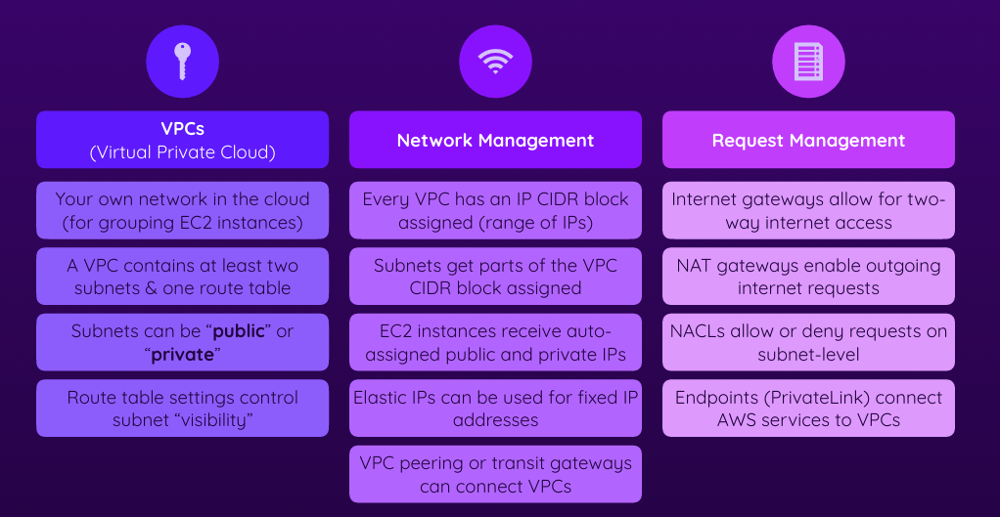