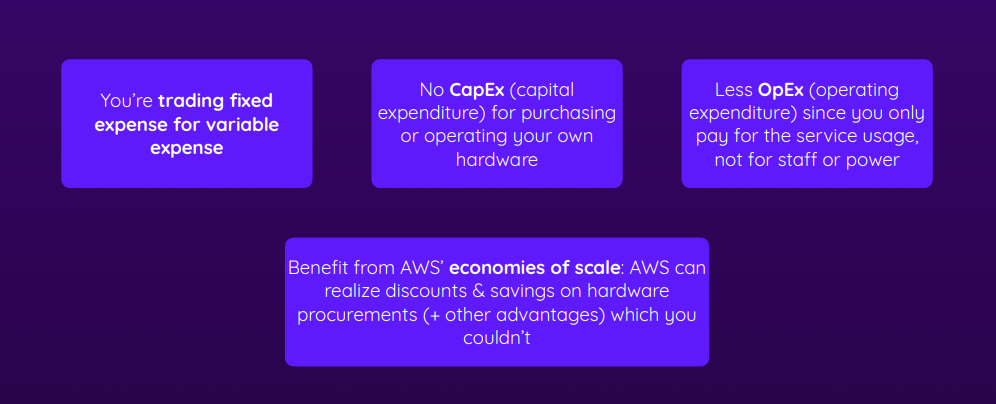
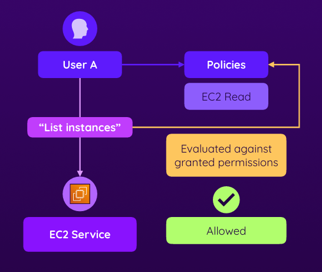

# AWS
- AWS là 1 công ty cung cấp dịch vụ đám mây lớn nhất thế giới
- AWS là viết tắt của Amazon Web Services
- A Cloud Computing Service Provider của Amazon
- Chính xác Cloud Computing là gì?
  - Cung cấp tài nguyên theo yêu cầu của các CNTT thông qua Internet với giá cả phải chăng
  - Về cơ bản bạn chỉ cần trả tiền cho những gì bạn sử dụng. Bạn có thể thuê máy chủ, lưu trữ, cơ sở dữ liệu, mạng, phần mềm, và nhiều hơn nữa. Ví dụ bạn muốn thuê 1 máy chủ, bạn chỉ cần trả tiền cho máy chủ đó mà không cần mua máy chủ đó (Elastic Compute Cloud - EC2)
  
  
- Ngày xưa khi chưa có Cloud Computing, các công ty phải mua máy chủ, lưu trữ, cơ sở dữ liệu, mạng, phần mềm, và nhiều hơn nữa ( chi phí vận hành chi phí bảo trì...)

    - Thuận lợi : Bạn có toàn quyền kiểm soát cơ sở hạ tầng vật lí và phần cứng, bạn biết chính xác nơi dữ liệu của bạn đang lưu trữ
    - Nhược điểm : Chi phí cao, cần nhiều thời gian để triển khai, cần nhiều người để quản lý, không linh hoạt, không mở rộng được và bạn phải chịu trách nhiệm về việc bảo trì và nâng cấp cơ sở hạ tầng
- Những lợi ích mà AWS mang lại:
    - AWS chịu trách nhiệm về việc vận hành, bảo trì và nâng cấp cơ sở hạ tầng, bạn sẽ không cần phải lo lắng về việc bảo trì, không cần lo lắng khi cần cập nhập hay bảo vê cơ sở hạ tầng cũng như các vấn đề liên quan đến bảo mật
    
    - Reliability
    - Agility, Elasticity & Scalability
    - Pay-as-you Go 
    - Global Reach & High Availability
    - https://docs.aws.amazon.com/whitepapers/latest/aws-overview/six-advantages-of-cloud-computing.html
- AWS Global Infrastructure
    - AWS có 24 region trên toàn thế giới và 77 zone . Region là 1 cluster của các data center, zone là 1 data center độc lập với các zone khác
    - Mỗi region có ít nhất 2 zone
    - Mỗi zone là 1 data center độc lập với các zone khác
    - Mỗi region có ít nhất 1 edge location
    - Edge location là nơi lưu trữ cache của CloudFront
    - CloudFront là dịch vụ CDN của AWS
    - https://aws.amazon.com/about-aws/global-infrastructure/
- Regions & Availability Zones (AZs)

- Reasons For Picking A Certain Region

- **AWS also operates a world-wide network to connect all their regions**

- Self-Service & Managed Services

- Which Services Does AWS Offer?

# AWS Account Security, Permissions, and Policies
- AWS Security Model:
    - Shared Responsibility Model : Nguyên tắc cơ bản là bảo mật. Ý tưởng đơn giản là AWS chịu trách nhiệm về việc bảo mật về những thứ bạn có thể kiểm soát. Phần lớn chúng là cơ sở hạ tầng, máy móc vật lí. Bạn chịu trách nhiệm về đơn đăng kí của mình và khối lượng công việc bạn đưa lên đó cũng như bạn sẽ chịu trách nhiệm về việc bảo vệ tài khoản của mình và các thông tin kết nối
- Protecting Your Account
- What Is IAM?
    - IAM là Identity and Access Management
    - IAM là dịch vụ quản lý người dùng, nhóm và quyền truy cập trong AWS
    - IAM cho phép bạn quản lý quyền truy cập vào tài nguyên AWS của bạn
    - IAM là dịch vụ miễn phí
    - https://aws.amazon.com/iam/
    - Indetity chỉ đơn giản là 
    
- Users, Groups, Roles, and Policies
    - Users: Người dùng, là những thực thể được tạo trong tk AWS và thường được người dùng tạo ra cho mọi người dùng có thể truy cập tài khoản AWS của họ. Điều đó có thể kiểm soát những gì người dùng có thể làm trong tài khoản AWS của họ
    - Groups: Nhóm, Những người có chung những quyền truy cập vào tài nguyên AWS. Bạn có thể thêm hoặc xóa người dùng từ nhóm, bạn cũng có thể thêm hoặc xóa quyền truy cập từ nhóm. Về cơ bản bạn có thể đặt quyền cho toàn bộ nhóm và mỗi người dùng được thêm vào nhóm sẽ có cùng 1 quyền. Điều này tránh tạo ra việc sao chép lại quá nhiều quyền không cần thiết
    - Roles: Vai trò, là cách bạn cung cấp quyền truy cập vào tài nguyên AWS cho các thực thể khác nhau. Ví dụ bạn có thể cung cấp quyền truy cập vào tài nguyên AWS cho 1 dịch vụ khác như EC2, Lambda, S3, ...
- Understanding Roles

- Policies Are Combined

- What Happens If Permissions Clash?

- Explicit DENY Statements Always Win!

- Core IAM Policy & Permission Rules

- When Are Permissions Evaluated?

- Summary

# Compute Services: EC2 

- What Are “Containers”?
    - Containers là 1 cách để đóng gói ứng dụng và tất cả các phần mềm cần thiết để chạy ứng dụng đó. Containers giúp ứng dụng chạy đúng cách khi chuyển từ môi trường phát triển sang môi trường sản xuất
    - Containers giúp ứng dụng chạy đúng cách khi chuyển từ môi trường phát triển sang môi trường sản xuất
    - ECS/EKS là dịch vụ quản lý containers của AWS. ECS là Elastic Container Service, EKS là Elastic Kubernetes Service
- What Are “Serverless” Services?
    - Serverless là 1 mô hình tính toán mà bạn không cần quản lý cơ sở hạ tầng. Bạn chỉ cần tập trung vào việc viết mã và chạy mã của bạn
    - Lambda là dịch vụ serverless của AWS
- Understanding EC2

- Amazon Machine Images (AMIs)

- EC2 Pricing

- Summary

*** Doc cty : ***
*** Doc EC2 Notion : ***

# VPCs & Multiple EC2 Instances