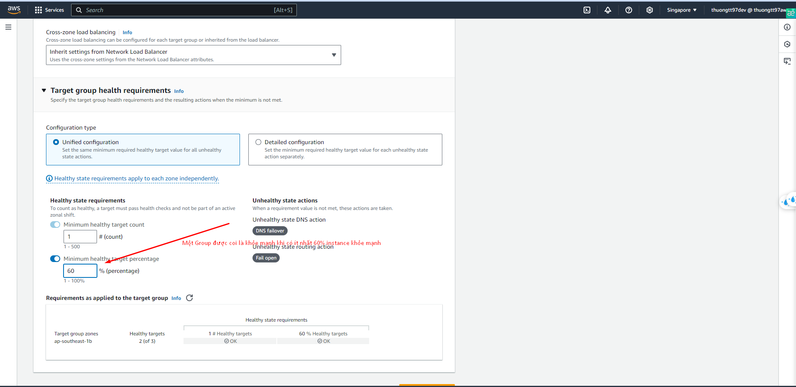
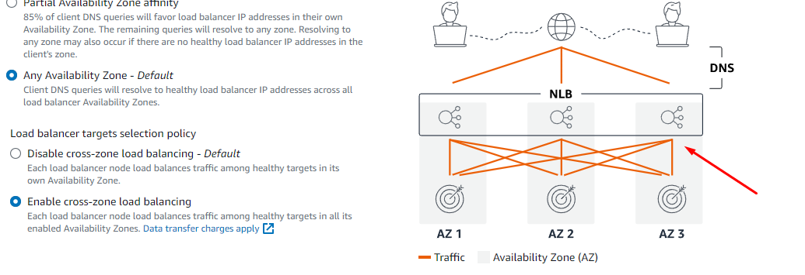

# AWS
### IAM
- Identity and Access Management là viết tắt của IAM, là dịch vụ quản lý quyền truy cập của AWS. IAM cho phép bạn quản lý người dùng và quyền truy cập vào các tài nguyên AWS của bạn thông qua các chính sách quyền truy cập.
- Root account: là tài khoản mặc định khi bạn tạo tài khoản AWS. Tài khoản này có toàn quyền truy cập vào tất cả các tài nguyên của bạn. Do đó, bạn không nên sử dụng tài khoản root để quản lý tài nguyên AWS của mình.
- User: là người dùng được tạo ra từ tài khoản root hoặc từ một user khác. User có thể được gán các quyền truy cập vào các tài nguyên AWS thông qua chính sách quyền truy cập.
- Group: là một nhóm các user, mỗi group có thể chứa nhiều user. Group có thể được gán các quyền truy cập vào các tài nguyên AWS thông qua chính sách quyền truy cập và không chứa các nhóm khác.
- Role: là một cách để bạn cung cấp quyền truy cập vào các tài nguyên AWS cho các user hoặc các service khác. Role không chứa các user hoặc group.
- Policy: là một tập hợp các quyền truy cập được gán cho user, group hoặc role. Policy có thể được gán cho user, group hoặc role.
- IAM là global service, nghĩa là bạn có thể sử dụng chung một tài khoản IAM cho tất cả các region của AWS.
- Một số chính sách quyền truy cập:
    - Allow: cho phép user thực hiện một hành động nào đó.
    - Deny: không cho phép user thực hiện một hành động nào đó.
    - Resource: xác định tài nguyên mà user được phép thực hiện hành động.
    - Condition: xác định điều kiện để user được phép thực hiện hành động.
- Tạo user:
    - Bước 1: Đăng nhập vào tài khoản AWS.
    - Bước 2: Chọn dịch vụ IAM.
    - Bước 3: Chọn Users.
    - Bước 4: Chọn Add user.
    - Bước 5: Nhập tên user và chọn quyền truy cập.
    - Bước 6: Chọn Attach existing policies directly.
    - Bước 7: Chọn quyền truy cập cho user.
    - Bước 8: Chọn Next: Tags.
    - Bước 9: Chọn Next: Review.
    - Bước 10: Chọn Create user.

- IAM Policy:
    - Bước 1: Đăng nhập vào tài khoản AWS.
    - Bước 2: Chọn dịch vụ IAM.
    - Bước 3: Chọn Policies.
    - Bước 4: Chọn Create policy.
    - Bước 5: Chọn JSON.
    - Bước 6: Nhập nội dung policy.
    - Bước 7: Chọn Review policy.
    - Bước 8: Nhập tên policy và chọn Create policy.
- IAM policy example:
```json
{
    "Version": "2012-10-17",
    "Statement": [
        {
            "Effect": "Allow",
            "Action": "s3:*",
            "Resource": "*"
        }
    ]
}
```
- IAM Password Policy:
    - Bước 1: Đăng nhập vào tài khoản AWS.
    - Bước 2: Chọn dịch vụ IAM.
    - Bước 3: Chọn Account settings.
    - Bước 4: Chọn Edit.
    - Bước 5: Chỉnh sửa password policy.
    - Bước 6: Chọn Apply password policy.

- MFA:
    - Bước 1: Đăng nhập vào tài khoản AWS.
    - Bước 2: Chọn dịch vụ IAM.
    - Bước 3: Chọn Users.
    - Bước 4: Chọn user cần kích hoạt MFA.
    - Bước 5: Chọn Security credentials.
    - Bước 6: Chọn Edit.
    - Bước 7: Chọn Assigned MFA device.
    - Bước 8: Chọn Virtual MFA device hoặc Hardware MFA device.
    - Bước 9: Chọn Next: Review.
    - Bước 10: Chọn Activate MFA.

### EC2
**VMs, Hosts, and Hypervisors**
- Virtual Machine (VM): là một máy ảo chạy trên một máy chủ vật lý. Mỗi VM có hệ điều hành riêng và có thể chạy các ứng dụng riêng biệt.
    - Máy chủ vật lý: là máy chủ thực sự, chạy trên phần cứng vật lý bao gồm CPU, RAM, ổ cứng, card mạng, ...
    - Hypervisor: là phần mềm quản lý và chia sẻ tài nguyên phần cứng cho các VM. Hypervisor chịu trách nhiệm quản lý các VM, cung cấp tài nguyên phần cứng cho các VM và chia sẻ tài nguyên phần cứng giữa các VM.
    - Host: là máy chủ vật lý chạy hypervisor và quản lý các VM.
    - Các loại hypervisor:
        - Type 1: chạy trực tiếp trên phần cứng vật lý, không cần hệ điều hành.
        - Type 2: chạy trên hệ điều hành, cần hệ điều hành.
    - Mỗi máy chủ vật lý có thể chứa nhiều VM, mỗi VM có thể chạy hệ điều hành khác nhau, riêng biệt với các VM khác.
- Amazon Elastic Compute Cloud (EC2): là dịch vụ cung cấp máy ảo (VM) trên cloud của AWS. EC2 cho phép bạn tạo, quản lý và chạy các máy ảo trên cloud của AWS.
- Với EC2, về cơ bản bạn sẽ thuê một máy ảo (VM) từ AWS, sau đó bạn có thể cài đặt hệ điều hành, ứng dụng và dữ liệu trên máy ảo đó.
- Những gì chúng ta nhận được ở đây là IaaS (Infrastructure as a Service), nghĩa là chúng ta sẽ thuê một máy chủ ảo từ AWS, sau đó tự quản lý hệ điều hành, ứng dụng và dữ liệu trên máy chủ ảo đó.
- Một số khái niệm cơ bản về EC2:
    - Instance: là một máy ảo chạy trên cloud của AWS.
    - AMI (Amazon Machine Image): là một bản snapshot của một instance, bao gồm hệ điều hành, ứng dụng và dữ liệu.
    - Instance type: là một bộ cấu hình phần cứng cho instance, bao gồm CPU, RAM, ổ cứng, ...
    - EBS (Elastic Block Store): là dịch vụ lưu trữ dữ liệu trên cloud của AWS.
    - Security group: là một bộ quy tắc cho phép hoặc chặn traffic vào và ra khỏi instance.
    - Key pair: là một cặp khóa (public key và private key) dùng để SSH vào instance.
    - Elastic IP: là một địa chỉ IP tĩnh dùng để kết nối vào instance.
- Các bước tạo EC2 instance:
    - Bước 1: Đăng nhập vào tài khoản AWS.
    - Bước 2: Chọn dịch vụ EC2.
    - Bước 3: Chọn Launch instance.
    - Bước 4: Chọn AMI(Amazon Machine Image). Chọn OS mà bạn muốn cài đặt.
    - Bước 5: Chọn Instance type(Resource : CPU, RAM, ổ cứng, ...) tùy theo nhu cầu của bạn. Các instance type có giá khác nhau.
    - Bước 6: Chọn Configure instance.
    - Bước 7: Chọn Add storage.
    - Bước 8: Chọn Add tags.
    - Bước 9: Chọn Configure security group.
    - Bước 10: Chọn Review and Launch.
    - Bước 11: Chọn Launch.
    - Bước 12: Chọn Key pair và chọn Launch instances.
- Dịch vụ không được quản lí và dịch vụ được quản lí:
    - Dịch vụ không được quản lí: là dịch vụ mà bạn phải tự quản lý hệ điều hành, ứng dụng và dữ liệu trên instance. Giống như bạn nấu ăn, khi bạn tự chuẩn bị thức ăn bạn có toàn quyền kiểm soát quá trình đó, bạn cũng phải làm tất cả mọi thứ liên quan đến công việc đó
    - Dịch vụ được quản lí: là dịch vụ mà AWS sẽ quản lý hệ điều hành, ứng dụng và dữ liệu trên instance.Giống như bạn đi ăn tiệm, bạn chỉ cần chọn món và ăn, còn việc nấu ăn, dọn dẹp sau khi ăn sẽ do nhà hàng lo.Nhưng tiền thì bạn phải trả và bạn cũng không thể kiểm soát mọi thứ trong quá trình đó ví dụ như bạn k thể chạy vào bếp để thêm 1 cái đùi gà vào món ăn của mình. S3 là 1 dịch vụ như vậy.
- Regions và Availability Zones:
    - Region: là một vùng địa lý chứa nhiều Availability Zones. Mỗi region có ít nhất 2 Availability Zones.
    - Availability Zone: là một trung tâm dữ liệu độc lập với các trung tâm dữ liệu khác trong cùng một region. Mỗi Availability Zone có nhiều data center.
    - Mỗi region có ít nhất 2 Availability Zones, mỗi Availability Zone có nhiều data center. Mục đích của việc chia ra là để tăng tính sẵn sàng và độ tin cậy cho dịch vụ của AWS(AWS chỉ cần cung cấp LB giữa các AZ).
    - Khi bạn tạo một instance, bạn có thể chọn region và Availability Zone cho instance đó.
- EC2 types:
    - General Purpose: cung cấp một bộ cấu hình cơ bản cho các ứng dụng thông thường.
    - Compute Optimized: cung cấp nhiều CPU và RAM cho các ứng dụng đòi hỏi nhiều CPU.
    - Memory Optimized: cung cấp nhiều RAM cho các ứng dụng đòi hỏi nhiều RAM.
    - Storage Optimized: cung cấp nhiều ổ cứng cho các ứng dụng đòi hỏi nhiều ổ cứng.
    - Link: https://aws.amazon.com/ec2/instance-types/
- EC2 pricing:
    - On-Demand: bạn sẽ trả tiền cho số lượng tài nguyên bạn sử dụng.
    - Reserved: bạn sẽ trả tiền trước cho một số lượng tài nguyên và sử dụng chúng trong một khoảng thời gian nhất định.
    - Spot: bạn sẽ trả tiền cho tài nguyên dựa trên giá hiện tại của thị trường.
    - Dedicated Hosts: bạn sẽ trả tiền cho một máy chủ vật lý và sử dụng tài nguyên trên máy chủ đó.
    - Link: https://aws.amazon.com/ec2/pricing/
- Launch EC2 instance(Khởi chạy EC2 instance):
    - Bước 1: Đăng nhập vào tài khoản AWS.
    - Bước 2: Chọn dịch vụ EC2.
    - Bước 3: Chọn Launch instance.
    - Bước 4: Chọn AMI.
    - Bước 5: Chọn Instance type.
    - Bước 6: Chọn Configure instance.
    - Bước 7: Chọn Add storage.
    - Bước 8: Chọn Add tags.
    - Bước 9: Chọn Configure security group.
    - Bước 10: Chọn Review and Launch.
    - Bước 11: Chọn Launch.
    - Bước 12: Chọn Key pair và chọn Launch instances.
    
- AMI (Amazon Machine Image):
    - AMI là một bản snapshot của một instance, bao gồm hệ điều hành, ứng dụng và dữ liệu.
    - Bạn có thể tạo AMI từ một instance đang chạy hoặc từ một AMI có sẵn.
    - Bạn có thể chia sẻ AMI với các tài khoản khác hoặc với tất cả mọi người.
    - Bạn có thể tạo AMI bằng cách chọn instance, chọn Actions -> Image and templates -> Create image.
    - Về cơ bản đây là thiết lập phần mềm bao gồm cả hệ điều hành mà bạn cần để chạy instance.
    - AWS cũng cung cấp cho chúng ta nhiều tùy chọn khác nhau
    - Nên lựa chọn Amazon Linux 2 AMI 
    
- Nên chọn loại phù hợp với giá cả và nhu cầu sử dụng của bạn


- Create Key Pair: Cặp khóa (public key và private key) dùng để SSH vào instance. 
    - Bước 1: Đăng nhập vào tài khoản AWS.
    - Bước 2: Chọn dịch vụ EC2.
    - Bước 3: Chọn Key Pairs.
    - Bước 4: Chọn Create key pair.
    - Bước 5: Nhập tên key pair và chọn Create key pair.
    - Bước 6: Download key pair và lưu trữ nó ở một nơi an toàn.


- Target Groups Node and Health



- TCP traffic distribution: Cách mà LB xác định nút nào sẽ gửi lưu lượng dựa trên:
    - Protocol
    - Source IP address
    - Source port
    - Destination IP address
    - Destination port
    - TCP sequence number
- Cross-zone load balancing: Cấu hình cho phép LB phân phối lưu lượng vào các nút trong cùng một AZ và các AZ khác nhau.



**1 instance thuộc 1 subnet và 1 subnet thuộc 1 AZ**

**1 subnet thuộc 1 VPC**

**1VPC có thể chứa nhiều subnet**

**1 NLB có thể chứa 1 hoặc nhiều target group, mỗi target group có thể chứa nhiều instance thuộc nhiều subnet và AZ khác nhau**

- Application Load Balancer (ALB): là dịch vụ cung cấp load balancing cho các ứng dụng chạy trên nhiều instance. ALB cho phép bạn cấu hình các quy tắc routing dựa trên URL, host, path, ...
    - Bộ cân bằng tải hoạt động ở layer 7, có thể phân phối lưu lượng dựa trên URL, host, path, ...