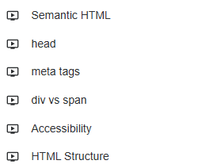
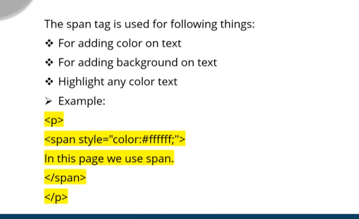

## HTML interviews ?!

1. !DOCTYPE là gì?
1. HTML là gì? Sự khác biệt giữa HTML & HTML5? Ưu điểm của HTML5?
2. Làm thế nào để chuyển hướng đến 1 phần cụ thể của trang web bằng HTML
- Sử dụng thẻ a và href là id của phần cần chuyển hướng
```html
<a href="#section1">Chuyển hướng đến phần cần chuyển hướng</a>
<section id ="section1"> contennnnnnnnnnt here</section>
```

3.  What are the 3 differences between Block-Level and Inline Elements?
3. What is the difference between <div> and <span> element?
3.  What is the difference between <section> & <article> elements?
3. Thẻ <b> vs <strong> có giống nhau không ? Nếu không hãy giải thích tại sao ?
4. Có mấy loại Webs Storage trong HTML5 ?
- Session  Storage ?
- Local Storage ?
5. Thẻ semantic là gì ?
- header
- footer
- secssion
6. Có những loại tag nào để hiển thị table ?
- caption 
- table header
- table row
- table data
<!-- - <table> <tr> <th> <td> <caption> -->

7. Mục đích của thẻ meta ?


8. Có những thuộc tính nào được sử dụng trong thẻ image?
alt
src
....
9. Image map là gì ?!
10. Span tag được sử dụng như thế nào ?!


11. Iframe ?
12. Sự khác biệt giữa absolute và relative URL?Sự khác biệt giữa URL tuyệt đối và URL tương đối là gì?
13. Khác biệt giữa link và thẻ a ?
14. Handle event như thế nào trong HTMl

Advanced hơn thì sẽ hỏi đến các câu hỏi liên quan đên Form


## CSS 
1. CSS Terminology, vài thuộc tính ?
2. CÓ mấy kiểu CSS, loại nào được ưu tiên nhất?
- Inline
- EmmbedCSS
- Extenal CSS
3. RGBA mean ? HSL
4. Z-Index
5. Universal selector
6. Các css link state?
- link
- a:visited
- a:hover
- a:active
7. Shadow effect, các value của nó
8. Cell padding, Cell spacing
9. Keyframe được sử dụng như thế nào ?!
10. Flex-Grid
11. Adding 3D transition : https://www.youtube.com/watch?v=76RFEWtPFK0
12. 18. Responsive Design @media :  SYntax
13. Box model
14. visibility hidden vs display none
15. Class vs ID
16. Data Attribute
17. CSS Preprocessors pseudo-class pseudo-element
18. Block - Inline
19. Sự khác biệt giữa vị trí: tương đối/tuyệt đối/cố định là gì?
## Câu hỏi liên quan đến tình huống ?

Collapse margin
CHia giao diện Layout
WEb Design
Lựa chọn thẻ


####


