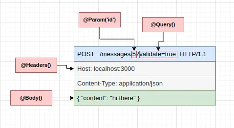

# NestJS

## Core Concepts & Dependencies Injection

### NestJS là gì? Tại sao nên sử dụng NestJS?

NestJS là một framework cho Node.js được xây dựng dựa trên TypeScript. Nó sử dụng các khái niệm và mô hình từ Angular để cung cấp một kiến trúc mạnh mẽ và dễ mở rộng cho việc phát triển các ứng dụng server-side. Dưới đây là một số lý do tại sao nên sử dụng NestJS:

- TypeScript: NestJS được xây dựng hoàn toàn bằng TypeScript, mang lại lợi ích của việc sử dụng một ngôn ngữ mạnh mẽ với tính năng kiểm tra kiểu tĩnh, giúp giảm thiểu lỗi và cải thiện khả năng bảo trì mã nguồn.

- Kiến trúc mô-đun: NestJS sử dụng kiến trúc mô-đun, cho phép bạn tổ chức mã nguồn thành các module riêng biệt, dễ quản lý và tái sử dụng.

- Dependency Injection: NestJS cung cấp cơ chế Dependency Injection mạnh mẽ, giúp quản lý các phụ thuộc giữa các thành phần trong ứng dụng một cách dễ dàng và hiệu quả.

- Hỗ trợ đa dạng: NestJS hỗ trợ nhiều thư viện và công nghệ phổ biến như TypeORM, Mongoose, GraphQL, WebSockets, và nhiều hơn nữa, giúp bạn dễ dàng tích hợp và sử dụng các công nghệ này trong ứng dụng của mình.

- Cộng đồng và tài liệu phong phú: NestJS có một cộng đồng lớn và tài liệu phong phú, giúp bạn dễ dàng tìm kiếm sự hỗ trợ và học hỏi từ các nguồn tài liệu có sẵn.

- Hiệu suất cao: NestJS được tối ưu hóa cho hiệu suất cao, giúp bạn xây dựng các ứng dụng server-side mạnh mẽ và hiệu quả.

- Dễ dàng kiểm thử: NestJS cung cấp các công cụ và mô hình để dễ dàng viết và chạy các bài kiểm thử, giúp đảm bảo chất lượng và độ tin cậy của ứng dụng.

Với những lợi ích trên, NestJS là một lựa chọn tuyệt vời cho việc phát triển các ứng dụng server-side hiện đại và mạnh mẽ.


### Setting Up First Nest Project


Để bắt đầu một dự án NestJS mới, bạn cần cài đặt Nest CLI (Command Line Interface) bằng cách chạy lệnh sau:

```bash
npm install -g @nestjs/cli
nest new project-name
```

Sau khi cài đặt Nest CLI và tạo một dự án mới, bạn có thể chạy ứng dụng NestJS bằng cách sử dụng lệnh sau:

```bash
cd project-name
npm run start
```

Lệnh `npm run start` sẽ khởi chạy ứng dụng NestJS và mở cổng mặc định 3000 để lắng nghe các yêu cầu HTTP. Bạn có thể truy cập ứng dụng NestJS qua địa chỉ `http://localhost:3000` trong trình duyệt web của bạn.

Sau khi đã cài đặt và khởi chạy dự án NestJS, bạn có thể bắt đầu phát triển ứng dụng của mình bằng cách tạo các module, controller, service, và các thành phần khác trong ứng dụng.

### Tools

ESLint là một công cụ kiểm tra mã nguồn JavaScript và TypeScript để phát hiện và sửa lỗi cú pháp, phong cách và logic trong mã nguồn. Nó giúp đảm bảo mã nguồn của bạn tuân thủ các quy tắc và tiêu chuẩn chất lượng mã nguồn.

```bash
npm run lint
```

Prettier là một công cụ tự động định dạng mã nguồn JavaScript và TypeScript để giữ mã nguồn của bạn dễ đọc và dễ hiểu. Nó giúp duy trì một định dạng chuẩn cho mã nguồn của bạn và giảm thời gian và công sức cần thiết để định dạng mã nguồn thủ công.

```bash
npm run format
```

### Core concepts

- Application:
  - HTTP server
  - Microservice Application
  - A Standalone Application
- Các thành phần của NestJs
  
- Module:
  - Là các khối xây dựng cơ bản của ứng dụng NestJS và chứa các controller, provider, và các thành phần khác.
  - Mỗi ứng dụng NestJS có ít nhất một module gốc (root module) được gọi là `AppModule`.
  

- Decorator:
  
  
  
  
  - Là các hàm `đặc biệt` được sử dụng để thêm metadata hoặc chức năng cho các class, methods, hoặc properties trong TypeScript.
  - NestJS sử dụng các decorator để đánh dấu các class, methods, properties, và các thành phần khác trong ứng dụng.
  - Ví dụ: `@Module`, `@Controller`, `@Injectable`, `@Get`, `@Post`, `@Put`, `@Delete`, `@Param`, `@Body`, `@Query`, `@Inject`, `@UseGuards`, `@UseInterceptors`, `@UseFilters`, `@UsePipes`, và nhiều decorator khác.
  - Có thể hình dung nó như 1 chiếc áo hay 1 cái phụ kiện gì đó chúng ta đeo vào để trở nên mạnh hơn, đẹp hơn, hoặc thông minh hơn.

- Controller:
  -  `@Controller()`
  - Khi bạn có 1 thành phần Module, bạn cần 1 cách để xử lý các yêu cầu HTTP từ client và trả về các phản hồi tương ứng.
  - Controller là một thành phần trong ứng dụng NestJS được sử dụng để xử lý các yêu cầu HTTP từ client và trả về các phản hồi tương ứng.
  - Mỗi controller chứa một hoặc nhiều route handlers (methods) được gắn với các endpoint HTTP cụ thể.
  - Ví dụ: `@Get`, `@Post`, `@Put`, `@Delete`, `@Patch`, `@Options`, `@Head`, `@All`.
  
  

- Provider:
  - Về đơn giản là 1 Class có thể được đưa vào các lớp khác thông qua Dependency Injection.
  - `@Injectable()`
  - Ví dụ như khi bạn đánh dấu 1 class với `@Injectable()`, bạn có thể sử dụng nó trong các controller, service, hoặc các thành phần khác trong ứng dụng NestJS bằng cách sử dụng provider.

  VD: 
  ```typescript
  @Injectable()
  export class UserService {
    getUsers(): string {
      return 'This action returns all users';
    }
  }
  ```
  ```typescript
  @Controller('users')
  export class UserController {
    constructor(private readonly userService: UserService) {}

    @Get()
    findAll(): string {
      return this.userService.getUsers();
    }
  }
  ```

  ```typescript
  @Module({
    controllers: [UserController],
    providers: [UserService],
  })
  export class UserModule {}
  ```
- Request Response:
  
  
- Middleware:
  - Middleware là một hàm hoặc một class được sử dụng để xử lý các yêu cầu HTTP trước khi chúng được chuyển đến các route handlers (controllers) hoặc sau khi chúng được xử lý bởi các route handlers.
  - Middleware có thể thực hiện các chức năng như xác thực, ghi log, xử lý lỗi, và nhiều chức năng khác.
  - Middleware có thể được áp dụng cho toàn bộ ứng dụng hoặc cho một số route cụ thể.
  - Ví dụ: `@Middleware`, `@Use`, `@UseGuards`, `@UseInterceptors`, `@UseFilters`, `@UsePipes`.
  - Ví dụ như bạn đi máy bay thì chúng ta không thể vào được máy bay luôn mà chúng ta cần làm thủ tục gửi hành lí, sau đó đi qua cửa an ninh, xuất trình thẻ lên máy bay ....sau đó mới lên được máy bay. Việc thực hiện 1 Request cũng tương tự như vậy, chúng ta cần phải đi qua các bước kiểm tra, xử lý trước khi đến được đích.

  ```typescript
  import { Module, NestModule, MiddlewareConsumer } from '@nestjs/common';
  import { LoggerMiddleware } from './common/middleware/logger.middleware';
  import { CatsModule } from './cats/cats.module';

  @Module({
    imports: [CatsModule],
  })
  export class AppModule implements NestModule {
    configure(consumer: MiddlewareConsumer) {
      consumer
        .apply(LoggerMiddleware)
        .forRoutes('cats');
    }
  }
  ```
  ```typescript
  consumer
  .apply(LoggerMiddleware)
  .exclude(
    { path: 'cats', method: RequestMethod.GET },
    { path: 'cats', method: RequestMethod.POST },
    'cats/(.*)',
  )
  .forRoutes(CatsController);
  ```
- Guards
  - Guards là các hàm hoặc class được sử dụng để kiểm tra và xác thực các yêu cầu HTTP trước khi chúng được chuyển đến các route handlers (controllers).
  - Guards có thể được sử dụng để kiểm tra quyền truy cập, xác thực người dùng, kiểm tra dữ liệu đầu vào, và nhiều chức năng khác.
  - Ví dụ: `@Guard`, `@UseGuards `
  - Ví dụ như khi bạn vào 1 quán bar, bạn cần phải xuất trình thẻ căn cước hoặc thẻ sinh viên để chứng minh bạn đủ tuổi để vào quán bar. Guard cũng tương tự như vậy, nó sẽ kiểm tra xem bạn có đủ quyền truy cập vào 1 route hay không.

  ```typescript
  import { Injectable, CanActivate, ExecutionContext } from '@nestjs/common';
  import { Observable } from 'rxjs';
  
  @Injectable()
  export class AuthGuard implements CanActivate {
    canActivate(
      context: ExecutionContext,
    ): boolean | Promise<boolean> | Observable<boolean> {
      return true;
    }
  }
  ```
  ```typescript
  import { Controller, Get, UseGuards } from '@nestjs/common';
  import { AuthGuard } from './auth.guard';

  @Controller('cats')
  export class CatsController {
    @UseGuards(AuthGuard)
    @Get()
    findAll(): string {
      return 'This action returns all cats';
    }
  }
  ```
- Interceptors
  - Interceptors là các class được sử dụng để xử lý các yêu cầu HTTP trước khi chúng được chuyển đến các route handlers (controllers) hoặc sau khi chúng được xử lý bởi các route handlers.
  - Interceptors có thể thực hiện các chức năng như ghi log, xử lý lỗi, thay đổi dữ liệu, CACHING, SERIALIZE, và nhiều chức năng khác trước hoặc sau khi yêu cầu được xử lý.
  - Ví dụ: `@Interceptor`, `@UseInterceptors`

  ```typescript
  import { Injectable, NestInterceptor, ExecutionContext, CallHandler } from '@nestjs/common';
  import { Observable } from 'rxjs';

  @Injectable()
  export class LoggingInterceptor implements NestInterceptor {
    intercept(context: ExecutionContext, next: CallHandler): Observable<any> {
      console.log('Before...');
  
      const now = Date.now();
      return next
        .handle()
        .pipe(tap(() => console.log(`After... ${Date.now() - now}ms`)));
    }
  }
  ```
  ```typescript
  import { Controller, Get, UseInterceptors } from '@nestjs/common';
  import { LoggingInterceptor } from './logging.interceptor';

  @Controller('cats')
  export class CatsController {
    @UseInterceptors(LoggingInterceptor)
    @Get()
    findAll(): string {
      return 'This action returns all cats';
    }
  }
  ```

- Pipes:
  - Pipes là các class được sử dụng để xử lý và kiểm tra dữ liệu đầu vào trước khi chúng được chuyển đến các route handlers (controllers) hoặc sau khi chúng được xử lý bởi các route handlers.
  - Pipes có thể thực hiện các chức năng như kiểm tra kiểu dữ liệu, chuyển đổi dữ liệu, xác thực dữ liệu, và nhiều chức năng khác.
  - Ví dụ: `@Pipe`, `@UsePipes`
  - `ValidationPipe`
  - `ParseIntPipe`
  - `ParseFloatPipe`
  - `ParseBoolPipe`
  - `ParseArrayPipe`
  - `ParseUUIDPipe`
  - `ParseEnumPipe`
  - `DefaultValuePipe`
  - `ParseFilePipe`

  ```typescript
  import { Injectable, PipeTransform, ArgumentMetadata } from '@nestjs/common';

  @Injectable()
  export class ValidationPipe implements PipeTransform {
    transform(value: any, metadata: ArgumentMetadata) {
      // validate the value
      return value;
    }
  }
  ```
  ```typescript
  import { Controller, Get, UsePipes } from '@nestjs/common';
  import { ValidationPipe } from './validation.pipe';

  @Controller('cats')
  export class CatsController {
    @UsePipes(ValidationPipe)
    @Get()
    findAll(): string {
      return 'This action returns all cats';
    }
  }
  ```

  ```typescript
  //Controlle
  @Get(':id')
  async findOne(@Param('id', ParseIntPipe) id: number) {
    return this.catsService.findOne(id);
  }

  //Request
  GET localhost:3000/abc

  //Handle
  {
    "statusCode": 400,
    "message": "Validation failed (numeric string is expected)",
    "error": "Bad Request"
  }

  //Custom

  @Get(':id')
  async findOne(
    @Param('id', new ParseIntPipe({ errorHttpStatusCode: HttpStatus.NOT_ACCEPTABLE }))
    id: number,
  ) {
    return this.catsService.findOne(id);
  }

  @Get()
  async findOne(@Query('id', ParseIntPipe) id: number) {
    return this.catsService.findOne(id);
  }

  @Get(':uuid')
  async findOne(@Param('uuid', new ParseUUIDPipe()) uuid: string) {
    return this.catsService.findOne(uuid);
  }
  ```

- Exception Filters:
  - Exception Filters là các class được sử dụng để xử lý các ngoại lệ (exceptions) được ném trong quá trình xử lý yêu cầu HTTP.
  - Exception Filters có thể được sử dụng để xử lý và trả về các phản hồi lỗi tùy chỉnh khi xảy ra ngoại lệ.
  - Ví dụ: `@ExceptionFilter`, `@UseFilters`
  
  ```typescript
  import { ExceptionFilter, Catch, ArgumentsHost, HttpException } from '@nestjs/common';

  @Catch(HttpException)
  export class HttpExceptionFilter implements ExceptionFilter {
    catch(exception: HttpException, host: ArgumentsHost) {
      const ctx = host.switchToHttp();
      const response = ctx.getResponse();
      const request = ctx.getRequest();
      const status = exception.getStatus();

      response
        .status(status)
        .json({
          statusCode: status,
          timestamp: new Date().toISOString()
          })
    }
  }
  ```
  ```typescript
  @Controller('cats')
  export class CatsController {
    @Get()
    @UseFilters(HttpExceptionFilter)
    findAll() {
      throw new HttpException('Forbidden', HttpStatus.FORBIDDEN);
    }
  }
  ```


# TypeORM
- TypeORM là một thư viện ORM (Object-Relational Mapping) cho TypeScript và JavaScript (ES7, ES6, ES5). Nó hỗ trợ nhiều cơ sở dữ liệu như MySQL, MariaDB, PostgreSQL, SQLite, MS SQL Server, Oracle, WebSQL.
- TypeORM cho phép bạn tạo các entity (đối tượng) để tương tác với cơ sở dữ liệu mà không cần viết các truy vấn SQL trực tiếp. Thay vào đó, bạn có thể sử dụng các phương thức của TypeORM để thực hiện các thao tác CRUD (Create, Read, Update, Delete) trên cơ sở dữ liệu.
- TypeORM cũng hỗ trợ các mối quan hệ giữa các entity, các truy vấn phức tạp, và các tính năng như eager loading, lazy loading, transaction, migration, và nhiều tính năng khác.
- TypeORM cung cấp một cách tiếp cận linh hoạt và dễ sử dụng để làm việc với cơ sở dữ liệu trong ứng dụng TypeScript hoặc JavaScript của bạn.
# Cách cài đặt TypeORM vs NestJS
- Để sử dụng TypeORM trong NestJS, bạn cần cài đặt các gói sau:
  1. TypeORM: `npm install typeorm`
  2. @nestjs/typeorm: `npm install @nestjs/typeorm`
  3. mysql: `npm install mysql`
- Bạn cũng cần cài đặt các gói khác nếu sử dụng cơ sở dữ liệu khác như PostgreSQL, SQLite, hoặc MS SQL Server.
- Sau khi cài đặt các gói, bạn cần cấu hình TypeORM trong tệp `app.module.ts` của NestJS để kết nối với cơ sở dữ liệu.
- Dưới đây là một ví dụ về cách cấu hình TypeORM trong NestJS để kết nối với cơ sở dữ liệu MySQL:
  ```typescript
  import { Module } from '@nestjs/common';
  import { TypeOrmModule } from '@nestjs/typeorm';
  import { AppController } from './app.controller';
  import { AppService } from './app.service';
  import { User } from './user.entity';

  @Module({
    imports: [
      TypeOrmModule.forRoot({
        type: 'mysql',
        host: 'localhost',
        port: 3306,
        username: 'root',
        password: 'password',
        database: 'test',
        entities: [User],
        synchronize: true,
      }),
    ],
    controllers: [AppController],
    providers: [AppService],
  })
  export class AppModule {}
  ```
- Trong ví dụ trên, chúng ta đã import `TypeOrmModule` từ `@nestjs/typeorm` và cấu hình nó trong phần `imports` của `@Module`. Chúng ta đã chỉ định các thông số kết nối cho cơ sở dữ liệu MySQL, bao gồm `host`, `port`, `username`, `password`, `database`, `entities`, và `synchronize`.
- `entities` là một mảng chứa các entity (đối tượng) mà chúng ta muốn sử dụng trong ứng dụng. Trong trường hợp này, chúng ta đã import `User` từ tệp `user.entity.ts`.
- `synchronize` là một cờ để tự động tạo bảng trong cơ sở dữ liệu nếu chúng không tồn tại. Điều này hữu ích trong quá trình phát triển, nhưng không nên sử dụng trong môi trường sản xuất.
- Sau khi cấu hình TypeORM, bạn có thể sử dụng các entity và các phương thức của TypeORM để tương tác với cơ sở dữ liệu trong ứng dụng NestJS của bạn.

# CRUD Operations with TypeORM in NestJS
- Để thực hiện các thao tác CRUD (Create, Read, Update, Delete) với TypeORM trong NestJS, bạn có thể sử dụng các phương thức của TypeORM như `getRepository`, `save`, `find`, `update`, `delete`, và nhiều phương thức khác.
- Dưới đây là một ví dụ về cách thực hiện các thao tác CRUD với TypeORM trong NestJS:
  ```typescript
  import { Injectable } from '@nestjs/common';
  import { InjectRepository } from '@nestjs/typeorm';
  import { Repository } from 'typeorm';
  import { User } from './user.entity';

  @Injectable()
  export class UserService {
    constructor(
      @InjectRepository(User)
      private userRepository: Repository<User>,
    ) {}

    async createUser(user: User): Promise<User> {
      return this.userRepository.save(user);
    }

    async getUsers(): Promise<User[]> {
      return this.userRepository.find();
    }

    async getUserById(id: number): Promise<User> {
      return this.userRepository.findOne(id);
    }

    async updateUser(id: number, user: User): Promise<User> {
      await this.userRepository.update(id, user);
      return this.userRepository.findOne(id);
    }

    async deleteUser(id: number): Promise<void> {
      await this.userRepository.delete(id);
    }
  }
  ```
# So sánh Save vs Create trong TypeORM
- Trong TypeORM, có hai phương thức để tạo một bản ghi mới trong cơ sở dữ liệu: `save` và `create`. Dưới đây là sự khác biệt giữa chúng:
  - `save`: Phương thức `save` được sử dụng để lưu một bản ghi đã tồn tại hoặc tạo một bản ghi mới nếu nó chưa tồn tại. Nếu bản ghi đã tồn tại, nó sẽ cập nhật bản ghi đó với dữ liệu mới. Nếu bản ghi chưa tồn tại, nó sẽ tạo một bản ghi mới.
  - `create`: Phương thức `create` được sử dụng để tạo một bản ghi mới mà không lưu nó vào cơ sở dữ liệu. Bạn cần gọi phương thức `save` sau khi sử dụng phương thức `create` để lưu bản ghi vào cơ sở dữ liệu.
  - Các hook trước và sau lưu (beforeInsert, afterInsert) chỉ hoạt động với phương thức `save`, không hoạt động với phương thức `create`.
# Migrations trong TypeORM
- Migration là quá trình tạo và quản lý các phiên bản cơ sở dữ liệu. Trong TypeORM, bạn có thể sử dụng migrations để tạo các phiên bản cơ sở dữ liệu, thay đổi cấu trúc cơ sở dữ liệu, và chuyển đổi dữ liệu giữa các phiên bản.
- Để tạo một migration trong TypeORM, bạn có thể sử dụng lệnh `typeorm migration:create` với các tùy chọn như `--name` để chỉ định tên của migration và `--dir` để chỉ định thư mục lưu trữ migration.
- Dưới đây là một ví dụ về cách tạo một migration trong TypeORM:
  ```bash
  npx typeorm migration:create -n CreateUsersTable
  ```
- Sau khi tạo migration, bạn có thể sử dụng lệnh `typeorm migration:run` để chạy migration và áp dụng các thay đổi vào cơ sở dữ liệu.
- Dưới đây là một ví dụ về cách chạy migration trong TypeORM:
  ```bash
  npx typeorm migration:run
  ```
- Migration là một công cụ hữu ích để quản lý cấu trúc cơ sở dữ liệu trong ứng dụng của bạn và đảm bảo rằng các phiên bản cơ sở dữ liệu được duy trì và cập nhật một cách an toàn.
# findOne vs find trong TypeORM
- Trong TypeORM, có hai phương thức để truy vấn dữ liệu từ cơ sở dữ liệu: `findOne` và `find`. Dưới đây là sự khác biệt giữa chúng:
  - `findOne`: Phương thức `findOne` được sử dụng để truy vấn một bản ghi duy nhất từ cơ sở dữ liệu dựa trên một điều kiện. Nếu không tìm thấy bản ghi này, nó sẽ trả về `undefined`.
  - `find`: Phương thức `find` được sử dụng để truy vấn tất cả các bản ghi từ cơ sở dữ liệu dựa trên một điều kiện. Nếu không tìm thấy bản ghi nào, nó sẽ trả về một mảng rỗng.
# update 
- Phương thức `update` trong TypeORM được sử dụng để cập nhật một hoặc nhiều bản ghi trong cơ sở dữ liệu dựa trên một điều kiện. Nó trả về một số nguyên thể hiện số lượng bản ghi đã được cập nhật.
- Dưới đây là một ví dụ về cách sử dụng phương thức `update` trong TypeORM:
  ```typescript
  await this.userRepository.update({ id: 1 }, { name: 'John Doe' });
  ```
  ```typescript 
  // use hooks
  async updateUser(id: number, attrs: Partial<User>):{
    const user = await this.findOne(id);
    if (!user) {
      throw new NotFoundException(`User with ID ${id} not found`);
    }
    Object.assign(user, attrs);
    return this.userRepository.save(user);
  }
  ```
# remove
- Phương thức `remove` trong TypeORM được sử dụng để xóa một bản ghi từ cơ sở dữ liệu. Bạn có thể truyền một bản ghi hoặc một ID của bản ghi để xóa.
- Dưới đây là một ví dụ về cách sử dụng phương thức `remove` trong TypeORM:
  ```typescript
  await this.userRepository.remove(user);
  ```
  ```typescript
    // use hooks
  async deleteUser(id: number): Promise<void> {
    const user = await this.findOne(id);
    if (!user) {
      throw new NotFoundException(`User with ID ${id} not found`);
    }
    await this.userRepository.remove(user);
  }
  ```
# QueryBuilder trong TypeORM

# GraphQL

# Init Project

- Cài đặt nest cli
```bash
$ npm i -g @nestjs/cli
$ nest new nest-grapql
```
- Sau khi cài đặt xong, chạy lệnh sau để kiểm tra
```bash
$ cd nest-grapql
$ npm run start:dev
```
- Mở trình duyệt và truy cập vào địa chỉ `http://localhost:3000/` để kiểm tra
- Tip nhỏ: nên comment file .eslintrc.js để tránh lỗi eslint - comment dòng `module.exports = { ... }` đến hết file
- Câu hỏi : npm run start hoặc npm run start:dev khác nhau như thế nào?

# Install GraphQL

- Cài đặt thư viện graphql

```bash
$ npm i @nestjs/graphql @nestjs/apollo @apollo/server graphql
```

- Trong file `src/app.module.ts` thêm đoạn code để setup graphql + apollo server (Server GraphQL)

- src/app.module.ts
```typescript
import { ApolloDriver, ApolloDriverConfig } from '@nestjs/apollo';
import { Module } from '@nestjs/common';
import { GraphQLModule } from '@nestjs/graphql';
import { ApolloServerPluginLandingPageLocalDefault } from '@apollo/server/plugin/landingPage/default';
import { join } from 'path';

@Module({
  imports: [
    GraphQLModule.forRoot<ApolloDriverConfig>({
      driver: ApolloDriver, // sử dụng driver ApolloDriver
      playground: false, // tắt chế độ playground mặt định
      autoSchemaFile: join(process.cwd(), 'src/schema.gql'), // đường dẫn đến file schema
      plugins: [ApolloServerPluginLandingPageLocalDefault()], // thêm plugin landing page
    }),
  ],
})
export class AppModule {}

```
- Sau khi chúng ta chạy xong thì terminal sẽ hiện ra thông báo lỗi: Error: Query root type must be provided 
- Câu hỏi: Lỗi trên là do gì?

# Thêm 1 module mới

- Tạo resource `items` bằng nest cli

```bash
$ nest g res items --no-spec
```

- Lúc này chúng ta sẽ được hỏi muốn tạo kiểu transport nào, chọn  `GraphQL code first`

- Sau khi tạo xong, chúng ta sẽ thấy thư mục `items` được tạo ra trong thư mục `src` và hết lỗi Query root type must be provided (vì đã tạo ra 1 query type) => File schema.gql sẽ được tự động tạo ra

- Folder items bao gồm đầy đủ các file cần thiết để tạo ra 1 module graphql: `items.resolver.ts`, `items.service.ts`, `items.entity.ts`, `items.module.ts` và đã được import vào `app.module.ts`. Lúc này chúng ta có thể xem nó đc import vào `app.module.ts` như thế nào?

- src/app.module.ts
```typescript
import { ApolloServerPluginLandingPageLocalDefault } from '@apollo/server/plugin/landingPage/default';
import { ApolloDriver, ApolloDriverConfig } from '@nestjs/apollo';
import { Module } from '@nestjs/common';
import { GraphQLModule } from '@nestjs/graphql';
import { join } from 'path';
import { ItemsModule } from './items/items.module';

@Module({
  imports: [
    GraphQLModule.forRoot<ApolloDriverConfig>({
      driver: ApolloDriver, // sử dụng driver ApolloDriver
      playground: false, // tắt chế độ playground mặt định
      autoSchemaFile: join(process.cwd(), 'src/schema.gql'), // đường dẫn đến file schema
      plugins: [ApolloServerPluginLandingPageLocalDefault()], // thêm plugin landing page
    }),
    ItemsModule,
  ],
})
export class AppModule {}
```
- Xem kết quả bằng cách chạy lệnh `npm run start:dev` và truy cập vào địa chỉ `http://localhost:3000/graphql` để kiểm tra
- Lúc này chúng ta sẽ thấy 1 query `items` được tạo ra và có thể thử nghiệm nhưng sẽ bị lỗi vì chưa có dữ liệu

# Thêm database

- Sử dụng docker để tạo database postgres

- Tạo file `docker-compose.yml` trong thư mục gốc của project

- docker-compose.yml
```yml
version: '3'

services:
  db:
    image: postgres:14.4
    restart: always
    ports:
      - '5432:5432'
    environment:
      POSTGRES_PASSWORD: ${DB_PASSWORD}
      POSTGRES_DB: ${DB_NAME}
    container_name: anylistDB
    volumes:
      - ./postgres:/var/lib/postgresql/data

```
- thêm biến môi trường vào file `.env` trong thư mục gốc của project

- .env
```env
STATE=dev
DB_PASSWORD=algunpassword
DB_NAME=AnyList
DB_HOST=localhost
DB_PORT=5432
DB_USERNAME=postgres
```
- Tìm hiểu Dokcerfile và docker-compose.yml là gì?

- Chạy lệnh sau để tạo database ( lưu ý: cần cài đặt docker trước)
- Nếu sử dụng window thì dùng docker desktop là đủ
- Nếu file đc mount ra thì thêm `./postgres` vào file `.gitignore` để tránh lưu file vào git

```bash
$ docker-compose up -d
```
- Sau khi chạy xong, mở docker desktop để kiểm tra xem container đã được tạo chưa

- Cài đặt thư viện `TypeORM` và `pg` để kết nối với database postgres

```bash
$ npm i @nestjs/typeorm typeorm pg
```

- Thêm kết nối database vào file `src/app.module.ts`
- src/app.module.ts
```typescript
import { ApolloServerPluginLandingPageLocalDefault } from '@apollo/server/plugin/landingPage/default';
import { ApolloDriver, ApolloDriverConfig } from '@nestjs/apollo';
import { Module } from '@nestjs/common';
import { GraphQLModule } from '@nestjs/graphql';
import { TypeOrmModule } from '@nestjs/typeorm';
import { join } from 'path';
import { ItemsModule } from './items/items.module';

@Module({
  imports: [
    GraphQLModule.forRoot<ApolloDriverConfig>({
      driver: ApolloDriver, // sử dụng driver ApolloDriver
      playground: false, // tắt chế độ playground mặt định
      autoSchemaFile: join(process.cwd(), 'src/schema.gql'), // đường dẫn đến file schema
      plugins: [ApolloServerPluginLandingPageLocalDefault()], // thêm plugin landing page
    }),
    TypeOrmModule.forRoot({
      type: 'postgres',
      host: process.env.DB_HOST,
      port: +process.env.DB_PORT,
      username: process.env.DB_USERNAME,
      password: process.env.DB_PASSWORD,
      database: process.env.DB_NAME,
      synchronize: true,
      autoLoadEntities: true,
    }),
    ItemsModule,
  ],
})
export class AppModule {}
```

- Nếu chỉ thêm đơn thuần như thế này sẽ không load được các environment variables từ file `.env` => cần cài thêm thư viện @nestjs/config để load các biến môi trường từ file `.env`

```bash
$ npm i @nestjs/config
```

- Thêm đoạn config vào file `src/app.module.ts`

- src/app.module.ts
```typescript
import { ApolloServerPluginLandingPageLocalDefault } from '@apollo/server/plugin/landingPage/default';
import { ApolloDriver, ApolloDriverConfig } from '@nestjs/apollo';
import { Module } from '@nestjs/common';
import { GraphQLModule } from '@nestjs/graphql';
import { TypeOrmModule } from '@nestjs/typeorm';
import { join } from 'path';
import { ItemsModule } from './items/items.module';
import { ConfigModule } from '@nestjs/config';

@Module({
  imports: [
    ConfigModule.forRoot({
      isGlobal: true,
      envFilePath: '.env',
    }), // thêm module ConfigModule
    GraphQLModule.forRoot<ApolloDriverConfig>({
      driver: ApolloDriver, // sử dụng driver ApolloDriver
      playground: false, // tắt chế độ playground mặt định
      autoSchemaFile: join(process.cwd(), 'src/schema.gql'), // đường dẫn đến file schema
      plugins: [ApolloServerPluginLandingPageLocalDefault()], // thêm plugin landing page
    }),
    TypeOrmModule.forRoot({
      type: 'postgres',
      host: process.env.DB_HOST,
      port: +process.env.DB_PORT,
      username: process.env.DB_USERNAME,
      password: process.env.DB_PASSWORD,
      database: process.env.DB_NAME,
      synchronize: true,
      autoLoadEntities: true,
    }),
    ItemsModule,
  ],
})
export class AppModule {}
```
- Chạy lệnh `npm run start:dev` để kiểm tra kết nối database

# Tạo entity


