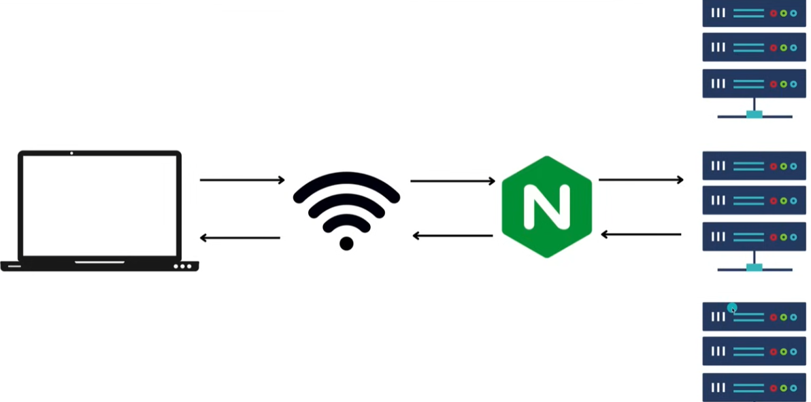
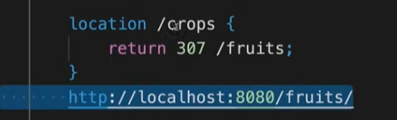

## NGINX là gì?
- NGINX là một web server mã nguồn mở, nhanh, nhẹ, hiệu quả và có thể mở rộng. Nó được sử dụng làm web server, reverse proxy, load balancer, HTTP cache và nhiều mục đích khác. NGINX được phát triển bởi Igor Sysoev vào năm 2002.

- Reverse proxy: NGINX có thể được sử dụng như một reverse proxy để chuyển hướng các yêu cầu từ internet đến các server ứng dụng web hoặc các server khác.
- Load balancer: NGINX cung cấp khả năng cân bằng tải giữa các server, giúp tăng hiệu suất và độ tin cậy của hệ thống.
- HTTP cache: NGINX có thể được sử dụng như một HTTP cache để lưu trữ các tài nguyên tĩnh và giảm thời gian phản hồi của server.
- Ngoài ra, NGINX còn cung cấp nhiều tính năng khác như SSL/TLS termination, gzip compression, URL rewriting, và nhiều tính năng bảo mật khác.
### Cài đặt NGINX
- Để cài đặt NGINX với Docker, chúng ta có thể sử dụng lệnh sau:
```bash
docker run -d -p 80:80 nginx
```
- Sau khi chạy lệnh trên, NGINX sẽ được cài đặt và chạy trên cổng 80 của máy chủ. Bạn có thể truy cập vào địa chỉ IP của máy chủ để kiểm tra xem NGINX đã được cài đặt thành công hay chưa.
### Serving Static Content
- nginx.conf
```bash
  http {
    server {
      listen 8008; # Listen on port 8008
      server_name localhost; # Set server name to localhost
      root /usr/share/nginx/html; # Set root directory to /usr/share/nginx/html
      index index.html; # Set index file to index.html
    }
  }
  events { }
```
- Khối http là ngữ cảnh chính để xử lý lưu lượng HTTP. Bên trong khối này, có một khối server định nghĩa các thiết lập cho một máy chủ ảo cụ thể.

- Trong khối server, chỉ thị listen 8008; yêu cầu NGINX lắng nghe các kết nối đến trên cổng 8008. Chỉ thị server_name localhost; đặt tên máy chủ là localhost, có nghĩa là khối máy chủ này sẽ xử lý các yêu cầu hướng đến localhost.

- Chỉ thị root /usr/share/nginx/html; xác định thư mục gốc cho máy chủ, nơi NGINX sẽ tìm kiếm các tệp để phục vụ cho khách hàng. Trong trường hợp này, nó được đặt là /usr/share/nginx/html. Chỉ thị index index.html; đặt tệp mặc định để phục vụ khi một thư mục được yêu cầu, đó là index.html.
- Restart NGINX:
  - ```bash
    docker exec -it <container_id> nginx -s reload
    ```
  - Sau khi khởi động lại NGINX, bạn có thể truy cập vào http://localhost:8008 để xem trang web mẫu được phục vụ bởi NGINX.
  - ```bash
    nginx -s reload
    ```
### Mime Types
- Mime types là một cách để xác định loại nội dung của một tệp dựa trên phần mở rộng của tên tệp. Mime types được sử dụng để xác định cách mà trình duyệt web sẽ xử lý tệp khi nó được tải xuống từ máy chủ.
- NGINX sử dụng chỉ thị types để xác định mime types cho các tệp được phục vụ. Chỉ thị types được sử dụng để xác định mime types cho các tệp được phục vụ. Chỉ thị này có thể được đặt trong các khối server, location hoặc http.
- Ví dụ:
```bash
  types {
    text/html html htm shtml; # Đăng ký mime type cho các tệp html, htm và shtml
    text/css css; # Đăng ký mime type cho các tệp css
    text/xml xml; # Đăng ký mime type cho các tệp xml
    image/gif gif;
    image/jpeg jpeg jpg;
    application/javascript js;
    application/atom+xml atom;
    application/rss+xml rss;
  }
```
```bash
  http {
    include mime.types; # Bao gồm tệp mime.types mặc định
  }
```
### Location Blocks
- Location blocks là một cách để xác định cách NGINX xử lý các yêu cầu HTTP dựa trên URL của yêu cầu. Location blocks có thể được sử dụng để xác định cách NGINX xử lý các yêu cầu cho các tệp cụ thể, thư mục hoặc các yêu cầu khác.
- Ví dụ:
```bash
  location / {
    root /usr/share/nginx/html; # Set root directory to /usr/share/nginx/html
    index index.html; # Set index file to index.html
  }
  location /images/ {
    root /usr/share/nginx; # Set root directory to /usr/share/nginx,để phục vụ các tệp trong thư mục /usr/share/nginx/images (localhost:8008/images)
  }
  location /static/ {
    alias /usr/share/nginx/html/images/; # Set alias to /usr/share/nginx/html/images, để phục vụ các tệp trong thư mục /usr/share/nginx/html/images (localhost:8008/static- Content là của thư mục /usr/share/nginx/html/images)
  }
```
```bash
  http {
    server {
      listen 8008; # Listen on port 8008
      server_name localhost; # Set server name to localhost
      root /usr/share/nginx/html; # Set root directory to /usr/share/nginx/html
      index index.html; # Set index file to index.html
      location / {
        root /usr/share/nginx/html; # Set root directory to /usr/share/nginx/html
        try_files $uri $uri/ /index.html; # try_files chỉ định cách NGINX xử lý các yêu cầu, nếu tệp hoặc thư mục không tồn tại, nó sẽ chuyển hướng yêu cầu đến index.html
      }
      location ~* /count/[0-9]+ {
        return 200 'This is a count URL'; # Nếu URL khớp với biểu thức chính quy /count/[0-9]+, NGINX sẽ trả về một phản hồi 200 với nội dung 'This is a count URL'
      }
      location ~* /count/[0-9]+ {
        root /usr/share/nginx/html; # Set root directory to /usr/share/nginx/html
        try_files $uri $uri/ /index.html; # try_files chỉ định cách NGINX xử lý các yêu cầu, nếu tệp hoặc thư mục không tồn tại, nó sẽ chuyển hướng yêu cầu đến index.html
      }
    }
  }
```
### Rewrites and Redirections
- Rewrite và redirections là cách để chuyển hướng yêu cầu HTTP từ một URL đến một URL khác. Rewrite và redirections có thể được sử dụng để chuyển hướng yêu cầu từ một URL cũ đến một URL mới, hoặc để chuyển hướng yêu cầu từ một URL đến một tệp cụ thể.
- Ví dụ:
```bash
  location /old-url {
    rewrite ^/old-url$ /new-url permanent; # Chuyển hướng yêu cầu từ /old-url đến /new-url với mã trạng thái 301
  }
  location /old-url {
    return 301 /new-url; # Chuyển hướng yêu cầu từ /old-url đến /new-url với mã trạng thái 301
  }
  location /old-url {
    rewrite ^/old-url$ /new-url last; # Chuyển hướng yêu cầu từ /old-url đến /new-url và ngừng xử lý các chỉ thị rewrite khác
  }
  location /old-url {
    rewrite ^/old-url$ /new-url break; # Chuyển hướng yêu cầu từ /old-url đến /new-url và tiếp tục xử lý các chỉ thị rewrite khác
  }
```


### Reverse Proxy
- Reverse proxy là một loại proxy server mà nó chuyển hướng các yêu cầu từ internet đến các server ứng dụng web hoặc các server khác. Reverse proxy giúp bảo vệ các server ứng dụng web khỏi các cuộc tấn công mạng và giúp cân bằng tải giữa các server.
- Ví dụ:
```bash
  location / {
    proxy_pass http://localhost:8080; # Chuyển hướng yêu cầu đến http://localhost:8080
  }
  location / {
    proxy_pass http://localhost:8080; # Chuyển hướng yêu cầu đến http://localhost:8080
    proxy_set_header Host $host; # Thiết lập tiêu đề Host cho yêu cầu
    proxy_set_header X-Real-IP $remote_addr; # Thiết lập tiêu đề X-Real-IP cho yêu cầu
    proxy_set_header X-Forwarded-For $proxy_add_x_forwarded_for; # Thiết lập tiêu đề X-Forwarded-For cho yêu cầu
    proxy_set_header X-Forwarded-Proto $scheme; # Thiết lập tiêu đề X-Forwarded-Proto cho yêu cầu
  }
```
- Trong ví dụ trên, chỉ thị proxy_pass http://localhost:8080; chuyển hướng yêu cầu đến http://localhost:8080. Chỉ thị proxy_set_header được sử dụng để thiết lập các tiêu đề cho yêu cầu được chuyển hướng.
### Load Balancing
- Load balancing là một cách để phân phối lưu lượng truy cập giữa các server ứng dụng web hoặc các server khác. Load balancing giúp tăng hiệu suất và độ tin cậy của hệ thống bằng cách phân phối lưu lượng truy cập giữa các server.
- Ví dụ:
```bash
  upstream backend {
    server localhost:8080; # Định nghĩa một nhóm các máy chủ backend
    server localhost:8081;
    server localhost:8082;
  }
  server {
    listen 8008; # Listen on port 8008
    server_name localhost; # Set server name to localhost
    location / {
      proxy_pass http://backend; # Chuyển hướng yêu cầu đến nhóm máy chủ backend
    }
  }
```
- Trong ví dụ trên, chỉ thị upstream backend { ... } định nghĩa một nhóm các máy chủ backend với các máy chủ localhost:8080, localhost:8081 và localhost:8082. Chỉ thị proxy_pass http://backend; chuyển hướng yêu cầu đến nhóm máy chủ backend.
### Caching
- Caching là một cách để lưu trữ các tài nguyên tĩnh như hình ảnh, tệp CSS và tệp JavaScript trên máy chủ proxy hoặc trình duyệt của người dùng để giảm thời gian phản hồi của server và tăng tốc độ tải trang web.
- Ví dụ:
```bash
  http {
    proxy_cache_path /var/cache/nginx levels=1:2 keys_zone=my_cache:10m max_size=10g inactive=60m use_temp_path=off; # Định nghĩa một vùng cache với tên my_cache
    server {
      listen 8008; # Listen on port 8008
      server_name localhost; # Set server name to localhost
      location / {
        proxy_cache my_cache; # Sử dụng vùng cache my_cache
        proxy_cache_valid 200 302 10m; # Cache các phản hồi 200 và 302 trong 10 phút
        proxy_cache_valid 404 1m; # Cache các phản hồi 404 trong 1 phút
        proxy_cache_key $scheme$host$request_uri; # Thiết lập khóa cache
        proxy_pass http://localhost:8080; # Chuyển hướng yêu cầu đến http://localhost:8080
      }
    }
  }
```
- Trong ví dụ trên, chỉ thị proxy_cache_path /var/cache/nginx levels=1:2 keys_zone=my_cache:10m max_size=10g inactive=60m use_temp_path=off; định nghĩa một vùng cache với tên my_cache. Chỉ thị proxy_cache my_cache; sử dụng vùng cache my_cache. Chỉ thị proxy_cache_valid 200 302 10m; cache các phản hồi 200 và 302 trong 10 phút. Chỉ thị proxy_cache_valid 404 1m; cache các phản hồi 404 trong 1 phút. Chỉ thị proxy_cache_key $scheme$host$request_uri; thiết lập khóa cache. Chỉ thị proxy_pass http://localhost:8080; chuyển hướng yêu cầu đến http://localhost:8080.
