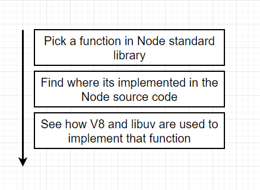

# NodeJS

## Node Internals

- Chúng ta sẽ có những đoạn mã code JS
- Khi chúng ta chạy NodeJS và sau đó là tệp index.js tức là chúng ta đang gọi dự án Nodejs
- Giống như bất cứ JS Project nào, NodeJS sẽ có 1 tập hợp những dependencies mà nó sử dụng để thực thi code của bạn. Hai dependencies chính là `V8` và `Libuv`
- `V8` là một engine JS được phát triển bởi Google, nó chịu trách nhiệm biên dịch mã JS của bạn thành mã máy. Mục đích của dự án này là có thể thực thi mã JS bên ngoài trình duyệt
- `Libuv` là một thư viện C được sử dụng để thực hiện các thao tác I/O không đồng bộ và xử lý sự kiện trên nền tảng đa luồng. Nó cho phép NodeJS truy cập vào Hệ điều hành, hệ thống tệp và mạng...
- Câu hỏi là tại sao chúng ta không sư dụng `V8` và `Libuv` trực tiếp mà lại sử dụng NodeJS?
  - Điều đầu tiên cần hiểu là trong nội bộ của NodeJS, có một số thư viện được viết bằng C++ và được gọi là `C++ bindings`. Những thư viện này giúp NodeJS tương tác với `V8` và `Libuv`
  - Nếu bạn là 1 JS dev, bạn có thể không muốn viết code C++ cả ngày
  
  - Một điều khác mà NodeJS làm là cung cấp 1 loạt các trình bao bọc và 1 số API rất nhất quán để chúng ta có thể sử dụng như `fs`, `http`, `crypto`...
  
## Modules Implementation

- Chúng ta sẽ tìm hiểu bằng cách chọn ngẫu nhiên 1 số chức năng bên trong thư viện chuẩn của NodeJS
- Sau đó chúng ta sẽ cố gắng tìm nơi chức năng đó được thực thi trong mã nguồn của NodeJS
- Sau đó chúng ta sẽ tìm hiểu cách NodeJS sử dụng `V8` và `Libuv` để thực thi chức năng đó


- Quá trình binding chính là việc kết nối giữa JS và C++
## Node Backed by C++
- NodeJS được viết bằng C++ và JS
- V8 là engine JS được viết bằng C++
- Libuv là thư viện C được sử dụng để thực hiện các thao tác I/O không đồng bộ và xử lý sự kiện trên nền tảng đa luồng
- NodeJS sử dụng `C++ bindings` để tương tác với `V8` và `Libuv`

## Basic Of Threads
- Bất cứ khi nào chúng ta chạy 1 chương trình, chúng ta sẽ có 1 Process. Process là 1 thể hiện của 1 chương trình máy tính đang chạy trên máy tính của bạn
- Trong mỗi Process, chúng ta có 1 hoặc nhiều Threads. Mỗi Thread là 1 đơn vị nhỏ nhất của xử lý trong 1 Process
- Thread được gửi đến CPU để thực thi code
- Mỗi Thread có thể thực thi code độc lập với các Thread khác

Chúng cũng sẽ phải chờ đợi CPU để thực thi code của mình bằng cách chờ OS Schedule lên lịch cho chúng

Vì thế để chúng ta có thể xử lí các Thread nhanh hơn hoặc nhiều hơn tại 1 thời điểm chúng ta cần bổ sung thêm CPU

## Event Loop, event loop implementation, event loop tick
- Event Loop là một khái niệm quan trọng trong NodeJS
- Event Loop là một vòng lặp vô hạn mà NodeJS sử dụng để xử lý các sự kiện và gọi lại trong ứng dụng của bạn
- Event Loop giúp NodeJS xử lý các sự kiện không đồng bộ mà không chặn luồng chính của ứng dụng
- Event Loop hoạt động bằng cách lắng nghe các sự kiện từ hàng đợi sự kiện và gọi lại chúng khi chúng sẵn sàng

## Is NodeJS Single Threaded?
- NodeJS được biết đến là single-threaded vì nó sử dụng một luồng chính để thực thi mã JavaScript
- Tuy nhiên, NodeJS sử dụng mô hình không đồng bộ để xử lý các sự kiện và gọi lại, cho phép nó xử lý hàng trăm hoặc thậm chí hàng nghìn kết nối cùng một lúc
- NodeJS sử dụng một cơ chế gọi là Event Loop để xử lý các sự kiện không đồng bộ mà không chặn luồng chính của ứng dụng


## Thead Pool
- Là 1 chuỗi gồm 4 luồng có thể sử dụng để tính toán các tác vụ tính toán nặng
- Khi chúng ta cần thực hiện các tác vụ tính toán nặng, chúng ta có thể sử dụng Thread Pool để thực hiện các tác vụ đó mà không chặn luồng chính của ứng dụng
- Thread Pool giúp chúng ta tận dụng tối đa tài nguyên CPU và xử lý các tác vụ tính toán nặng mà không ảnh hưởng đến hiệu suất của ứng dụng


Tùy thuộc vào phần cứng, và có thể thay đổi số lượng luồng trong Thread Pool


## OS Operations

# Enhancing NodeJS Performance
# Caching
# Security
# Testing
# Deployment
# Monitoring
# Scaling


## GraphQL
- GraphQL là một ngôn ngữ truy vấn dùng để tạo ra các API mạnh mẽ và linh hoạt
### Apollo Server
- Apollo Server là một thư viện NodeJS giúp chúng ta xây dựng các GraphQL server
- Apollo Server hỗ trợ nhiều phiên bản khác nhau như Apollo Server Express, Apollo Server Koa, Apollo Server Hapi...
- Apollo Server cung cấp một API dễ sử dụng để khai báo schema và resolvers
- Apollo Server cung cấp một số tính năng như caching, tracing, monitoring...

```js
import { ApolloServer } from '@apollo/server';
import { startStandaloneServer } from '@apollo/server/standalone';

const typeDefs = `#graphql
  type Query { # Khai báo query
    greeting: String # Khai báo field greeting kiểu String
  }
`; // Khai báo schema

const resolvers = {
  Query: { // Khai báo query resolver
    greeting: () => 'Hello world!', // Khai báo resolver cho field greeting
  },
}; // Khai báo resolvers

const server = new ApolloServer({ typeDefs, resolvers }); // Khởi tạo server
const { url } = await startStandaloneServer(server, { listen: { port: 9000 } }); // Chạy server
console.log(`Server running at ${url}`);
```
```js
async function fetchGreeting() {
  const response = await fetch('http://localhost:9000/', {
    method: 'POST',
    headers: {
      'Content-Type': 'application/json',
    },
    body: JSON.stringify({
      query: 'query { greeting }', // Truy vấn GraphQL
    }),
  });
  const { data } = await response.json();
  return data.greeting;
}
```
- Mặc định các yêu cầu GraphQL đều là POST request
### Code First or Schema First
- Code First: Viết schema và resolvers trong cùng 1 file
- Schema First: Viết schema và resolvers trong 2 file riêng biệt
### Schema
- Schema là một phần quan trọng của GraphQL
- Schema mô tả cấu trúc của dữ liệu mà GraphQL server hỗ trợ
- Schema bao gồm các loại dữ liệu, các query, mutation và subscription
- Schema được viết bằng ngôn ngữ truy vấn GraphQL
- Schema được chia thành 2 phần: Type Definitions và Resolvers
### Type Definitions
- Type Definitions mô tả cấu trúc của dữ liệu mà GraphQL server hỗ trợ
- Type Definitions bao gồm các loại dữ liệu, các query, mutation và subscription
- Type Definitions được viết bằng ngôn ngữ truy vấn GraphQL
- Type Definitions được chia thành 2 phần: Query, Mutation và Subscription
### Resolvers
- Resolvers là các hàm JavaScript được sử dụng để thực thi các truy vấn, mutation và subscription
- Resolvers nhận vào 4 tham số: parent, args, context, info
- Resolvers trả về dữ liệu tương ứng với truy vấn, mutation và subscription
- Resolvers được chia thành 3 phần: Query, Mutation và Subscription
