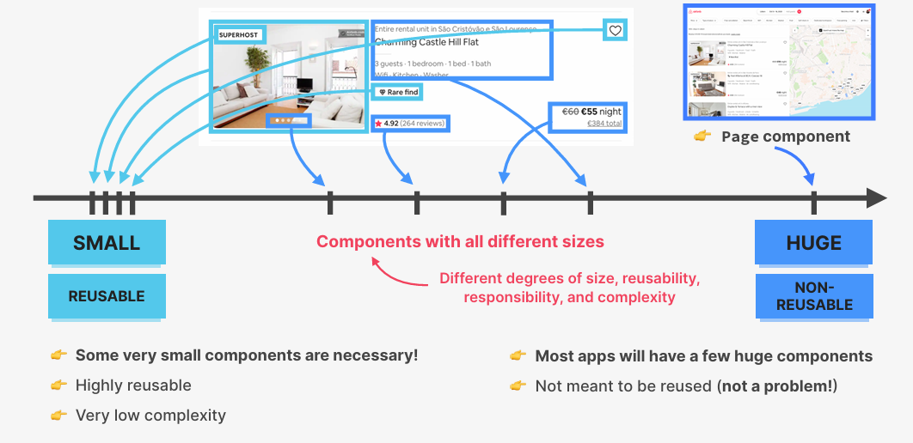
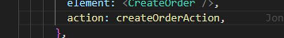

# REACTJS
## Lí do nên học ReactJS
- Độ hot, cộng đồng lớn, tool xịn
- Được đánh giá là thân thiện với SEO nhất trong các LIB/FW
- Khả năng mở rộng tốt, tính tái sử dụng cao nhờ tư tưởng chia nhỏ các CP
- Hiệu suất cao(Ứng dụng lớn, DOM thay đổi mà vẫn mượt mà), phát triển nhanh chóng(Nhiều thư viện UI)
- Khả năng tương thích ngược(SP để nâng cấp các phiên bản)
## ReactJS vs SPA

- Là 1 ứng dụng tải 1 trang HTML và tất cả các nội dung cần thiết (Chẳng hạn như JS và CSS) để ứng dụng chạy
- ReactJS là 1 trong những thư viện giúp chúng ta tạo ra được các SPA
- Không yêu cầu tải lại trang trong quá trình sử dụng(Hiện đại hơn so với MPA)
- Các ứng dụng ReactJS nhìn có vẻ rất nhiều trang, SPA đề cập đến kiến trúc phía bên dưới chứ không phải qua con mắt của người dùng(Tất cả sẽ được import trong file index.html, tất cả sẽ được tải về trong file script)
- Khả năng tối ưu file JS và vì thế khi lần đầu vào trang SPA thì thường sẽ load rất chậm vì nó cần thời gian để tải file JS và phần lớn thời gian sẽ được tải trong lần đầu
- SPA có phần FE riêng biệt, chỉ tải thêm dữ liệu mới khi cần, code có tình tái sử dụng cao, có thể chia team FE vs BE để code song song

## Vấn đề gặp phải khi xây dựng 1 trang web bằng JS thuần

-	Vấn đề xử lí data + hiển thị data

-	Khó đồng bộ data của state mới với state cũ
-	Có rất nhiều những thao tác các cần xử lí (Thao tác liên quan đến DOM, EVENTS…)

-	Nhiều code dẫn đến khó bảo trì, khó chia sẻ state giữa các UI, dẫn đến nhiều RÁC
## Lí do để 1 Framework tồn tại

-	Thực hiện các công việc liên quan đến đồng bộ hóa Data
-	Làm cho dữ liệu được đồng bộ hóa theo thời gian
-	Cung cấp chính xác cấu trúc viết code
-	Cung cấp 1 cách nhất quán việc xây dựng các trang web
-	Cung cấp 1 cách để chia sẻ state giữa các UI

## REACTJS LÀ GÌ?

-	Xây dựng dựa trên các CP
    
    
    -	Các CP là các build-block tạo nên các UI trong ReactJS
    -	Chúng ta xây dựng các UI phức tạp bằng cách kết hợp nhiều CP
-	Declarative
    
    -	Mô tả các CP trông như thế nào bằng 1 cú pháp gọi là JSX
    -	ReactJS sẽ biết 1 CP trông như thế nào dựa trên các data + state hiện tại
    -	Là sự trừu tượng hóa khỏi DOM: Chúng ta không bao giờ động vào DOM
    -	JSX là cú pháp kết hợp HTML, CSS, JS cũng như các CP tham chiếu khác
-	State-drive
    
    -	ReactJS cập nhập lại UI sau mỗi lần thay đổi trạng thái khi người dùng thực hiện 1 action làm thay đổi state 
-	Thư viện JS
    
    -	Là thư viện do chỉ có mỗi layer “viewer”, chúng ta cần thêm rất nhiều những thư viện khác để có thể tạo thành 1 ứng dụng hoàn chỉnh
-	Được sử dụng phổ biến
    
    -	Nhiều công ti lớn sử dụng
    -	Lượng Jobs khổng lồ trên thị trường
    -	Cộng đồng dev đông, tài liệu đầy đủ, xịn xò
-	Tạo bởi FB
    
    -	ReactJS được tạo ra bởi FB
    -	ReactJS được sử dụng trong nhiều ứng dụng của FB
    -	ReactJS được sử dụng trong nhiều ứng dụng của FB

***Summary:***

##  SETTING UP A NEW REACT PROJECT: THE TWO OPTIONS

-	CRA
    - Hoàn thiện “công cụ khởi đầu” cho ứng dụng ReatJS
    - Mọt thứ đã được cấu hình sẵn (ESLint, Prettier, Jest ...)
    - Sử dụng các công cụ lỗi thời (Webpack ...)
-	Vite
    - Công cụ xây dựng hiện đại có chứa teamplate để thiết lập các ứng dụng ReactJS
    - Cần thiết lập thủ công ESLint (1 vài cái khác nữa …)
    - Đóng gọi module nhanh, reload ứng dụng nhanh

##  REACT COMPONENTS
- CP là 1 build-block(Khối xây dựng)
  
  
  
  - Toàn bộ ứng dụng ReactJS được tạo bởi các CP
  - Các khối xây dựng của UI trong ReactJS
  -	Mỗi thành phần UI bao gồm data, logic, UI 
  -	Chúng ta có thể buiding các tổ hợp UI bằng nhiều CP hoặc kết hợp chúng
  -	CP có thể tái sử dụng, lồng nhau, và passing data giữa chúng

## JSX

-	Là cú pháp Declarative(khai báo) để mô tả CP trông như thế nào và chúng làm việc ntn
-	CP phải trả về 1 khối JSX
-	Là cú pháp mở rộng của JS cho phép chúng ta nhúng code JS, CSS,HTML
-	Chúng ta có thể chuyển đổi JSX element  to React.createElement Fn
-	Chúng ta có thể sử dụng ReactJS mà không có JSX nhưng sẽ rất khó hiểu và khó đọc
-	JSX hoạt động cơ bản giống HTML nhưng có thể sử dụng JS Mode bằng cách sử dụng {}, nó có thể sử dụng hàm, các toán tử…bla

***Lưu ý:***
Fragment (mảnh vỡ) giúp bạn viết code ngắn đi, và không render “thừa html”
### RULE OF JSX

## SEPARATION OF CONCERNS

## PROPS

-	Props là cách chúng ta truyền dữ liệu giữa các CP, đặc biệt là từ CP cha sang CP con
-	Có thể hiểu là 1 cách liên lạc giữa các CP
-	Là 1 công cụ để cấu hình và tùy chỉnh các thành phần, thành phần con sẽ trông như thế nào và hoạt động như thế nào
-	Giống như 1 tham số được truyền vào trong các hàm JS thông thường
-	Có thể truyền bất cứ cái gì bạn muốn (value, arr, obj, function …)
-	Props là những dữ liệu đến từ bên ngoài, chúng chỉ có thể update từ CP cha(Khác với state là những data nội bộ, chúng có thể update từ trong logic CP)
-	Props chỉ có thể đọc, chúng là những data bất biến. Đây là 1 trong những rule nghiêm ngặt nhất của ReactJS

***Luồng dữ liệu 1 chiều***
- Có thể truyền dữ liệu từ cha -> con và không có chiều ngược lại (Angular là luồng dữ liệu 2 chiều). Lí do luồng dữ liệu là 1 chiều là làm cho ứng dụng dễ đoán và dễ hiểu hơn( hiểu rõ được dữ liệu đến từ đâu, làm thế nào để điều khiển chúng, và liên quan đến hiệu suất)

## LIFTING UP STATE

***Summary:***

## STATE

-	State là khái niệm quan trọng nhất trong ReactJS, vì mọi thứ cơ bản đều xoay quanh trạng thái
-	Props là dữ liệu đến từ bên ngoài, State là nội tại cho phép chúng ta lưu trữ dữ liệu của chính nó và có thể thay đổi theo thời gian làm cho ứng dụng của chúng ta có tính tương tác, thay đổi UI khi chúng ta thực hiện 1 action nào đó liên quan đến việc thay đổi state
-	State là 1 thành phần tồn tại theo thời gian, là dữ liệu mà CP của nó phải ghi nhớ suất vòng đời của nó, có thể coi như là 1 bộ nhớ của CP
-	Cho phép chúng ta cập nhập lại chế độ xem của các CP, thay đổi UI theo data bằng các re-render lại
-	Cho phép duy trì tính toán lại các biến cục bộ
-	Mỗi CP khác nhau phải có sự quản lí state của riêng nó, ngay cả khi 1 CP được render nhiều lần (Map list). Chúng sẽ hoạt động độc lập với các thành phần khác làm cho trạng thái bị cô lập trong các thành phần
-	Toàn bộ UI giống như 1 hàm của trạng thái, toàn bộ giao diện hiển thị đều được là đại diện cho trạng thái hiện tại theo thời gian

## STATE VS PROPS

## THINKING IN REACT

-	Làm thế nào để chia giao diện người dùng thành những thành phần khác nhau ?
-	Khi nào thì chúng ta thực sự cần đến những thành phần mới ?
-	Chúng ta có thể phân loại mọi thành phần dựa trên kích thước của nó : từ nhỏ đến lớn
-	Ví dụ để tạo ra 1 thành phần thẻ, chúng ta có thể tạo ra 1 CP lớn bao gồm tất cả mọi thứ. Tuy nhiên CP của chúng ta sẽ có 1 số vấn đề :
    
    -	Có quá nhiều thứ  đang diễn ra trong thành phần này nên nó phải chịu quá nhiều trách nhiệm
    -	Nó cần quá nhiều props
Hai vấn đề trên khiến việc tái sử dụng CP trở nên rất khó khăn.Quá nhiều code khiến chúng trở nên phức tạp và đan xen, quá khó để hiểu và sử dụng

-	Nếu chúng ta chia nhỏ mọi thứ thì chúng ta có quá nhiều CP nhỏ cũng dẫn đến việc khó kiểm soát, sẽ dễ gây nhầm lẫn do có nhiều CP có chung công dụng, và quá trừu tượng. Ví dụ khi bạn tạo 1 thành phần nút , người dùng sẽ ko biết thực sự nút sẽ hoạt động ntn , bởi vì các hành động ẩn =>	Cân bằng giữa việc quá nhỏ hoặc quá lớn
-	Có thể rút ra một vài tiêu chí như sau :
    
    
    -	Khi quyết định tách nhỏ 1 CP , chúng ta nên để ý đến việc tạo sư tách biệt hợp lí của nội dung, thậm chí bố cục của 1 trang
    -	Chúng ta phải suy nghĩ đến việc tái sử dụng 
    -	Đảm bảo mỗi CP có 1 trách nhiệm, nhiệm vụ rõ ràng
    -	Phong cách code của cá nhân (Một số người có thể thích chia nhỏ, một số người thích viết nhiều code ….==> cần tìm ra các viết hợp lí nhất cho mình, để làm việc một các hiệu quả nhất)
-	Khi nào nên thạo mới
    -	Đề nghị :Nên xác định rõ thành phần mới nên bao gồm những gì. Chúng ta nên bắt đầu với 1 thành phần tương đối lớn, sau đó chia phần lớn hơn thành các thành phần nhỏ hơn có liên quan khi nó trở nên cần thiết
    
-	Khi nào thì cần thiết :
    -	 Đọc lại quy tắc chia nhỏ
    -	Khi viết CP lớn, bạn cảm thấy thành phần này chứa 1 đoạn mã nào đó hoặc các bố trí không thực sự thuộc về nhau => CP mới
    -	Có thể CP được sử dụng đi sử dụng lại trong chính CP đó, hoặc sau này chúng ta muốn hoặc cần sử dụng ở đâu đó  => CP mới
    -	 Hoặc đơn giản là CP của bạn đang chứa quá nhiều những thứ khác nhau: states, props, sử dụng quá nhiều hiệu ứng 
    -	Hoặc đơn giản là bạn thích
-	Hướng dẫn chung:
    -	Mỗi lần tạo ra CP mới giống như việc tạo ra 1 sự trừu tượng mới, phải suy nghĩ việc các CP khác nhau, việc chuyển đổi qua lại giữa các thành phần. Chính vì thế ko nên cố gắng tạo ra CP mới quá sớm nếu còn có thể
    -	Đặt tên CP có ý nghĩa về việc nó sẽ thực hiện hoặc sẽ hiển thị và đừng ngại sử dụng các tên dài, điều này là hoàn toàn bình thường trong quá trình phát triển Reactjs
    -	Không bao giờ khai báo 1 CP trong 1 CP khác
    -	Định vị những thành phần có liên quan này trong cùng 1 tập tin
    -	Một ứng dụng hoàn toàn là bt khi có nhiều CP có kích thước khác nhau
-	Chúng ta vẫn luôn cần 1 số thành phần rất nhỏ(Nếu làm dự án từ đầu hãy viết common) : Bởi vì chúng có tình tái sử dụng cao, độ phức tạp thấp (đôi khi chính xác là thứ chúng ta cần). Chúng ta cũng có 1 số CP lớn không cần để tái sử dụng, trong những trường hợp như thế ko cần lo lắng về khả năng tái sử dụng lại hoặc suy nghĩ đến việc phải chia nhỏ các thành phần này ra => để ý thấy rằng CP nhỏ hay lớn tỉ lệ nghịch với việc chúng ta có thể tái sử dụng lại được chúng hay không

-	Các loại thành phần khác nhau.Có 3 loại:

    -	Không trạng thái/ Hoặc hiển thị giao diện :
        -	Không states
        -	Nhận props sau đó trình bày dữ liệu đó hoặc 1 số nội dung khác, thường là CP nhỏ và có khả năng tái sử dụng (logo, text, hiển thị đơn giản)
    -	Thành phần có trạng thái:
        -	Có states, có khả năng tái sử dụng ( list, card bla..)
    -	Thành phần cấu trúc: Trang, bố cục, màn hình … thường là nhiều thành phần nhỏ kết hợp lại với nhau, thành phần này có thể rất lớn và không thể tái sử dụng, nhưng chúng ta không cần nhất thiết phải làm như vậy
-	Sự kết hợp các CP:
    -	Thực chất là việc kết hợp các thành phần khác nhau bằng cách sử dụng props children hoặc bằng các truyền các CP là các props
    -	Khi kết hợp các Cp, chúng ta có thể: 
        -	Tạo ra các thành phần có tính tái sử dụng cao và các thành phần linh hoạt
        -	Fix trường hợp 1 CP có thể truy cập vào các trạng thái con
        -	Cho chúng ta việc để lại các khoảng trống có thể đặt bất cứ thứ gì vào nếu chúng ta muốn
-	COMPONENT, INSTANCE,ELEMENT
    -	CP: Mô tả 1 phần giao diện của người dùng, trả về các React element(element tree) thường viết bằng cú pháp JSX, có thể coi nó như 1 bản thiết kế hoặc bản mẫu
    -	INSTANCE: Các instance được tạo khi chúng ta sử dụng CP, React sẽ gọi hàm CP() cho mỗi lần đc sử dụng, có thể coi như 1 thể hiện của CP trong khi bản thân CP chỉ là 1 chức năng mà chúng ta đã viết trước khi được gọi, và từ đó có thể giữ lại được states + props riêng biệt và cũng có Life Cycle của riêng nó. Thực ra thì có thể coi CP vs instance của CP là 1(bản chất là giống nhau nhưng cách gọi về mặt kĩ thuật sẽ chính xác hơn)
    -	EL:CP sẽ trả về các EL

Kết luận: CP => CP Instance  =>EL => thêm zô DOM(DOM Element- HTML)

## COMPONENT COMPOSITION

## HOW RENDERING WORKS(ADVANCED)
NOT TRUE #1: RENDERING IS UPDATING THE SCREEN / DOM
NOT TRUE #2: REACT COMPLETELY DISCARDS OLD VIEW (DOM) ON RE-RENDER

##  THE KEY PROP
-	Key props là 1 props đặc biệt mà chúng ta có thể sử dụng để phân biệt các thuật toán khác nhau là duy nhất, điều này cũng hoạt động cho các DOM EL và React EL 
-	Điều này cho phép React phân biệt giữa nhiều phiên bản của cũng một loại CP
-	Bất cứ khi nào 1 CP có khóa ổn định , phần tử sẽ được giữ trong DOM, ngay cả khi vị trí của tree DOM đã thay đổi ( cũng 1 list danh sách khi thêm hoặc xóa nếu có key sẽ tăng per, vì nó sẽ đc DOM giữ lại, nếu ko có thì nó ko phân biệt được nên sẽ update lại tất cả).
=>	Luôn luôn sử sụng Key props khi có nhiều phần tử cùng loại
## RULES FOR RENDER LOGIC: PURE COMPONENTS
-	Chúng ta nên tạo ra các CP không có trạng thái, không có side effect, không thay đổi trạng thái của nó, không thay đổi props của nó, không thay đổi bất cứ thứ gì ngoài CP của nó

## STATE UPDATE BATCHING
-	React sẽ tự động gom các cập nhật state lại với nhau, điều này giúp tăng hiệu suất

## HOW EVENTS WORK IN REACT

-	Khi bấm vào 1 nút thì 1 sự kiện mới sẽ được tạo nhưng nó sẽ không đc tạo ở nơi thực sự diễn ra mà ở phần gốc của DOM tree, sau đó nó sẽ đi đến toàn bộ tree (CAPTURING PHASE)  nơi thực sự diễn ta cuộc gọi (TAGET ELEMENT) và thực thực sự thực hiện được lần trigger đầu tiên của button lúc đó sẽ xử lí handle function, sau đó EVENT lại di truyển ngược lại toàn bộ DOM(BUBBLING PHASE)
-	Theo mặc định thì phần xử lí lắng nghe sự kiện không chỉ trên phần tử mục tiêu mà có có cả trong phần bubbling phase , nên sẽ xử lí luôn event ở những nơi khác, chúng ta có thể ngăn chặn sự việc này bằng cách sử dụng stopPropagation()
-	EVENT DELEGATION: react ủy quyền cho tất cả các sự kiện đều được xử lí ở root DOM

## REACT 3RD-PARTY LIBRARY ECOSYSTEM

## PRACTICAL SUMMARY (CONFIRM YOUR KNOWLEDGE)
-	CP giống như 1 bản thiết kế chi tiết cho 1 UI, cái mà cuối cùng sẽ tồn tại trên màn hình
-	Sau khi sử dụng 1 CP, react sẽ tạo 1 CP INSTANCE giống như 1 biểu hiện vật lí thực tế, của 1 thành phần chứa props, states, effect
-	Một thành phần khi đc render sẽ trả về react element
-	Render có nghĩa là gọi các hàm thành phần, và tính toán những yếu tố cần tiết cho DOM để thực hiện insert, delete, update
-	Chỉ những lần cập nhập states mới gây ra render
-	CP cha render lại, tất cả các CP con cũng được render lại, nhưng điều này ko có nghĩa là tất cả các thành phần con đều bị update lại DOM, vì react sẽ kiểm tra sự thay đổi giữa hai lần kết xuất, nếu có thay đổi(vị trí, element), sẽ cập nhập lại, nên dùng key pprops cho các phần tử cùng loại để tránh đc việc render khi thay đổi lại vị trí
-	KHÔNG BAO GIỜ ĐƯỢC KHAI BÁO 2 CP LỒNG NHAU
-	LOGIC render ko được tạo ra bất cứ các side effect nào
-	Khi chúng ta cập nhập nhiều states trong 1 hàm xử lí sự kiện , tất cả các thay đổi sẽ được cập nhập theo đợt, chỉ tạo ra 1 lần render duy nhất

## EFFECTS AND DATA FETCHING

### THE COMPONENT LIFECYCLE

### A FIRST LOOK AT EFFECTS

-	Render Logic
-	Event handle function
-	Side effect
-	Pure function
    -	Những function không có side effect, nó ko làm thay đổi bất cứ biến nào bên ngoài phạm vi của nó, cùng 1 đầu vào sẽ luôn cùng 1 đầu ra

Những quy tắc khi render:

-	Các thành phần phải là hàm thuần túy khi nói đến logic kết xuất điều này giống việc chúng ta đưa vào cùng 1 props, cùng 1 states thì đầu ra của chúng ta phải giống hệt nhau ở dạng JSX
-	Render logic không được sản sinh ra bất cứ side effect nào : API call, timer, use

DOM API

-	Không làm thay đổi các biến hoặc đối tượng bên ngoài scope
-	Không update states khi render logic
-	Side effect được cho phép sử dụng trong việc handle, và hook useEffect

## HOOKS

### INTRODUCTION TO HOOKS

- Gắn vào các CP
- Chỉ dùng với func CP
- Làm cho CP trở nên dễ hiểu, không chia logic life circle, không từ khóa this
- LifeCircle: Quá trình từ khi gắn vào DOM->Thay đổi dữ liệu->Bị xóa khỏi DOM
- Đánh giấu những thời điểm xảy ra các sự kiện
- Hooks giúp chúng ta tái sử dụng logic, giúp chúng ta viết code dễ đọc hơn, dễ test hơn, dễ bảo trì hơn

### RULES OF HOOKS

### useState

- Là 1 hook cơ bản để quản lí trạng thái
- Trạng thái của dữ liệu( khóc-> cười ) : OBJ->NEW OBJ
- Ra đời để giúp đơn giản hóa thể hiện trạng thái dữ liệu trên giao diện người dùng, trạng thái dữ liệu đều thể hiện hết ra giao diện người dùng
- Dùng useState khi muốn thay đổi thì giao diện tự động cập nhập(render lại theo dữ liệu)
- Các tính chất:
    - Cơ chế Replace thay vì Merge
    - CP được re-render sau khi setState
    - Initial state chỉ dùng cho lần đầu
    - Có thể setState với callback, chỉ chạy 1 lần với initial callback
    - setState là thay đổi giá trị state bằng giá trị mới
    - App đọc từ trên xuống dưới, chạy lại CP khi có thay đổi, các hàm vẫn sẽ được tạo ra chỉ là tham chiếu đến trạng thái mới
    - BATCHED: Là khái niệm state sẽ được update theo từng đợt chứ ko phải mỗi lần gọi setState (VD: Khi gọi 3 lần set lại 1 state trong cùng 1 hàm thì nó sẽ gọi 1 lần duy nhất, muốn pass luôn thì sử dụng prev state + callback)
    - Những logic tính toán phức tạp chỉ dùng 1 lần thì nên để vào state-> nó nhận giá trị lần đầu và không tính toán lại những lần sau khi CP re-render
### useEffect
- Mount vs Unmount
    - Khi không xuất hiện thì nó chưa được gắn vào DOM
    - Mount là đưa vào React Element, Unmount là gỡ ra khỏi React Element
- useEffect: quản lí các side effect trong CP

    - Side effect :Call API, thao tác DOM..: là các chưng trình phần mềm có tác động đến dữ liệu khiến dữ liệu thay đổi
    - useEffect(callback,[depns]): callback là bắt buộc, depns là không bắt buộc
    - Không cần cleanUp :API, thao thác DOM
    - Cần cleanUp: time out
    - Cách thức hoạt động của useEffect
        - Callback luôn được gọi sau khi CP Mount
        - Cleanup Fn (dọn dẹp) luôn được gọi trước khi CP Unmount
        - Cleanup luôn được gọi trước callback mỗi lần re-render ( trừ trường hợp mouted)
        - Thời điểm được gọi là sau khi CP đã được gắn vào DOM
        - Callback không có depens
            - Callback se được gọi lúc CP mount và bất cứ khi nào CP bị rerender
        - Callback với depens rỗng
            - Chỉ gọi callback 1 lần sau khi CP được Mounted
        - Callback với depens
            - Callback sẽ được gọi mỗi khi depens thay đổi
        - Cleanup Fn
            - Luôn được gọi trước khi callback mới được gọi
            - Luôn được gọi trước khi CP Unmount
            

### useLayoutEffect
- useEffect, useLayoutEffect
    - useEffect
        - Cập nhập state
        - Cập nhập DOM
        - Render UI
        - Cleanup Fn nếu dependenci thau đổi
        - Gọi callback
    - useLayoutEffect
        - Cập nhập lại state
        - Cập nhập lại DOM (đồng bộ)
        - Cleanup Fn nếu dependenci thay đổi
        - Gọi callback
        - Render UI

### useRef

- useRef: Lưu trữ giá trị giữa các lần render
- Giúp chúng ta chọn các DOM element
- Ref là viết tắt của reference. Về cơ bản chúng như là 1 chiếc hộp mà chúng ta có thể đặt bất cứ dữ liệu nào vào đó mà chúng ta muốn giữ nguyên giữa các lần render
- Về mặt kĩ thuật ref sẽ cho chúng ta 1 đói tượng có 1 thuộc tính current có thể thay đổi, chúng ta có thể ghi bất cứ dữ liệu vào thuộc tính này và tất nhiên là cũng đọc từ đó
- 2 cách sử dụng ref:
    - Để lưu trữ giá trị giữa các lần render
    - Để chọn các DOM element
### useMemo ( Tối ưu hóa)
### useCallback ( Tối ưu hóa)

### useContext (Quản lí trạng thái)
### useReducer (Quản lí trạng thái)

- Hooks thì còn nhiều quan trọng là anh em dùng bao nhiêu và như thế nào
### CUSTOM HOOKS

## ROUTING
- React Router: Thư viện quản lí routing trong ReactJS
- Cài đặt: npm install react-router-dom
- Cấu hình: 
    - BrowserRouter: Đóng gói ứng dụng
    - Route: Định nghĩa 1 route
    - Link: Định nghĩa 1 link
    - Switch: Chỉ hiển thị 1 route duy nhất
    - Redirect: Chuyển hướng
    - useParams: Lấy tham số từ URL
    - useHistory: Điều hướng
    - useLocation: Lấy thông tin về URL
    - useRouteMatch: Lấy thông tin về route
    - withRouter: HOC để truy cập history, location, match
    - Prompt: Hiển thị thông báo trước khi chuyển hướng
    - NavLink: Link có thể active
    - StaticRouter: Dùng cho server-side rendering
    - MemoryRouter: Dùng cho test
    - HashRouter: Dùng cho ứng dụng không phải server-side rendering
    - Router: Dùng cho custom router
    - RouteConfig: Định nghĩa route config
- Routing trong ReactJS
    
    
    
    - Khi ta sử dụng 1 Route trong ReactJS bản chất là chúng ta đang khớp các URL khác nhau tới các chế độ khác nhau trong giao diện người dùng:Routes
    - Có thể chuyển đổi bằng các thay đổi URL
    - Giữ cho giao diện được đồng bộ
    - Không giống như các FW khác có bộ routes, React sử dụng 1 thư viện thứ 3 gọi là React Route
- SPA
    
    - SPA là các ứng dụng web được thực thi hoàn toàn trên máy khách
    - Routes: những URL khác nhau dẫn đến các giao diện khác nhau
    - JS(React) : luôn sử dụng để update DOM.Lợi ích:
        - Khi chúng ta thay đổi URL trình duyệt sẽ phải tải lại 1 trang hoàn toàn mới nhưng với các ứng dụng SPA thì hoàn toàn khác, các trang này đơn thuần chỉ được cập nhập bằng JS, điều đó có nghĩa là nó sẽ ko tải lại toàn bộ trang
        - Có thể add thêm các DATA từ server vào để lấy các dữ liệu cần thiết

- Sự khác biệt giữa Link và NavLink
    - Khi dùng thẻ a vs href thì trang sẽ được link đến nơi cần link nhưng sẽ bị tải lại(điều này chúng ta có thể kiểm chứng trong tab network all khi toàn bộ các page sẽ bị tải lại) => Hãy sử dụng Link
    - Khi sử dụng link chúng ta ko thấy có CP nào đc tải lại điều đó chứng tỏ là các DOM đã được thay thế, chúng ta có thể mở tabs Component để thấy rõ hơn
    - Khi muốn đánh dấu hoặc quay lại chính xác 1 trang nào đó, chúng ta hãy sử dụng NavLink
    - NavLink đánh đấu cho chúng ta 1 class active, thứ mà chúng ta có thể dùng để css 1 cách tốt hơn

- Sự khác biệt giữa BrowserRouter và HashRouter
    - BrowserRouter: Dùng cho các ứng dụng web, nó sử dụng HTML5 history API để giữ cho UI và URL đồng bộ
    - HashRouter: Dùng cho các ứng dụng web không phải server-side rendering, nó sử dụng hash URL để giữ cho UI và URL đồng bộ
- Sự khác biệt giữa Route và Switch
    - Route: Định nghĩa 1 route
    - Switch: Chỉ hiển thị 1 route duy nhất
- Sự khác biệt giữa useParams và useLocation
    - useParams: Lấy tham số từ URL
    - useLocation: Lấy thông tin về URL
- Router with Layout :
    - 
    - Các thành phần Outlet sẽ được gắn với các content bên trong để thực hiện render
    - Phần chuyển đổi giữa các NavLink trông giống như các tabs nhưng được thực hiện theo 1 cách rất khác
- Ngoài useState thì URL cũng là 1 nơi rất tuyệt vời để lưu trữ state và đặc biệt là các trạng thái UI
- Là 1 trong những cách dễ dàng để lưu trữ trạng thái ở 1 nơi toàn cầu có thể dễ dàng truy cập cho tất cả các thành phần trong APP khác cách cũ là lưu từ thành phần cha sau đó truyền dần xuống các thành phần con nhưng nếu lưu trữ trên URL chúng ta có thể dễ dàng đọc các giá trị từ chúng
- Là 1 cách pass dữ liệu rất tốt từ trang này sang trang khác.
- Đánh dấu trang hoặc chia sẻ trang với trạng thái giao diện người dùng chính xác( Đặt lại history vào state của router)
- Sử dụng hook useParams để lấy các param, useSearchParams để lất các query và hàm set các query
- Điều hướng có lập trình với việc sử dụng các hook điều hướng useNavigate
- Programmatic Navigate có nghĩa cơ bản là để chuyển đến 1 URL mới mà người dùng không phải nhấp vào bất cứ 1 liên kết nào, và trường hợp phổ biến là sau khi người dùng sử dụng form, chúng ta muốn họ chuyển sang 1 trang mới trong ứng dụng 1 cách tự động useNavigate() => các trường hợp goback , bla bla
- Cũng có 1 cách khác để điều hướng nhưng sử dụng trong việc khởi tạo các Routes <Navigate /> , sử dụng cùng replace để thay thế phần tử hiện tại trong history stack
- Router6.4+  cho phép chúng ta khả năng dùng để tải dữ liệu, action data hoặc để gửi dữ liệu bằng cách sử dụng các form

- Sử dụng AppLayout để cấu hình cho toàn bộ App, sau đó những children sẽ xuất hiện trong phần <Outlet /> của thành phần router(hoạt động tương đối giống children)
- Tính năng tải dữ liệu(Loaders): Ý tưởng ở sau bộ tải này là ở đâu đó trong code của chúng ta , chúng ta tạo ra 1 hàm tìm nạp một số dữ liệu với API, sau đó chúng ta cung cấp chức năng loader đó cho 1 trong các Router, và đường tuyến sẽ lấy dữ liệu đó(fetch data) khi ứng dụng đi đến Router đó. Và khi có dữ liệu nó sẽ cung cấp vào chính thành phần của trang đó bắng cách sử dụng các custom Hook (useLoaderData())
- Với cách thông thường thì chúng ta render trước sau đó mới fetch data, nhưng với cách sử dụng loader, React Router sẽ thực sự bắt fetch data khi nó bắt đầu hiển thi router chính xác (khác so với dùng useEffect()- thường gọi là dòng thác dữ liệu)
- React router giờ đây ko chỉ chịu trách nhiệm khớp các URL mà nó còn thực hiện để cung cấp dữ liệu cần thiết cho mỗi trang, điểu này rất hữu ích ví router của page và dữ liệu trong page thường được liên kết chặt chẽ với nhau:
    - Sử dụng cách này để check loading
    - Sử dụng cách này để check errors( nếu không có errors trong children thì sẽ sử dụng ở app, sẽ là toàn bộ app)  
    - Form 
        - Form sẽ sự động khớp với action hiện tại( chính là url hiện tại) hoặc đơn giản chúng ra sẽ cung cấp cho nó 1 cái url để nó lấy gọi API
        - Sau đó chúng ta sẽ tạo ra 1 action. Sau khi thực hiện submit action, sau đó về cơ bản sẽ bị chặn bởi chức năng này ngay sau khi chúng ta kết nối với React Router
-  Hàm request của chúng ta sẽ truyền vào trong hàm action mang các data chúng ta sẽ xử lí và gọi data bên trong đó, Khi thực hiện action chúng ta cũng có thể setup loading
- Chúng ta có 1 hook để checking dữ liệu được trả về từ hành động đó. Thông thường chúng ta sẽ dùng nó để check lỗi
- Khi chúng ta muốn sử dụng lại logic-data của phần loader ở 1 trang nào đó mà không muốn phải chuyển qua trang đó.Get menu ở page Order mà ko cần phài back lại hay sử dụng useFetcher , hãy kiểm tra chăc chắn rằng fetcher ko co data or đang thực hiện 1 hành động nào đó
- Cũng có thể update từ CP khác với 1 action khác .Sau khi thực hiện action vs fetch.Form CP đó sẽ được thực hiện revalidate ( tải lại dữ liệu)

## CONTEXT

- Là 1 solution cho việc props drilling
- Passing state xuống những component nhỏ hơn lồng nhau
- Là 1 hệ thống truyền dữ liệu trong suốt ứng dụng mà không cần truyền xuống các props qua những thành phần thủ công 
- Chính vì thế nó cung cấp cho App 1 trạm phát sóng(broadcast) global state
- Provider: là 1 thành phần react đặc biệt cung cấp tài nguyên cho các thành phần con được quyền truy cập, và thành phần Provider này có thể được đặt ở mọi nơi trong app nhưng người ta thường đặt nó ở trong App(bao áp)
- Value: Là dữ liệu mà chúng ta muốn cung cấp, chúng ta thường cung cấp các value này cho các Provider.Thông thường các value này chứa 1 hoặc nhiều biến trạng thái và thậm chí 1 số hàm setter
- Consumer: đây là các thành phần đọc giá trị mà chúng ta đã truyền cho các Provider
    - Các thành phần nằm trong Context đều nằm trong Context và qua đó chúng có thể đọc giá trị từ Context
    - Bất cứ khi nào value được updated thì tất cả các thành phần con (Consumer) sẽ được re-render lại
    - Đây là 1 các mới để render lại 1 CP
    - Chúng ta có thể tạo ra rất nhiều ContextAPI và đặt chúng ở bất cứ nơi đâu chúng ta muốn

## STATE MANAGEMENT
- Giống như việc đưa state vào đúng nơi đúng chỗ
- Các loại trạng thái
    - 1.State accessibility: Local state(state cần cho 1 vài CP, và chỉ vài CP đó có thể truy cập)>< Global state(state cần cho rất nhiều CP, CP nào cũng có thể truy cập.
    - 2.State domain:
        - Remove state: Là tất cả dữ liệu cảu chúng ta được tải từ một máy chủ ở xa, vì thế thường được sử dụng ở API
        - Thường sử dụng Async, dữ liệu cần được tải lại liên tục và được cập nhập thường xuyên. Chính vì thế remove states thường được lưu vào cache, revalidate, và để làm được điều đó chúng ta sẽ cần phải có 1 số tool chuyên dụng
        - UI State: Theme, list, filter, form data. Chúng thường đồng bộ và được lưu trữ ngay trong ứng dụng và không tương tác với máy chủ nào cà . Chính vì thế chúng thường rất dễ handle với những công cụ mà chúng ta đã biết như useState hoặc useReducer

## REDUX
### Toolkit
### Saga
### Thunk
### RTK Query

## React Query
##
## Design Patterns, Best Practices, and Performance
### Screen Spliter
### List
### Modal
### Containers
### Local Storage
### Controlled vs Uncontrolled
### HOCs
### Custom Hooks
### Functional In React
- Recursive
- Composition
- Partial Component
### Compound Components
### Observer Pattern
### Memorization
### Lazy Loading and Code Splitting
### Error Boundaries
### Key
### Ref
### React Portals
### Async React Route
### React Suspense
### Scalable React
### Performance
### Testing
### Debugging
### Security
### SEO
### Accessibility
### Internationalization
### Server-Side Rendering
### Progressive Web Apps
### Publishing NPM Packages
### Monorepos
### Microfrontends
### Web Components

