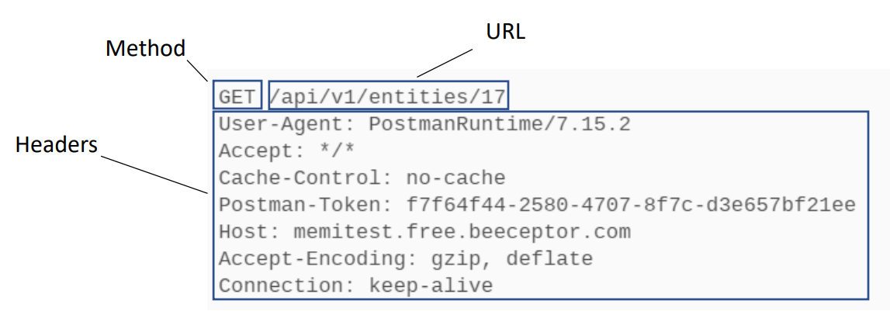
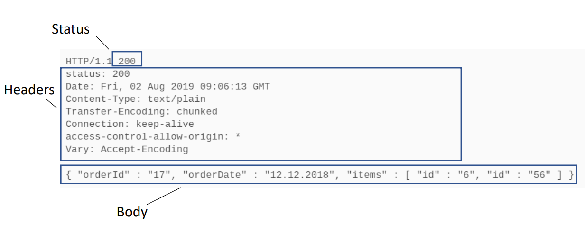

## REST API là gì?
- REST là viết tắt của Representational State Transfer, là một kiến trúc phần mềm dựa trên giao thức HTTP.
- REST API là một tập hợp các quy tắc thiết kế để tạo ra các API dễ sử dụng, dễ bảo trì và dễ mở rộng.
- REST API sử dụng các phương thức HTTP để thực hiện các thao tác CRUD (Create, Read, Update, Delete) trên tài nguyên.
## Structure of a REST API
- Request: 
    - Method: GET, POST, PUT, DELETE (HTTP verbs)
    - URL: /api/users (Location of the resource + parameters)
    - Headers: Content-Type: application/json (Metadata about the request)
    - Body: {"name": "John Doe", "email": ""} (Data sent to the server) (Optional)
    
- Response:
    - Status Code: 200 OK, 404 Not Found, 500 Internal Server Error
    - Headers: Content-Type: application/json (Metadata about the response)
    - Body: {"name": "John Doe", "email": ""} (Data sent back from the server)(Optional)
    
    - Response Types:
        - JSON: {"name": "John Doe", "email": ""}
        - XML: <user><name>John Doe</name><email></email></user>
        - HTML: <h1>John Doe</h1>

        - Text: John Doe
## REST API Documentation
- API Documentation là một tài liệu mô tả cách sử dụng một API.
- API Documentation bao gồm:
    - API Endpoints: /api/users
    - Request Parameters: name, email
    - Response Format: JSON
    - Error Codes: 404 Not Found, 500 Internal Server Error
    - Authentication: API Key, OAuth
    - Rate Limits: 100 requests per hour
    - Examples: curl, Postman
- API Documentation Tools:
    - Swagger: https://swagger.io/
    - Postman: https://www.postman.com/
    - Apiary: https://apiary.io/
## REST API Versioning
- API Versioning là cách quản lý các phiên bản của một API.
- Cách thức versioning:
    - URL: /api/v1/users
    - Header: Accept: application/vnd.myapi.v1+json
    - Query Parameter: /api/users?version=1
    - Custom Header: X-API-Version: 1
    - Subdomain: v1.api.example.com
## Authentication and Authorization
- Authentication: Xác thực người dùng
    - Basic Auth: username, password
    - API Key: key, secret
    - OAuth: access token, refresh token
- Authorization: Phân quyền người dùng
    - Role-based: admin, user
    - Resource-based: /api/users, /api/posts
    - Permission-based: read, write
## Performance Optimization
- Caching: Lưu trữ dữ liệu tạm thời
    - Client-side: localStorage, sessionStorage
    - Server-side: Redis, Memcached
    - CDN: Cloudflare, Akamai
- Compression: Nén dữ liệu
    - Gzip: text, html, css, js
    - Brotli: modern browsers
- Throttling: Giới hạn tần suất request
    - Rate Limiting: 100 requests per hour
    - Concurrency Limiting: 10 requests per second
- Asynchronous Processing: Xử lý bất đồng bộ
    - Webhooks: POST /api/webhooks
    - Message Queues: RabbitMQ, Kafka
    - Background Jobs: Celery, Sidekiq
- Monitoring: Giám sát hệ thống
    - Logs: access logs, error logs
    - Metrics: response time, throughput
    - Alerts: email, SMS
## Security Best Practices
- HTTPS: Sử dụng giao thức HTTPS
- CORS: Cross-Origin Resource Sharing
    - Origin: https://example.com
    - Methods: GET, POST, PUT, DELETE
    - Headers: Content-Type, Authorization
- CSRF: Cross-Site Request Forgery
    - Token: <input type="hidden" name="csrf_token" value="...">
    - Header: X-CSRF-Token: ...
- SQL Injection: Bảo vệ khỏi SQL Injection
    - Query: SELECT * FROM users WHERE id = ?
    - Parameterized Query: SELECT * FROM users WHERE id = ?
- Rate Limiting: Giới hạn tần suất request
    - Limit: 100 requests per hour
    - Token Bucket: leaky bucket
- JWT: JSON Web Tokens
    - Header: {"alg": "HS256", "typ": "JWT"}
    - Payload: {"sub": "1234567890", "name": "John Doe"}
    - Signature: HMACSHA256(base64UrlEncode(header) + "." + base64UrlEncode(payload), secret)
- OAuth: Open Authorization
    - Grant Types: Authorization Code, Implicit, Password, Client Credentials
    - Scopes: read, write
- Content Security Policy: Bảo vệ khỏi XSS
    - Directive: default-src 'self'
    - Report-Only: Content-Security-Policy-Report-Only
- OWASP Top 10: Bảo vệ khỏi các lỗ hổng bảo mật
## REST API Design Best Practices
- Use Nouns: Sử dụng danh từ
    - GET /api/users
    - POST /api/users
    - PUT /api/users/1
    - DELETE /api/users/1
- Use Plurals: Sử dụng số nhiều
    - /api/users
    - /api/posts
    - /api/comments
- Use Subresources: Sử dụng tài nguyên con
    - /api/posts/1/comments
    - /api/users/1/posts
    - /api/users/1/comments
- Use HTTP Methods: Sử dụng phương thức HTTP
    - GET: Lấy dữ liệu
    - POST: Tạo dữ liệu
    - PUT: Cập nhật dữ liệu
    - DELETE: Xóa dữ liệu
- Use Status Codes: Sử dụng mã trạng thái
    - 200 OK: Thành công
    - 201 Created: Đã tạo
    - 204 No Content: Không có nội dung
    - 400 Bad Request: Yêu cầu không hợp lệ
    - 401 Unauthorized: Chưa xác thực
    - 403 Forbidden: Bị cấm
    - 404 Not Found: Không tìm thấy
    - 500 Internal Server Error: Lỗi máy chủ
- Use Pagination: Sử dụng phân trang
    - /api/users?page=1&limit=10
    - /api/posts?page=1&limit=10
    - /api/comments?page=1&limit=10
- Use Filtering: Sử dụng lọc
    - /api/users?role=admin
    - /api/posts?tag=javascript
    - /api/comments?approved=true
- Use Sorting: Sử dụng sắp xếp
    - /api/users?sort=name
    - /api/posts?sort=created_at
    - /api/comments?sort=updated_at
- Use HATEOAS: Hypermedia as the Engine of Application State
    - Links: <https://api.example.com/users>; rel="users"
    - Actions: <https://api.example.com/users>; rel="create"
    - Forms: <https://api.example.com/users>; rel="update"
## API Gateway and Discovery
- API Gateway: Cổng API
    - Routing: /api/users
    - Load Balancing: Round Robin, Least Connections
    - Rate Limiting: 100 requests per hour
    - Authentication: Basic Auth, API Key, OAuth
    - Monitoring: Logs, Metrics, Alerts
- Service Discovery: Khám phá dịch vụ

