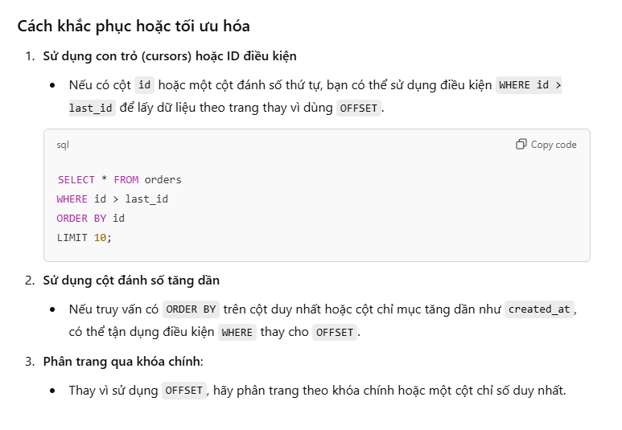
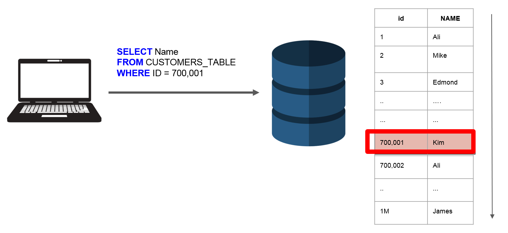
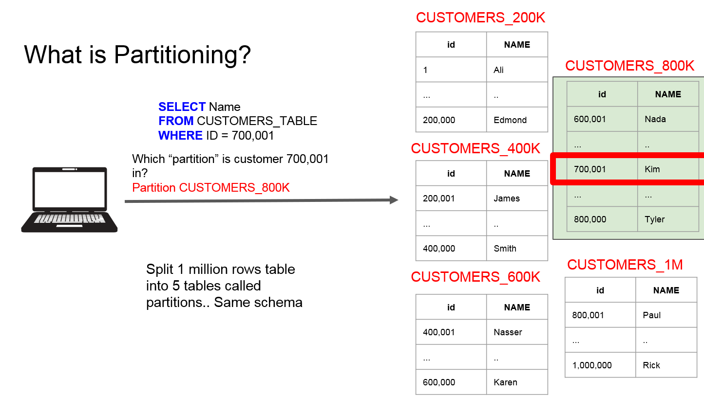

# PostgreSQL
## Cơ sở dữ liệu là gì?
- Về cơ bản, cơ sở dữ liệu là một tập hợp các dữ liệu có tổ chức, được lưu trữ trên máy chủ và được truy cập thông qua mạng hoặc máy chủ cục bộ. Cơ sở dữ liệu giúp chúng ta lưu trữ và truy xuất dữ liệu một cách dễ dàng và nhanh chóng.
- SQL (Structured Query Language) là ngôn ngữ truy vấn cơ sở dữ liệu phổ biến nhất, được sử dụng để truy vấn, cập nhật và quản lý cơ sở dữ liệu.
## Những thứ cần chú ý khi học PostgreSQL
- Cách viết truy vấn hiệu quả để lấy thông tin từ cơ sở dữ liệu.
- Thiết kế lược đồ cơ sở dữ liệu một cách hợp lý.
- Hiểu khi nào nên sử dụng các loại tính năng advanced của PostgreSQL như Index, Trigger, Function, ...
- Quản lí dữ liệu của chúng ta trên môi trường production.
## Database Design
- Có 3 câu hỏi lớn:
  - Chúng ta đang lưu trữ những dữ liệu gì?
  - Có những property nào của dữ liệu đó?
  - Loại dữ liệu nào sẽ được lưu trữ?
=> Câu trả lời cho 3 câu hỏi trên sẽ giúp chúng ta thiết kế lược đồ cơ sở dữ liệu một cách hợp lý: Bảng, Cột, Ràng buộc, ...
## Create Table
- Để tạo một bảng trong PostgreSQL, chúng ta sử dụng câu lệnh `CREATE TABLE`:
```sql
CREATE TABLE cities (
  name VARCHAR(50),
  country VARCHAR(50),
  population Integer,
  area Integer
);
```
- Alalyzing CREATE TABLE statement:
  - `CREATE TABLE`: Tạo một bảng mới( Keyword)
  - `table_name`: Tên của bảng( Identifier)
  - `name`, `country`, `population`, `area`: Tên của các cột
  - `VARCHAR(50)`, `Integer`: Kiểu dữ liệu của các cột. VARCHAR(50) là kiểu dữ liệu chuỗi với độ dài tối đa là 50 ký tự, Integer là kiểu dữ liệu số nguyên.
## Insert Data
- Để chèn dữ liệu vào bảng, chúng ta sử dụng câu lệnh `INSERT INTO`:
```sql
INSERT INTO cities (name, country, population, area)
VALUES ('Vietnam', 'Vietnam', 100000000, 331212);
```
- Alalyzing INSERT INTO statement:
  - `INSERT INTO`: Chèn dữ liệu vào bảng( Keyword)
  - `table_name`: Tên của bảng( Identifier)
  - `name`, `country`, `population`, `area`: Tên của các cột
  - `VALUES`: Giá trị của các cột
## Insert Multiple Rows
- Để chèn nhiều dòng dữ liệu vào bảng, chúng ta sử dụng câu lệnh `INSERT INTO` với nhiều giá trị:
```sql
INSERT INTO cities (name, country, population, area)
VALUES ('Vietnam', 'Vietnam', 100000000, 331212),
       ('USA', 'USA', 331000000, 9833520),
       ('China', 'China', 1400000000, 9596961);
```
## Select Data
- Để lấy dữ liệu từ bảng, chúng ta sử dụng câu lệnh `SELECT`:
```sql
SELECT * FROM cities;
SELECT name, country FROM cities;
```
- Alalyzing SELECT statement:
  - `SELECT`: Lấy dữ liệu từ bảng( Keyword)
  - `*`: Lấy tất cả các cột
  - `FROM`: Tên của bảng
  - `name`, `country`: Tên của các cột
## Caculate Columns
- Để tính toán các cột trong bảng, chúng ta sử dụng các toán tử như `+`, `-`, `*`, `/`:
```sql
SELECT name, population, area, population / area AS population_density
FROM cities;
```
- Alalyzing SELECT statement:
  - `SELECT`: Lấy dữ liệu từ bảng( Keyword)
  - `name`, `population`, `area`: Tên của các cột
  - `population / area AS population_density`: Tính toán cột `population_density` bằng cách chia cột `population` cho cột `area`
  - `AS`: Đặt tên cho cột tính toán
  - Math operators: `+`, `-`, `*`, `/`
  - String operators: `||`,CONCAT(),LENGTH(),LOWER(),UPPER(),TRIM(),... VD: `SELECT name || ' ' || country AS full_name FROM cities;`
## Filter Data
- Để lọc dữ liệu từ bảng, chúng ta sử dụng câu lệnh `WHERE`:
```sql
SELECT * FROM cities WHERE population > 100000000;
SELECT * FROM cities WHERE country = 'Vietnam';
```
- Alalyzing SELECT statement:
  - `SELECT`: Lấy dữ liệu từ bảng( Keyword)
  - `*`: Lấy tất cả các cột
  - `FROM`: Tên của bảng
  - `WHERE`: Lọc dữ liệu
  - `population > 100000000`: Lọc các dòng có cột `population` lớn hơn 100000000
  - `country = 'Vietnam'`: Lọc các dòng có cột `country` bằng 'Vietnam'
  - Thứ tự thực hiện: `FROM` -> `WHERE` -> `SELECT`
  - Comparison operators: `=`, `>`, `<`, `>=`, `<=`, `<>`
  - Logical operators: `AND`, `OR`, `NOT`
  - Pattern matching: `LIKE`, `ILIKE`, `SIMILAR TO`, `~`, `~*`, `!~`, `!~*`
  - Range: `BETWEEN`, `NOT BETWEEN`, `IN`, `NOT IN`
  - Caculations in WHERE: `SELECT * FROM cities WHERE population / area > 10000;`
## Update Data
- Để cập nhật dữ liệu trong bảng, chúng ta sử dụng câu lệnh `UPDATE`:
```sql
UPDATE cities
SET population = 100000000
WHERE country = 'Vietnam';
```
- Alalyzing UPDATE statement:
  - `UPDATE`: Cập nhật dữ liệu trong bảng( Keyword)
  - `table_name`: Tên của bảng( Identifier)
  - `SET`: Cập nhật giá trị của cột
  - `WHERE`: Lọc dữ liệu
  - `population = 100000000`: Cập nhật cột `population` thành 100000000
  - `country = 'Vietnam'`: Lọc các dòng có cột `country` bằng 'Vietnam'
## Delete Data
- Để xóa dữ liệu trong bảng, chúng ta sử dụng câu lệnh `DELETE`:
```sql
DELETE FROM cities WHERE country = 'Vietnam';
```
- Alalyzing DELETE statement:
  - `DELETE`: Xóa dữ liệu trong bảng( Keyword)
  - `FROM`: Tên của bảng
  - `WHERE`: Lọc dữ liệu
  - `country = 'Vietnam'`: Lọc các dòng có cột `country` bằng 'Vietnam'
## Working with Tables
- Create Database For A Photo Sharing App:
  - users: id, username, email, password
  - photos: id, user_id, url, description
  - comments: id, user_id, photo_id, content
  - likes: id, user_id, photo_id
- Note:
  - Chúng ta nên tạo những bảng nào cho bất kỳ 1 ứng dụng nào dựa vào yêu cầu của ứng dụng đó.
  - Có rất nhiều tài liệu hướng dẫn về cách thiết kế cơ sở dữ liệu, nhưng không có cách nào là đúng hoặc sai, tất cả đều phụ thuộc vào yêu cầu của ứng dụng.
  - Tìm hiểu về các loại ràng buộc như `PRIMARY KEY`, `FOREIGN KEY`, `UNIQUE`, `CHECK`, `NOT NULL`, ...
  - Mối quan hệ giữa các bảng: `One-to-One`, `One-to-Many`, `Many-to-Many`
- Các mối quan hệ giữa các bảng:
  - One-to-One: Một người dùng chỉ có một thông tin cá nhân, một thông tin cá nhân chỉ thuộc về một người dùng.
  - One-to-Many: Một người dùng có thể có nhiều ảnh, một ảnh chỉ thuộc về một người dùng.
  - Many-to-One: Một ảnh chỉ thuộc về một người dùng, một người dùng có thể có nhiều ảnh.
  - Many-to-Many: Một người dùng có thể thích nhiều ảnh, một ảnh có thể được thích bởi nhiều người dùng.
- Foreign Key:
  - Foreign key là một cột hoặc một tập hợp các cột trong bảng, tham chiếu đến một cột hoặc tập hợp các cột khác trong bảng khác.
  - Foreign key giúp chúng ta xác định mối quan hệ giữa các bảng.
  - Foreign key giúp chúng ta thực hiện các thao tác như JOIN, UPDATE, DELETE giữa các bảng.
  - Foreign key giúp chúng ta đảm bảo tính toàn vẹn dữ liệu giữa các bảng.
- Primary Key:
  - Primary key là một cột hoặc một tập hợp các cột trong bảng, giúp chúng ta xác định mỗi dòng dữ liệu trong bảng một cách duy nhất.
  - Primary key giúp chúng ta xác định mỗi dòng dữ liệu trong bảng một cách duy nhất.
  - Primary key giúp chúng ta thực hiện các thao tác như JOIN, UPDATE, DELETE giữa các bảng.
  - Primary key giúp chúng ta đảm bảo tính toàn vẹn dữ liệu giữa các bảng.
- Foreign Key của bảng này sẽ là Primary Key của bảng khác.
- Auto-Geneated Primary Key:
  - Chúng ta có thể sử dụng kiểu dữ liệu SERIAL để tạo một cột tự động tăng.VD:
  ```sql
  CREATE TABLE users (
    id SERIAL PRIMARY KEY,
    username VARCHAR(50),
    email VARCHAR(50),
    password VARCHAR(50)
  );
  ```
- Create Foreign Key:
  - Để tạo một Foreign Key trong PostgreSQL, chúng ta sử dụng câu lệnh `FOREIGN KEY`:
  ```sql
  CREATE TABLE photos (
    id SERIAL PRIMARY KEY,
    user_id INTEGER,
    url VARCHAR(255),
    description TEXT,
    FOREIGN KEY (user_id) REFERENCES users (id)
  );
  ```
  - Alalyzing CREATE TABLE statement:
    - `CREATE TABLE`: Tạo một bảng mới( Keyword)
    - `table_name`: Tên của bảng( Identifier)
    - `id`, `user_id`, `url`, `description`: Tên của các cột
    - `SERIAL`, `INTEGER`, `VARCHAR(255)`, `TEXT`: Kiểu dữ liệu của các cột
    - `PRIMARY KEY`: Đặt cột `id` làm Primary Key
    - `FOREIGN KEY (user_id)`: Tạo một Foreign Key với cột `user_id`
    - `REFERENCES users (id)`: Tham chiếu đến cột `id` của bảng `users`
- Add some data to the tables:
  ```sql
   INSERT INTO users (username, email, password)
    VALUES ('admin', 'admin@gmail.com', '123456'),
          ('user1', 'user1@gmail.com', '123456'),
          ('user2', 'user2@gmail.com', '123456')
  ```
  ```sql
  INSERT INTO photos (user_id, url, description)
    VALUES (1, 'https://example.com/photo1.jpg', 'This is photo 1'),
          (2, 'https://example.com/photo2.jpg', 'This is photo 2'),
          (3, 'https://example.com/photo3.jpg', 'This is photo 3')
  ```
- Join Tables:
  - Để kết hợp dữ liệu từ nhiều bảng, chúng ta sử dụng câu lệnh `JOIN`:
  ```sql
  SELECT photos.url, photos.description, users.username
  FROM photos
  JOIN users ON photos.user_id = users.id;
  ```
  - Alalyzing SELECT statement:
    - `SELECT`: Lấy dữ liệu từ bảng( Keyword)
    - `photos.url`, `photos.description`, `users.username`: Tên của các cột
    - `FROM`: Tên của bảng
    - `JOIN`: Kết hợp dữ liệu từ nhiều bảng (Join ở đây là `INNER JOIN`)
    - `ON`: Điều kiện kết hợp
    - `photos.user_id = users.id`: Kết hợp dữ liệu từ bảng `photos` với bảng `users` dựa trên cột `user_id` của bảng `photos` và cột `id` của bảng `users`
    - Số lượng dòng trả về sẽ bằng số lượng dòng của bảng `photos` nhưng mỗi dòng sẽ chứa thông tin từ cả 2 bảng `photos` và `users`
- Data Consistency:
  - Để đảm bảo tính toàn vẹn dữ liệu giữa các bảng, chúng ta cần sử dụng các ràng buộc như `PRIMARY KEY`, `FOREIGN KEY`, `UNIQUE`, `CHECK`, `NOT NULL`, ...
  - Ràng buộc `PRIMARY KEY`: Đảm bảo mỗi dòng dữ liệu trong bảng là duy nhất
  - Ràng buộc `FOREIGN KEY`: Đảm bảo mối quan hệ giữa các bảng
  - Ràng buộc `UNIQUE`: Đảm bảo mỗi giá trị trong cột là duy nhất
  VD:
  ```sql
  INSERT INTO photos (user_id, url, description)
    VALUES (NULL, 'https://example.com/photo1.jpg', 'This is photo 111'),
          (1, 'https://example.com/photo2.jpg', 'This is photo 2111'),
          (1, 'https://example.com/photo3.jpg', 'This is photo 311')
  ```
- Ràng buộc Foreign Key:
  - Ràng buộc `FOREIGN KEY` giúp chúng ta xác định mối quan hệ giữa các bảng.
  - NOT NULL: Chúng ta không thể chèn giá trị NULL vào cột `user_id` của bảng `photos` vì cột `user_id` là một Foreign Key tham chiếu đến cột `id` của bảng `users`.
- Delete Data Consistently:
  - Để xóa dữ liệu một cách an toàn, chúng ta cần xóa dữ liệu từ các bảng theo đúng thứ tự.
  - VD: Để xóa một người dùng, chúng ta cần xóa tất cả ảnh và bình luận của người dùng đó trước.
- Cascade Delete:
  - Để xóa dữ liệu từ các bảng một cách tự động, chúng ta sử dụng `ON DELETE CASCADE`:
  ```sql
  CREATE TABLE photos (
    id SERIAL PRIMARY KEY,
    user_id INTEGER,
    url VARCHAR(255),
    description TEXT,
    FOREIGN KEY (user_id) REFERENCES users (id) ON DELETE CASCADE
  );
  ```
  - Alalyzing CREATE TABLE statement:
    - `CREATE TABLE`: Tạo một bảng mới( Keyword)
    - `table_name`: Tên của bảng( Identifier)
    - `id`, `user_id`, `url`, `description`: Tên của các cột
    - `SERIAL`, `INTEGER`, `VARCHAR(255)`, `TEXT`: Kiểu dữ liệu của các cột
    - `PRIMARY KEY`: Đặt cột `id` làm Primary Key
    - `FOREIGN KEY (user_id)`: Tạo một Foreign Key với cột `user_id`
    - `REFERENCES users (id)`: Tham chiếu đến cột `id` của bảng `users`
    - `ON DELETE CASCADE`: Xóa tất cả ảnh của người dùng khi người dùng đó bị xóa
- On Delete Restrict:
  - Để ngăn chặn việc xóa dữ liệu từ các bảng, chúng ta sử dụng `ON DELETE RESTRICT`:
  ```sql
  CREATE TABLE photos (
    id SERIAL PRIMARY KEY,
    user_id INTEGER,
    url VARCHAR(255),
    description TEXT,
    FOREIGN KEY (user_id) REFERENCES users (id) ON DELETE RESTRICT
  );
  ```
  - Alalyzing CREATE TABLE statement:
    - `CREATE TABLE`: Tạo một bảng mới( Keyword)
    - `table_name`: Tên của bảng( Identifier)
    - `id`, `user_id`, `url`, `description`: Tên của các cột
    - `SERIAL`, `INTEGER`, `VARCHAR(255)`, `TEXT`: Kiểu dữ liệu của các cột
    - `PRIMARY KEY`: Đặt cột `id` làm Primary Key
    - `FOREIGN KEY (user_id)`: Tạo một Foreign Key với cột `user_id`
    - `REFERENCES users (id)`: Tham chiếu đến cột `id` của bảng `users`
    - `ON DELETE RESTRICT`: Ngăn chặn việc xóa ảnh của người dùng khi người dùng đó bị xóa

- On Delete Set Null:
  - Để đặt giá trị NULL cho cột tham chiếu khi dòng dữ liệu được tham chiếu bị xóa, chúng ta sử dụng `ON DELETE SET NULL`:
  ```sql
  CREATE TABLE photos (
    id SERIAL PRIMARY KEY,
    user_id INTEGER,
    url VARCHAR(255),
    description TEXT,
    FOREIGN KEY (user_id) REFERENCES users (id) ON DELETE SET NULL
  );
  ```
  - Alalyzing CREATE TABLE statement:
    - `CREATE TABLE`: Tạo một bảng mới( Keyword)
    - `table_name`: Tên của bảng( Identifier)
    - `id`, `user_id`, `url`, `description`: Tên của các cột
    - `SERIAL`, `INTEGER`, `VARCHAR(255)`, `TEXT`: Kiểu dữ liệu của các cột
    - `PRIMARY KEY`: Đặt cột `id` làm Primary Key
    - `FOREIGN KEY (user_id)`: Tạo một Foreign Key với cột `user_id`
    - `REFERENCES users (id)`: Tham chiếu đến cột `id` của bảng `users`
    - `ON DELETE SET NULL`: Đặt giá trị NULL cho cột `user_id` của bảng `photos` khi người dùng bị xóa

- On Delete No Action:
  - Để không thực hiện bất kỳ hành động nào khi dòng dữ liệu được tham chiếu bị xóa, chúng ta sử dụng `ON DELETE NO ACTION`:
  ```sql
  CREATE TABLE photos (
    id SERIAL PRIMARY KEY,
    user_id INTEGER,
    url VARCHAR(255),
    description TEXT,
    FOREIGN KEY (user_id) REFERENCES users (id) ON DELETE NO ACTION
  );
  ```
- On Delete Set Default:
  - Để đặt giá trị mặc định cho cột tham chiếu khi dòng dữ liệu được tham chiếu bị xóa, chúng ta sử dụng `ON DELETE SET DEFAULT`:
  ```sql
  CREATE TABLE photos (
    id SERIAL PRIMARY KEY,
    user_id INTEGER,
    url VARCHAR(255),
    description TEXT,
    FOREIGN KEY (user_id) REFERENCES users (id) ON DELETE SET DEFAULT
  );
  ```
- Create Table Comments:
  ```sql
  CREATE TABLE comments (
    id SERIAL PRIMARY KEY,
    user_id INTEGER,
    photo_id INTEGER,
    content TEXT,
    FOREIGN KEY (user_id) REFERENCES users (id) ON DELETE CASCADE,
    FOREIGN KEY (photo_id) REFERENCES photos (id) ON DELETE CASCADE
  );
  ```
  - Add some data to the tables:
  ```sql
  INSERT INTO comments (user_id, photo_id, content)
    VALUES (1, 1, 'This is comment 1'),
          (2, 1, 'This is comment 2'),
          (3, 2, 'This is comment 3')
  ``` 
## Relating Records With Joins
- Joins:
  - JOIN: Kết hợp dữ liệu từ nhiều bảng
  - INNER JOIN: Kết hợp dữ liệu từ nhiều bảng dựa trên điều kiện kết hợp
  - LEFT JOIN: Kết hợp dữ liệu từ bảng bên trái và bảng bên phải, bảng bên trái sẽ là bảng chính
  - RIGHT JOIN: Kết hợp dữ liệu từ bảng bên trái và bảng bên phải, bảng bên phải sẽ là bảng chính
  - FULL JOIN: Kết hợp dữ liệu từ cả 2 bảng
  - CROSS JOIN: Kết hợp mọi dòng từ bảng bên trái với mọi dòng từ bảng bên phải


## Aggregate Functions
- Aggregate Functions:
  - COUNT: Đếm số lượng dòng.Vd:
    ```sql
    SELECT COUNT(*) FROM photos;
    ```
  - SUM: Tính tổng giá trị.Vd:
  - AVG: Tính trung bình giá trị.Vd:
  - MIN: Tìm giá trị nhỏ nhất.Vd:
  - MAX: Tìm giá trị lớn nhất.Vd:
- Combining Aggregate Functions:
  ```sql
  SELECT
    user_id, MAX(id)
  FROM
    COMMENTS
  GROUP BY
    user_id;
  ```
  Check user_id nào có nhiều comment nhất:
  ```sql
  SELECT
    user_id, COUNT(id) as num_comments_created
  FROM
    COMMENTS
  GROUP BY
    user_id;
  ```
- Khi chúng ta dếm thì cột đó phải là cột không chứa giá trị NULL, nếu không sẽ bị lỗi không trả ra đúng kết quả. Bản ghi sẽ không được đếm nếu cột đó chứa giá trị NULL. Chúng ta có thể sử dụng `COUNT(*)` để đếm tất cả các bản ghi kể cả NULL.
- Đếm số lượng comment của mỗi bức ảnh:
  ```sql
  SELECT
    photo_id, COUNT(id) as num_comments
  FROM
    COMMENTS
  GROUP BY
    photo_id;
  ```
- Filtering Grouped with HAVING:
  - Để lọc dữ liệu sau khi đã nhóm, chúng ta sử dụng câu lệnh `HAVING`:
    ```sql
    SELECT
      user_id, COUNT(id) as num_comments
    FROM
      COMMENTS
    GROUP BY
      user_id
    HAVING
      COUNT(id) > 20;
    ```
  - Alalyzing SELECT statement:
    - `SELECT`: Lấy dữ liệu từ bảng( Keyword)
    - `user_id`, `COUNT(id) as num_comments`: Tên của các cột
    - `FROM`: Tên của bảng
    - `COMMENTS`: Tên của bảng
    - `GROUP BY`: Nhóm dữ liệu
    - `user_id`: Nhóm dữ liệu theo cột `user_id`
    - `HAVING`: Lọc dữ liệu sau khi đã nhóm
    - `COUNT(id) > 1`: Lọc các dòng có số lượng comment lớn hơn 1
    - Thứ tự thực hiện: `FROM` -> `GROUP BY` -> `HAVING` -> `SELECT`
  - Sự khác biệt giữa `WHERE` và `HAVING`:
    - `WHERE` lọc dữ liệu trước khi nhóm
    - `HAVING` lọc dữ liệu sau khi nhóm
    - Thứ tự thực hiện: `FROM` -> `JOINS` -> `WHERE` -> `GROUP BY` -> `HAVING` -> `SELECT`
    - Bạn không thể sử dụng `HAVING` mà không có `GROUP BY`

  -  ```sql
      SELECT
        photo_id,
        COUNT(*)
      FROM
        comments
      WHERE
        photo_id < 3
      GROUP BY
        photo_id
      HAVING
        COUNT(*) > 2;
      ```
## Sorting Data
- Sorting Data:
  - Để sắp xếp dữ liệu, chúng ta sử dụng câu lệnh `ORDER BY`:
    ```sql
    SELECT * FROM products ORDER BY id;
    SELECT * FROM products ORDER BY id DESC;
    SELECT * FROM products ORDER BY id ASC;
    SELECT * FROM products ORDER BY id DESC, user_id ASC;
    ```
  - Alalyzing SELECT statement:
    - `SELECT`: Lấy dữ liệu từ bảng( Keyword)
    - `*`: Lấy tất cả các cột
    - `FROM`: Tên của bảng
    - `products`: Tên của bảng
    - `ORDER BY`: Sắp xếp dữ liệu
    - `id`: Sắp xếp dữ liệu theo cột `id`
    - `DESC`: Sắp xếp dữ liệu theo thứ tự giảm dần
    - `ASC`: Sắp xếp dữ liệu theo thứ tự tăng dần
    - `id DESC, user_id ASC`: Sắp xếp dữ liệu theo cột `id` giảm dần, sau đó sắp xếp theo cột `user_id` tăng dần
    - Thứ tự thực hiện: `FROM` -> `WHERE` -> `GROUP BY` -> `HAVING` -> `ORDER BY` -> `SELECT`
  - Trường hợp sắp xếp 2 biến
    ```sql
    SELECT * FROM products ORDER price, weight;
    ```
    Alalyzing SELECT statement:
    - `SELECT`: Lấy dữ liệu từ bảng( Keyword)
    - `*`: Lấy tất cả các cột
    - `FROM`: Tên của bảng
    - `products`: Tên của bảng
    - `ORDER BY`: Sắp xếp dữ liệu
    - `price, weight`: Sắp xếp dữ liệu theo cột `price`, sau đó sắp xếp theo cột `weight`
  - Offset and Limit:
    - Để phân trang dữ liệu, chúng ta sử dụng câu lệnh `OFFSET` và `LIMIT`:
    ```sql
    SELECT * FROM products ORDER BY id OFFSET 5 LIMIT 5;
    ```
    Alalyzing SELECT statement:
    - `SELECT`: Lấy dữ liệu từ bảng( Keyword)
    - `*`: Lấy tất cả các cột
    - `FROM`: Tên của bảng
    - `products`: Tên của bảng
    - `ORDER BY`: Sắp xếp dữ liệu
    - `id`: Sắp xếp dữ liệu theo cột `id`
    - `OFFSET 5`: Bỏ qua 5 dòng đầu tiên
    - `LIMIT 5`: Lấy 5 dòng tiếp theo
    - Thứ tự thực hiện: `FROM` -> `WHERE` -> `GROUP BY` -> `HAVING` -> `ORDER BY` -> `OFFSET` -> `LIMIT` -> `SELECT`
## Union and Intersection with Sets
- Union:
  - Để kết hợp dữ liệu từ nhiều bảng, chúng ta sử dụng câu lệnh `UNION`:
  ```sql
  (SELECT * FROM products ORDER BY price DESC limit 5)
  UNION
  (SELECT * FROM products ORDER BY price/weight DESC limit 5);
  ```
  - Alalyzing SELECT statement:
    - `SELECT`: Lấy dữ liệu từ bảng( Keyword)
    - `*`: Lấy tất cả các cột
    - `FROM`: Tên của bảng
    - `products`: Tên của bảng
    - `ORDER BY`: Sắp xếp dữ liệu
    - `price DESC`: Sắp xếp dữ liệu theo cột `price` giảm dần
    - `price/weight DESC`: Sắp xếp dữ liệu theo cột `price/weight` giảm dần
    - `LIMIT 5`: Lấy 5 dòng
    - `UNION`: Kết hợp dữ liệu từ 2 bảng
    - Thứ tự thực hiện: `FROM` -> `WHERE` -> `GROUP BY` -> `HAVING` -> `ORDER BY` -> `OFFSET` -> `LIMIT` -> `UNION` -> `SELECT`
    - Trả về tất cả dòng dữ liệu từ cả 2 bảng, loại bỏ các dòng trùng lặp
  - Nếu 2 query khác nhau về cấu trúc, chúng ta cần sử dụng `UNION ALL` thay vì `UNION`
- Intersection:
  - Để lấy dữ liệu chung từ 2 bảng, chúng ta sử dụng câu lệnh `INTERSECT`:
  ```sql
  (SELECT * FROM products ORDER BY price DESC limit 5)
  INTERSECT
  (SELECT * FROM products ORDER BY price/weight DESC limit 5);
  ```
  - Alalyzing SELECT statement:
    - `SELECT`: Lấy dữ liệu từ bảng( Keyword)
    - `*`: Lấy tất cả các cột
    - `FROM`: Tên của bảng
    - `products`: Tên của bảng
    - `ORDER BY`: Sắp xếp dữ liệu
    - `price DESC`: Sắp xếp dữ liệu theo cột `price` giảm dần
    - `price/weight DESC`: Sắp xếp dữ liệu theo cột `price/weight` giảm dần
    - `LIMIT 5`: Lấy 5 dòng
    - `INTERSECT`: Lấy dữ liệu chung từ 2 bảng
    - Thứ tự thực hiện: `FROM` -> `WHERE` -> `GROUP BY` -> `HAVING` -> `ORDER BY` -> `OFFSET` -> `LIMIT` -> `INTERSECT` -> `SELECT`
    - Trả về các dòng dữ liệu chung từ cả 2 bảng
## Subqueries
- Subqueries:
  - Subquery là một câu truy vấn lồng trong một câu truy vấn khác.
  - Subquery giúp chúng ta thực hiện các câu truy vấn phức tạp hơn.
  - Subquery có thể được sử dụng trong câu lệnh `SELECT`, `INSERT`, `UPDATE`, `DELETE`.
  - Subquery có thể trả về một giá trị hoặc một tập hợp các giá trị.
  - Subquery có thể được sử dụng với các toán tử như `=`, `>`, `<`, `IN`, `NOT IN`, `EXISTS`, `NOT EXISTS`, ...
- Subquery in SELECT:
  - Subquery có thể trả về một giá trị hoặc một tập hợp các giá trị.
  - Subquery có thể được sử dụng với các toán tử như `=`, `>`, `<`, `IN`, `NOT IN`, `EXISTS`, `NOT EXISTS`, ...
  - VD: Lấy ra số lượng comment của mỗi bức ảnh:
  ```sql
  SELECT
    id,
    (SELECT COUNT(*) FROM comments WHERE photo_id = photos.id) as num_comments
  FROM
    photos;
  ```
  - Alalyzing SELECT statement:
    - `SELECT`: Lấy dữ liệu từ bảng( Keyword)
    - `id`: Lấy cột `id`
    - `(SELECT COUNT(*) FROM comments WHERE photo_id = photos.id) as num_comments`: Subquery trả về số lượng comment của mỗi bức ảnh
    - `FROM`: Tên của bảng
    - `photos`: Tên của bảng
    - Thứ tự thực hiện: `FROM` -> `WHERE` -> `GROUP BY` -> `HAVING` -> `ORDER BY` -> `OFFSET` -> `LIMIT` -> `SELECT`

## ACID Properties
- ACID Properties:
  - Atomicity: Tất cả các thao tác trong một giao dịch phải được thực hiện hoặc không được thực hiện.
  - Consistency: Dữ liệu phải luôn ổn định sau khi thực hiện một giao dịch.
  - Isolation: Một giao dịch không bị ảnh hưởng bởi các giao dịch khác.
  - Durability: Dữ liệu đã được lưu trữ phải được bảo vệ khỏi sự mất mát.
- Transactions:
  - Là 1 tập hợp các câu truy vấn SQL, mỗi câu truy vấn được coi là 1 đơn vị công việc vì đôi khi 1 câu truy vấn rất khó để đạt được kêt quả mong muốn, có đôi lúc điều đó là không thể
    - VD: Chuyển tiền từ tài khoản A sang tài khoản B, cần thực hiện 2 câu truy vấn: Trừ tiền từ tài khoản A và cộng tiền vào tài khoản B và trước đó cần kiểm tra xem tài khoản A có đủ tiền không, kiểm tra tài khoản B có tồn tại không,....
  - Để bắt đầu 1 giao dịch, chúng ta sử dụng câu lệnh `BEGIN` hoặc `START TRANSACTION`
    - Nếu bạn có 1000 câu truy vấn, tất cả 1000 thay đổi này sẽ được ghi vào bộ nhớ đệm và không được lưu vào cơ sở dữ liệu cho đến khi bạn sử dụng câu lệnh `COMMIT` hay sẽ lưu luôn sau mỗi câu truy vấn ???
  - Để kết thúc 1 giao dịch, chúng ta sử dụng câu lệnh `COMMIT` hoặc `ROLLBACK`
    - Nếu bạn sử dụng câu lệnh `COMMIT`, tất cả các thay đổi sẽ được lưu vào cơ sở dữ liệu
    - Nếu bạn sử dụng câu lệnh `ROLLBACK`, tất cả các thay đổi sẽ bị hủy và không được lưu vào cơ sở dữ liệu
    - Trường hợp transaction unexpected error = `ROLLBACK`
  - Thông thường các transaction được dùng để thay đổi và sửa đổi dữ liệu ?!? Trong trường hợp đọc dữ liệu thì không cần dùng transaction nhưng nếu dùng thì chúng ta đang làm việc với 1 bản sao của dữ liệu và không phải dữ liệu thật sự, nếu có điều gì đó thay đổi đồng thời với transaction thì bạn không quan tâm.
  - VD: Acount 1 có 1000$ và Account 2 có 2000$, chuyển 500$ từ Account 1 sang Account 2.
    - Bắt đầu 1 giao dịch
    ```sql
    BEGIN;
    ```
    - Lấy ra số dư của Account 1
    ```sql
    SELECT balance FROM accounts WHERE id = 1;
    ```
    - So sánh số dư của Account 1 với số tiền cần chuyển
    - Trừ số tiền cần chuyển từ Account 1
    ```sql
    UPDATE accounts SET balance = balance - 500 WHERE id = 1;
    ```
    - Cộng số tiền cần chuyển vào Account 2
    ```sql
    UPDATE accounts SET balance = balance + 500 WHERE id = 2;
    ```
    - Commit transaction
    ```sql
    COMMIT;
    ```
- Atomicity:
  - Atomicity đảm bảo rằng tất cả các thao tác trong một transaction phải được thực hiện hoặc không được thực hiện.
    - VD: Chuyển tiền từ tài khoản A sang tài khoản B, nếu một trong các thao tác thất bại, tất cả các thao tác khác cũng sẽ bị hủy.
  - Nếu trong trường hợp Database bị mất điện(hỏng), thì tất cả các thao tác chưa được lưu vào cơ sở dữ liệu sẽ bị hủy. Trong trường hợp đang commit dở thì sẽ rollback lại.
  - CSDL sẽ tự động phát hiện và rollback lại các thao tác chưa được lưu vào cơ sở dữ liệu.
  - VD: 
      ```sql
      UPDATE accounts SET balance = balance - 500 WHERE id = 1;
      -- Database crash
      ```
    - Nếu trường hợp làm kém (không dùng transaction) thì số tiền sẽ bị trừ nhưng không được cộng vào tài khoản B ==> Đó là 1 điều cực kỳ nguy hiểm. Đây là 1 hành động không nhất quán, bạn không thể kiểm soát được dữ liệu của mình.
    - Một actomicity transaction sẽ rollback lại toàn bộ thao tác nếu có bất kỳ lỗi nào xảy ra.
- Isolation:
  - Isolation đảm bảo rằng một transaction không bị ảnh hưởng bởi các transaction khác.
  - Khi chúng ta thực hiện nhiều transaction cùng 1 lúc, chúng ta cần đảm bảo rằng mỗi transaction không bị ảnh hưởng bởi các transaction khác.
  - Điều gì sẽ xảy ra nếu tôi đang thực hiện 1 transaction và đang truy vấn đọc, đọc và 1 số transaction đã đc `COMMIT` ? Câu hỏi là chúng ta sẽ đọc được dữ liệu mới hay dữ liệu cũ ? Điều này sẽ tạo ra 1 số vấn đề như:
    - Dirty Read: Đọc dữ liệu chưa được commit của transaction khác.
    - Non-Repeatable Read: Đọc dữ liệu đã bị thay đổi bởi transaction khác.
    - Phantom Read: Đọc dữ liệu mới được thêm vào bởi transaction khác.
  - Có 4 cấp độ cô lập:
    - Read Uncommitted: Một transaction có thể đọc dữ liệu chưa được commit của transaction khác.
    - Read Committed: Một transaction chỉ có thể đọc dữ liệu đã được commit của transaction khác.
    - Repeatable Read: Một transaction không thể đọc dữ liệu đã bị thay đổi bởi transaction khác.
    - Serializable: Một transaction không thể đọc hoặc thay đổi dữ liệu đã bị thay đổi bởi transaction khác.
    - Snapshot: Một transaction không thể đọc hoặc thay đổi dữ liệu đã bị thay đổi bởi transaction khác.
  - VD:
    - Transaction 1: Chuyển 500$ từ tài khoản A sang tài khoản B
    - Transaction 2: Chuyển 100$ từ tài khoản A sang tài khoản B
    - Nếu Transaction 1 chưa hoàn thành, Transaction 2 không được thực hiện cho đến khi Transaction 1 hoàn thành.
  - Database Implementations:
    - PostgreSQL: Sử dụng cấp độ cô lập `Read Committed` mặc định.
    - MySQL: Sử dụng cấp độ cô lập `Repeatable Read` mặc định.
    - Oracle: Sử dụng cấp độ cô lập `Serializable` mặc định.
    - SQL Server: Sử dụng cấp độ cô lập `Read Committed` mặc định.
- Consistency(Tính nhất quán):
  - Consistency đảm bảo rằng dữ liệu phải luôn ổn định sau khi thực hiện một transaction.
  - Consistency in Data: Thể hiện trạng thái dữ liệu sau khi thực hiện một transaction.
  - Consistency in reads: Dữ liệu có thể nhất quán trên data, nhưng có thê không nhất quán trên reads do chúng có nhiều phiên bản và chúng hơi không đồng bộ (VD như data và data cache, có thể mất do dùng transaction nhưng server bị lỗi mà chưa kịp rollback).
  - VD: Chuyển 500$ từ tài khoản A sang tài khoản B, nếu tài khoản A có 1000$ thì tài khoản B phải có 500$.
  - Nếu một transaction thất bại, dữ liệu phải được rollback lại.
  - Nếu một transaction thành công, dữ liệu phải được commit.
- Durability:
  - Durability đảm bảo rằng dữ liệu đã được lưu trữ phải được bảo vệ khỏi sự mất mát.
## Database Internals
## Database Indexes
- Index là gì ?
- Hiểu SQL query plan và Optimizer với Explain
- IndexScan, SeqScan, Bitmap Index Scan, Index Only Scan, Index Only Bitmap Index Scan
- B-Tree Index, Hash Index, Giảm độ phức tạp của câu lệnh SELECT, INSERT, UPDATE, DELETE
- So sánh hiệu suất giữa Index và không Index
- Khi nào nên sử dụng Index, quyết định Index cho cột nào, Index cho cột nào, Index cho cột nào

## Database Normalization
## Database Denormalization
## Database Sharding
- Sharding là gì ? Là 1 quá trình phân đoạn dữ liệu thành các phân vùng trải rộng trên nhiều phiên bản CSVDL, mục đích là tăng hiệu suất và khả năng mở rộng của hệ thống.
- Khi chúng ta có nhiều dữ liệu và chúng đều tập chung vào 1 máy chủ duy nhất thì máy chủ đó sẽ trở nên quá tải và không thể xử lý được nhiều request cùng 1 lúc. Thậm chí khi chúng ta có đánh chỉ mục cũng ko tối ưu đc.
- Bạn có thể cần nhiều bộ nhớ và CPU để xử lý nhiều request cùng 1 lúc.
Database Sharding là kỹ thuật phân chia cơ sở dữ liệu lớn thành các phần nhỏ hơn gọi là shard. Mỗi shard chứa một tập hợp dữ liệu riêng biệt và hoạt động độc lập. Việc này giúp cơ sở dữ liệu dễ dàng mở rộng, tăng cường hiệu năng và khả năng chịu lỗi bằng cách phân tán dữ liệu lên nhiều máy chủ.

Consistent Hashing
Consistent Hashing (băm nhất quán) là một kỹ thuật băm giúp xác định shard nào sẽ lưu trữ một dữ liệu cụ thể. Phương pháp này giúp giảm thiểu việc di chuyển dữ liệu khi thêm hoặc xóa shard mới, hạn chế ảnh hưởng đến việc phân bổ dữ liệu hiện có.

Cách hoạt động: Dữ liệu được băm vào một không gian định danh (thường là một vòng tròn), và mỗi shard được gán một phạm vi hash cụ thể. Khi dữ liệu mới được thêm vào, nó sẽ được lưu trữ trên shard chịu trách nhiệm cho hash của nó. Nếu một shard mới được thêm, chỉ một phần dữ liệu cần di chuyển.
Horizontal Partitioning vs Sharding
Horizontal Partitioning (phân vùng ngang): Chia dữ liệu thành các phân vùng (theo hàng), có thể nằm trên cùng một máy chủ hoặc khác nhau. Thường được sử dụng để quản lý các bảng lớn bằng cách chia chúng theo các khoảng giá trị (ví dụ: ID khách hàng).

Sharding: Là một hình thức phân vùng ngang nhưng độc lập hơn giữa các phân vùng (shard). Thông thường, dữ liệu được phân tán qua nhiều cơ sở dữ liệu hoặc máy chủ và mỗi shard có thể hoạt động như một cơ sở dữ liệu độc lập, cho phép khả năng mở rộng riêng.

Ví dụ với PostgreSQL
Dưới đây là một ví dụ đơn giản về cách triển khai sharding trong PostgreSQL.

Định nghĩa Shard: Giả sử bạn có hai shard (shard_1 và shard_2) trên các cơ sở dữ liệu hoặc bảng khác nhau.

Chèn dữ liệu dựa trên khóa shard: Có thể chọn một khóa sharding, ví dụ như user_id, và sử dụng logic modulo để phân chia.

```sql
Copy code
-- Kết nối với cơ sở dữ liệu shard dựa trên logic sharding
CREATE TABLE shard_1.user_data (id SERIAL PRIMARY KEY, user_id INT, data TEXT);
CREATE TABLE shard_2.user_data (id SERIAL PRIMARY KEY, user_id INT, data TEXT);

-- Chèn dữ liệu dựa trên khóa shard
CREATE OR REPLACE FUNCTION insert_user_data(user_id INT, data TEXT) RETURNS VOID AS $$
BEGIN
    IF user_id % 2 = 0 THEN
        INSERT INTO shard_1.user_data (user_id, data) VALUES (user_id, data);
    ELSE
        INSERT INTO shard_2.user_data (user_id, data) VALUES (user_id, data);
    END IF;
END;
$$ LANGUAGE plpgsql;

-- Ví dụ sử dụng
SELECT insert_user_data(3, 'Dữ liệu mẫu cho người dùng 3');
Ở đây, người dùng có ID chẵn sẽ được lưu ở shard_1, còn người dùng có ID lẻ sẽ được lưu ở shard_2.
```
Ưu và nhược điểm của Sharding
Ưu điểm
Scalability (Khả năng mở rộng): Tăng khả năng mở rộng theo chiều ngang, cho phép thêm shard mới khi dữ liệu tăng.
Performance (Hiệu suất): Giảm tải trên từng máy chủ riêng lẻ, cải thiện thời gian phản hồi.
Fault Tolerance (Khả năng chịu lỗi): Nếu một shard gặp sự cố, các shard khác không bị ảnh hưởng.
Nhược điểm
Complexity (Phức tạp): Sharding làm tăng độ phức tạp trong logic ứng dụng và hạ tầng.
Maintenance (Bảo trì): Quản lý shard, cân bằng dữ liệu, và phục hồi sau lỗi có thể cần nhiều công sức.
Cross-shard Joins (Liên kết chéo giữa các shard): Các truy vấn liên quan đến nhiều shard trở nên phức tạp và kém hiệu quả hơn.
- What is sharding?
-  Consistent Hashing
-  Horizontal Partitioning vs Sharding
-  Example (Code with Postgres)
-  Pros & Cons
-  Summary
## Concurency Control
- Exclusive Lock (Khóa độc quyền)
  - Exclusive Lock là khóa cho phép một giao dịch duy nhất có quyền truy cập và thay đổi dữ liệu tại một thời điểm. Khi một giao dịch đã nắm giữ exclusive lock trên một phần dữ liệu, không giao dịch nào khác có thể đọc hoặc ghi vào phần dữ liệu đó cho đến khi khóa được giải phóng.
  - Sử dụng: Exclusive lock thường được sử dụng cho các thao tác ghi (INSERT, UPDATE, DELETE) để đảm bảo rằng không có giao dịch nào khác có thể đọc hoặc ghi dữ liệu trong khi thao tác ghi đang diễn ra.
  - Ưu điểm: Đảm bảo tính toàn vẹn và nhất quán của dữ liệu khi thực hiện các thao tác ghi.
  - Hạn chế: Có thể gây chậm trễ hoặc tắc nghẽn khi nhiều giao dịch cần truy cập vào cùng một dữ liệu.
  Ví dụ 1: Exclusive Lock
Giả sử có một bảng account_balance lưu số dư tài khoản của khách hàng:

```sql
Copy code
CREATE TABLE account_balance (
    account_id INT PRIMARY KEY,
    balance DECIMAL(10, 2)
);
```
- Tình huống sử dụng Exclusive Lock:
  - Giả sử giao dịch A cần cập nhật số dư tài khoản của khách hàng. Để thực hiện việc này, nó cần khóa hàng (row) tương ứng để không có giao dịch nào khác có thể đọc hoặc ghi trong khi thao tác đang diễn ra.
```sql
Copy code
-- Giao dịch A bắt đầu
BEGIN;

-- Giao dịch A lấy exclusive lock để cập nhật số dư
UPDATE account_balance
SET balance = balance - 100
WHERE account_id = 1;
-- Exclusive lock được giữ cho đến khi giao dịch kết thúc

-- Giao dịch A hoàn thành
COMMIT;
```
Trong thời gian giao dịch A giữ exclusive lock, nếu một giao dịch khác (giao dịch B) cố gắng đọc hoặc ghi vào account_balance cho account_id = 1, giao dịch B sẽ phải đợi cho đến khi giao dịch A hoàn tất và giải phóng khóa.
- Shared Lock (Khóa chia sẻ)
  - Shared Lock là khóa cho phép nhiều giao dịch đồng thời đọc cùng một phần dữ liệu mà không cần thay đổi trạng thái của dữ liệu. Khi một giao dịch nắm giữ shared lock, các giao dịch khác cũng có thể nắm giữ shared lock trên cùng phần dữ liệu để đọc.
  - Sử dụng: Shared lock thường được dùng cho các thao tác đọc (SELECT) khi không cần thay đổi dữ liệu.
  - Ưu điểm: Cho phép nhiều giao dịch đọc dữ liệu cùng lúc, tăng hiệu suất đọc mà không cần phải đợi lẫn nhau.
  - Hạn chế: Nếu có một giao dịch yêu cầu exclusive lock (để ghi), nó sẽ phải đợi cho đến khi tất cả các shared lock trên phần dữ liệu đó được giải phóng.
  Giả sử bạn có một bảng products lưu thông tin về sản phẩm:

```sql
CREATE TABLE products (
    product_id INT PRIMARY KEY,
    name VARCHAR(50),
    price DECIMAL(10, 2)
);
```
- Tình huống sử dụng Shared Lock:
  - Giả sử giao dịch C muốn kiểm tra giá của một sản phẩm. Nó sẽ cần shared lock để có thể đọc dữ liệu mà không bị xung đột với các giao dịch đọc khác.

```sql
-- Giao dịch C bắt đầu
BEGIN;

-- Giao dịch C lấy shared lock để đọc giá sản phẩm
SELECT price FROM products WHERE product_id = 1;

-- Giao dịch C hoàn thành
COMMIT;
```
  - Vì đây là shared lock, nên nhiều giao dịch khác (như giao dịch D, E, ...) cũng có thể lấy shared lock trên cùng dữ liệu đó để đọc thông tin sản phẩm. Tuy nhiên, nếu có một giao dịch khác muốn thực hiện thao tác ghi (cần exclusive lock), nó sẽ phải đợi cho đến khi tất cả các shared lock được giải phóng.
So sánh nhanh giữa Exclusive Lock và Shared Lock
Thuộc tính	Exclusive Lock	Shared Lock
Chỉ dành cho	Một giao dịch duy nhất	Nhiều giao dịch đồng thời
Phù hợp cho	Ghi (INSERT, UPDATE, DELETE)	Đọc (SELECT)
Khả năng truy cập	Chặn mọi giao dịch khác	Cho phép nhiều giao dịch đọc
Xung đột với	Shared Lock, Exclusive Lock	Exclusive Lock
- Tóm tắt
  - Exclusive Lock: Được sử dụng cho thao tác ghi, chỉ cho phép một giao dịch truy cập dữ liệu tại một thời điểm.
  - Shared Lock: Được sử dụng cho thao tác đọc, cho phép nhiều giao dịch đọc cùng một dữ liệu mà không cần đợi.
- Deadlock xảy ra khi hai hoặc nhiều giao dịch (transactions) chờ nhau giải phóng tài nguyên để tiếp tục thực hiện, dẫn đến tình trạng không giao dịch nào có thể hoàn tất được. Trong cơ sở dữ liệu, deadlock thường xảy ra khi hai giao dịch cố gắng giữ các khóa trên các tài nguyên khác nhau mà cả hai đều cần để thực hiện, và mỗi giao dịch chờ tài nguyên từ giao dịch kia, tạo thành vòng lặp chờ vô hạn.
- Ví dụ về Deadlock
  - Giả sử bạn có một bảng accounts trong cơ sở dữ liệu để quản lý số dư tài khoản:
```sql
Copy code
CREATE TABLE accounts (
    account_id INT PRIMARY KEY,
    balance DECIMAL(10, 2)
);
```
- Tình huống xảy ra Deadlock:
  - Giả sử có hai giao dịch A và B thực hiện thao tác cập nhật trên các tài khoản khác nhau nhưng cuối cùng lại cần quyền truy cập vào cùng một tài khoản:
  - Giao dịch A muốn chuyển tiền từ tài khoản account_id = 1 sang account_id = 2.
  - Giao dịch B muốn chuyển tiền từ tài khoản account_id = 2 sang account_id = 1.
- Quá trình thực hiện giao dịch:
  - Giao dịch A bắt đầu và lấy exclusive lock trên account_id = 1 để trừ tiền từ tài khoản này:
```sql
-- Giao dịch A bắt đầu
BEGIN;
UPDATE accounts SET balance = balance - 100 WHERE account_id = 1;
```
  - Giao dịch B bắt đầu và lấy exclusive lock trên account_id = 2 để trừ tiền từ tài khoản này:
```sql
-- Giao dịch B bắt đầu
BEGIN;
UPDATE accounts SET balance = balance - 50 WHERE account_id = 2;
```
  - Giao dịch A tiếp tục và cố gắng lấy exclusive lock trên account_id = 2 để cộng tiền vào tài khoản đó, nhưng không thể vì tài khoản này đã bị khóa bởi Giao dịch B.
  - Giao dịch B tiếp tục và cố gắng lấy exclusive lock trên account_id = 1 để cộng tiền vào tài khoản đó, nhưng không thể vì tài khoản này đã bị khóa bởi Giao dịch A.
  - Vậy, Giao dịch A chờ Giao dịch B giải phóng khóa trên account_id = 2, và Giao dịch B chờ Giao dịch A giải phóng khóa trên account_id = 1. Không giao dịch nào có thể hoàn tất, và tình trạng deadlock xảy ra.
- Cách phòng tránh Deadlock
  - Đặt thứ tự truy cập tài nguyên: Đảm bảo rằng tất cả các giao dịch truy cập tài nguyên theo một thứ tự nhất định để tránh vòng lặp chờ. Ví dụ, luôn truy cập account_id nhỏ trước rồi đến account_id lớn.
  - Thiết lập timeout cho giao dịch: Nhiều hệ quản trị cơ sở dữ liệu (DBMS) hỗ trợ thiết lập thời gian chờ cho các khóa. Nếu giao dịch không thể lấy khóa trong một khoảng thời gian nhất định, nó sẽ bị hủy, giúp ngăn chặn deadlock.
  - Phát hiện và phá vỡ deadlock: Nhiều DBMS có cơ chế phát hiện deadlock tự động. Khi phát hiện deadlock, một trong các giao dịch sẽ bị hủy để giải phóng tài nguyên và cho phép các giao dịch khác tiếp tục.
  - Tối ưu hóa logic giao dịch: Viết các giao dịch với thời gian giữ khóa ngắn nhất có thể để giảm thiểu khả năng xảy ra deadlock. Tránh thao tác với nhiều tài nguyên khác nhau trong một giao dịch khi không cần thiết.
- Tóm tắt
  - Deadlock là một tình huống bế tắc khi các giao dịch chờ lẫn nhau để giải phóng tài nguyên, dẫn đến vòng lặp chờ không thể giải quyết. Phòng tránh deadlock yêu cầu quản lý và tối ưu hóa cách các giao dịch truy cập tài nguyên, sử dụng timeout hoặc phát hiện và phá vỡ deadlock tự động trong hệ quản trị cơ sở dữ liệu.

- Lí do sử dụng offset khiến câu truy vấn trở nên chậm
  - Quét qua tất cả các bản ghi trước OFFSET: Khi sử dụng OFFSET, cơ sở dữ liệu phải duyệt qua toàn bộ các bản ghi từ đầu đến vị trí bắt đầu của OFFSET để loại bỏ chúng trước khi lấy các bản ghi cần thiết. Điều này làm tăng chi phí xử lý, đặc biệt với các tập dữ liệu lớn. Ví dụ, nếu bạn có OFFSET 10000 LIMIT 10, cơ sở dữ liệu phải đọc 10,000 bản ghi đầu tiên rồi mới chọn 10 bản ghi tiếp theo.
```sql
SELECT * FROM orders
ORDER BY created_at
OFFSET 10000 LIMIT 10;

```
  -  Không sử dụng được chỉ mục hiệu quả: Khi sử dụng OFFSET, chỉ mục không được tận dụng triệt để vì cơ sở dữ liệu cần duyệt qua và loại bỏ các bản ghi dựa trên thứ tự yêu cầu. Đối với các trường hợp sắp xếp phức tạp, chỉ mục cũng khó hỗ trợ tốt, dẫn đến quá trình tìm kiếm và bỏ qua bản ghi chậm hơn.
  - Tăng chi phí xử lý bộ nhớ và CPU:Khi số lượng bản ghi bị bỏ qua tăng lên, việc duyệt qua từng bản ghi và lưu trữ trong bộ nhớ tạm trước khi loại bỏ chúng sẽ làm tăng tải lên bộ nhớ và CPU. Điều này dẫn đến thời gian xử lý lâu hơn, ảnh hưởng đến hiệu suất hệ thống.
  - Thiếu khả năng tối ưu hóa truy vấn: Một số hệ quản trị cơ sở dữ liệu gặp khó khăn trong việc tối ưu hóa các truy vấn sử dụng OFFSET, vì phần lớn công việc nằm ở việc quét và bỏ qua dữ liệu. Điều này làm tăng độ phức tạp, và DBMS khó tối ưu hóa hơn so với truy vấn không sử dụng OFFSET.


## Database Connection Pooling
- Database Connection Pooling (bộ kết nối cơ sở dữ liệu) là một kỹ thuật quản lý các kết nối đến cơ sở dữ liệu trong một ứng dụng. Thay vì tạo một kết nối mới mỗi khi cần truy cập vào cơ sở dữ liệu, Connection Pooling tạo ra một nhóm các kết nối có sẵn và quản lý chúng. Các kết nối này được tái sử dụng cho nhiều yêu cầu từ ứng dụng, giúp giảm thời gian tạo kết nối mới và cải thiện hiệu suất hệ thống.
- Cách hoạt động của Database Connection Pooling:
  - Khởi tạo Pool: Khi ứng dụng khởi động, một số lượng kết nối cố định (hoặc có thể cấu hình) sẽ được tạo ra và lưu trữ trong "pool" (bể kết nối).
  - Yêu cầu kết nối: Khi ứng dụng cần thực hiện truy vấn, nó sẽ lấy một kết nối có sẵn từ pool thay vì tạo một kết nối mới.
  - Hoàn trả kết nối: Sau khi truy vấn hoàn tất, kết nối được trả lại vào pool để sẵn sàng phục vụ yêu cầu tiếp theo.
  - Mở rộng hoặc thu nhỏ pool: Một số connection pool có khả năng mở rộng khi số lượng yêu cầu cao (tạo thêm kết nối) và thu nhỏ khi nhu cầu giảm xuống (đóng bớt kết nối không cần thiết).
- Ưu điểm của Database Connection Pooling:
  - Hiệu suất tốt hơn: Giảm thời gian cần thiết để kết nối với cơ sở dữ liệu, vì các kết nối đã được tạo sẵn và chỉ cần tái sử dụng.
  - Giảm tải cho cơ sở dữ liệu: Giới hạn số lượng kết nối tối đa mà ứng dụng có thể mở đến cơ sở dữ liệu, giúp tránh tình trạng quá tải.
  - Quản lý tài nguyên hiệu quả: Tối ưu hóa việc sử dụng tài nguyên và quản lý kết nối, đặc biệt quan trọng khi có nhiều yêu cầu đồng thời.
  - Dễ dàng mở rộng: Giúp ứng dụng đáp ứng tốt hơn khi nhu cầu truy cập cơ sở dữ liệu tăng lên, bằng cách cấu hình để tạo thêm các kết nối khi cần thiết.
- Nhược điểm của Database Connection Pooling:
  - Quản lý phức tạp: Cần cấu hình số lượng kết nối tối đa, thời gian chờ, và các thông số khác để đảm bảo hoạt động tối ưu.
  - Tiêu thụ bộ nhớ: Mỗi kết nối vẫn sử dụng bộ nhớ và tài nguyên hệ thống, vì vậy nếu quá nhiều kết nối được tạo ra, có thể gây tiêu thụ bộ nhớ cao.
  - Kết nối cũ bị mất: Trong một số trường hợp, các kết nối cũ có thể bị hỏng (do thời gian chờ quá lâu hoặc lỗi mạng), cần phải được phát hiện và loại bỏ khỏi pool.
```js
const { Pool } = require('pg');

// Khởi tạo pool với các thông số cấu hình
const pool = new Pool({
  user: 'dbuser',
  host: 'localhost',
  database: 'mydb',
  password: 'secretpassword',
  port: 5432,
  max: 10,               // Số kết nối tối đa trong pool
  idleTimeoutMillis: 30000, // Thời gian chờ trước khi đóng kết nối nhàn rỗi
  connectionTimeoutMillis: 2000 // Thời gian chờ khi yêu cầu kết nối
});

// Sử dụng kết nối từ pool để thực hiện truy vấn
async function queryDatabase() {
  const client = await pool.connect();
  try {
    const res = await client.query('SELECT * FROM mytable');
    console.log(res.rows);
  } finally {
    client.release(); // Trả kết nối lại vào pool sau khi dùng xong
  }
}

// Gọi hàm thực hiện truy vấn
queryDatabase().catch(err => console.error('Error executing query', err));

```
## Database Replication
- Replication database (sao chép cơ sở dữ liệu) là một kỹ thuật tạo ra các bản sao của cơ sở dữ liệu để lưu trữ trên nhiều máy chủ khác nhau. Kỹ thuật này đảm bảo dữ liệu có sẵn và đáng tin cậy hơn bằng cách nhân bản dữ liệu từ một cơ sở dữ liệu chính (primary database) đến các cơ sở dữ liệu phụ (replica database). Các bản sao này có thể được sử dụng cho mục đích đọc, xử lý yêu cầu phân tán, và cải thiện hiệu suất hệ thống.

- Các kiểu Replication Database phổ biến
  - Master-Slave Replication:
    - Master Database: Chịu trách nhiệm ghi dữ liệu và thực hiện các thay đổi.
    - Slave Database: Nhận dữ liệu từ master và chỉ phục vụ cho việc đọc (read-only).
    - Ứng dụng: Thường được dùng để giảm tải cho master bằng cách chuyển các truy vấn đọc sang slave.
  - Master-Master Replication:
    - Mỗi cơ sở dữ liệu có thể vừa ghi vừa đọc dữ liệu, cho phép nhiều nguồn ghi đồng thời.
    - Thích hợp cho các hệ thống yêu cầu truy cập đồng thời từ nhiều máy chủ.
    - Khó khăn: Xử lý xung đột dữ liệu khi có nhiều bản ghi đồng thời, yêu cầu cơ chế đồng bộ hóa tốt.
    Transactional Replication:

Thường sao chép các thay đổi ở mức độ giao dịch, đảm bảo tính toàn vẹn của dữ liệu.
Ứng dụng: Phù hợp cho các hệ thống cần độ chính xác cao trong việc sao chép dữ liệu (như hệ thống tài chính).
Snapshot Replication:

Tạo bản sao của cơ sở dữ liệu tại một thời điểm nhất định và sao chép toàn bộ dữ liệu.
Ưu điểm: Dễ triển khai, thích hợp cho các hệ thống ít cập nhật dữ liệu.
Nhược điểm: Không phù hợp với hệ thống yêu cầu thời gian thực vì dữ liệu chỉ được cập nhật định kỳ.
Log-based Replication:

Sử dụng các thay đổi được ghi nhận trong transaction log để cập nhật dữ liệu từ bản chính sang các bản sao.
Ứng dụng: Hiệu quả cho các hệ thống yêu cầu cập nhật nhanh và liên tục.
Ưu điểm của Replication Database
Cải thiện hiệu suất: Chuyển các truy vấn đọc sang các replica để giảm tải cho cơ sở dữ liệu chính.
Tăng khả năng chịu lỗi: Trong trường hợp hệ thống chính gặp sự cố, các bản sao có thể thay thế, đảm bảo dịch vụ liên tục.
Khả năng mở rộng: Dễ dàng mở rộng hệ thống khi lưu lượng truy cập tăng bằng cách thêm nhiều bản sao.
Cải thiện tốc độ truy cập: Đặt các replica ở các vị trí địa lý khác nhau, giúp giảm độ trễ truy cập từ các khu vực khác nhau.
Nhược điểm của Replication Database
Độ trễ đồng bộ: Các replica có thể không kịp thời cập nhật các thay đổi từ cơ sở dữ liệu chính, dẫn đến sự sai lệch về dữ liệu (độ trễ replication).
Quản lý phức tạp: Cần theo dõi và duy trì sự nhất quán giữa các bản sao, đặc biệt trong trường hợp có nhiều replica hoặc replication đa chiều.
Chi phí tài nguyên cao: Việc nhân bản dữ liệu đòi hỏi thêm không gian lưu trữ và tài nguyên hệ thống.
Xử lý xung đột dữ liệu: Với các hệ thống có nhiều nguồn ghi (master-master replication), dễ xảy ra xung đột dữ liệu, yêu cầu cơ chế phát hiện và giải quyết xung đột hiệu quả.
Ví dụ về Replication trong MySQL (Master-Slave)
Cấu hình Master:

Chỉnh sửa file cấu hình MySQL (my.cnf) để đặt server thành master.

Ví dụ cấu hình:

ini
Copy code
[mysqld]
server-id = 1
log-bin = /var/log/mysql/mysql-bin.log
Tạo user cho Replication:

sql
Copy code
CREATE USER 'replicator'@'%' IDENTIFIED BY 'password';
GRANT REPLICATION SLAVE ON *.* TO 'replicator'@'%';
Cấu hình Slave:

Chỉnh sửa my.cnf trên server slave để cấu hình thành replica.

ini
Copy code
[mysqld]
server-id = 2
Bắt đầu Replication:

sql
Copy code
CHANGE MASTER TO
  MASTER_HOST='master_host',
  MASTER_USER='replicator',
  MASTER_PASSWORD='password',
  MASTER_LOG_FILE='mysql-bin.000001',
  MASTER_LOG_POS= 0;

START SLAVE;
Tóm tắt
Database replication là kỹ thuật tạo bản sao cơ sở dữ liệu giúp cải thiện hiệu suất, tăng khả năng chịu lỗi, và hỗ trợ mở rộng hệ thống. Có nhiều kiểu replication phù hợp cho từng nhu cầu, nhưng triển khai và duy trì replication yêu cầu quản lý phức tạp và tốn tài nguyên.
## Database Partitioning
- Là một kỹ thuật chia nhỏ cơ sở dữ liệu thành nhiều phần nhỏ hơn để tăng hiệu suất và sự linh hoạt.
- Và để CSDL quyết định bảng nào hoặc phân vùng nào sẽ được truy cập dựa trên mệnh đề WHERE
- Giả sử chúng ta có 1 bảng có 1 triệu dòng dữ liệu, nếu chúng ta chia nhỏ thành 10 phân vùng thì mỗi phân vùng sẽ có 100.000 dòng dữ liệu.
- Khi chúng ta truy vấn dữ liệu từ bảng, CSDL sẽ quyết định bảng nào hoặc phân vùng nào sẽ được truy cập dựa trên mệnh đề WHERE.

- Những gì CSDL sẽ làm là nếu bạn có 1 chỉ mục trên bảng chúng ta sẽ sử dụng chỉ mục đó và sau đó chúng ta sẽ đến hàng cụ thể trên ổ đĩa và lấy dữ liệu từ đó.Hoặc nếu không có chúng ta sẽ dùng Table Scan để quét toàn bộ bảng=> Với những bảng nhiều dữ liệu thì đây là điều tồi tệ nhất mà chúng ta có thể làm
- Phân vùng dữ liệu  ý tưởng ở đây là chia bảng thành nhiều thành phần nhỏ hơn để chúng ta biết rằng chúng ta chỉ làm việc với một phần nhỏ của bảng đó.
- Cơ sở dữ liệu này sẽ gắn các phân vùng này vào bảng chính

- Horizontal Partitioning:
  - Chia bảng thành nhiều phân vùng dựa trên hàng ( CHia thành các phần từ ID này đến ID kia)
  - VD: Chia bảng `users` thành 2 phân vùng dựa trên cột `id`
- Vertical Partitioning:
  - Chia bảng thành nhiều phân vùng dựa trên cột( Chia thành các cột nào hay được truy cập cùng nhau hoặc những cột nào không cần thiết như password, blob data)
  - VD: Chia bảng `users` thành 2 phân vùng dựa trên cột `username`

- Partitioning Types:
  - Range Partitioning: Chia bảng thành nhiều phân vùng dựa trên giá trị của cột (Date, IDs,...)
  - List Partitioning: Chia bảng thành nhiều phân vùng dựa trên giá trị của cột(Data cho Hà Nội, Hồ Chí Minh, Đà Nẵng)
  - Hash Partitioning: Chia bảng thành nhiều phân vùng dựa trên giá trị của hàm băm
  - Composite Partitioning: Kết hợp nhiều phân vùng
  - Subpartitioning: Chia phân vùng thành nhiều phân vùng nhỏ hơn
- So sánh Horizontal Parttioning với Sharing:
  - HP chia bảng lớn thành nhiều bảng trong cùng CSDL và CSDL đảm nhận việc quản lí các phân vùng này
  - Sharing chia bảng lớn thành nhiều bảng tuy nhiên chúng là các máy chủ hoàn toàn khác nhau(Ví dụ bạn có những khách hàng ở châu Á và châu Âu, bạn có thể chia dữ liệu của họ ra 2 máy chủ khác nhau)
- Lợi ích của Partitioning:
  - Tăng hiệu suất: Chúng ta chỉ làm việc với một phần nhỏ của bảng
  - Tăng sự linh hoạt: Chúng ta có thể dễ dàng thêm hoặc xóa phân vùng
  - Tăng khả năng chịu lỗi: Nếu một phân vùng bị lỗi, các phân vùng khác vẫn hoạt động bình thường
  - Tăng khả năng mở rộng: Chúng ta có thể dễ dàng mở rộng cơ sở dữ liệu bằng cách thêm phân vùng mới
  - Chi phí thấp: Chúng ta không cần phải mua nhiều máy chủ
- Nhược điểm của Partitioning:
  - Khó quản lí: Chúng ta cần quản lí nhiều phân vùng
  - Khó hiểu: Chúng ta cần hiểu rõ cách hoạt động của phân vùng
  - Khó triển khai: Chúng ta cần phải cấu hình phân vùng
  - Khó bảo trì: Chúng ta cần phải bảo trì nhiều phân vùng
  - Update: Cập nhật dữ liệu trên phân vùng có thể mất nhiều thời gian
  - Khi thay đổi cấu trúc bảng, chúng ta cần phải thay đổi cấu trúc của tất cả các phân vùng
Summary:
- Partitioning là gì ?
- Horizontal Partitioning và Vertical Partitioning
- Partitioning Types: Range, List, Hash, Composite, Subpartitioning
- Lợi ích và nhược điểm của Partitioning

## Database Backup and Recovery
## Database Security
## Database Performance Tuning
## Database Monitoring
## Database Design Patterns
## Database Design Tools
## Database Migration
## Database Version Control
## Database Deployment
