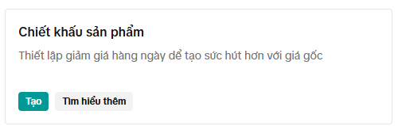
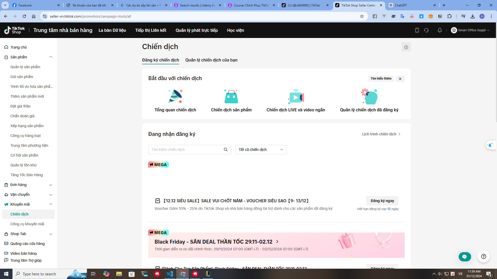
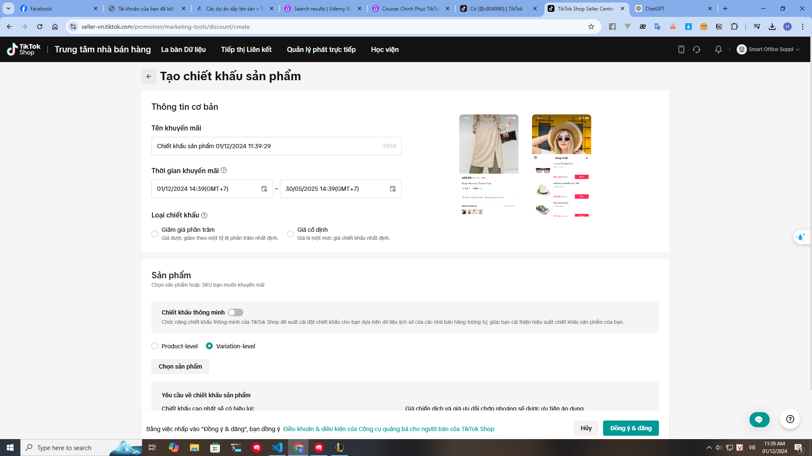
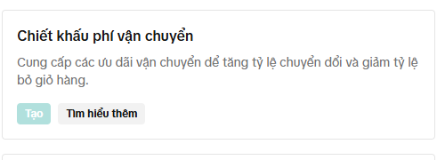
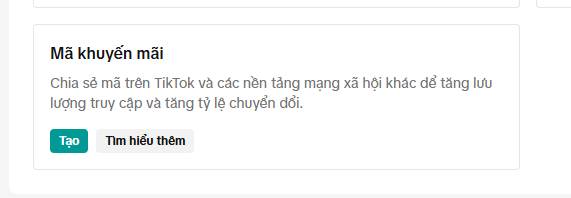

- Tiktok là một nền tảng truyền thông xã hội cho phép người dùng tạo và chia  sẻ video người dùng và quan trọng hơn mô hình kinh doanh của nó là gì
- Khi chạy quảng cáo có thể tiếp cận được nhiều người hơn mà còn có thể tiếp cận được đúng đối tượng mà bạn muốn
- Cần chọn đúng nội dung phù hợp để làm content, tuy vậy content này nên gắn đến thương hiệu bạn quan tâm
- Xây dựng kênh Tiktok khi chưa có nhiều người theo dõi cần phải chú trọng đến việc tạo ra nội dung chất lượng và tương tác với người theo dõi
- Entertainment, Music, Dance, Comedy, Education, và Lifestyle là những thể loại phổ biến trên Tiktok
- Dùng chatGPT để tạo r những tiêu đề phù hợp : " Tạo 30 tiêu đề cho các bài post tik tok cho Food brand với tiêu đề ""10 món ăn ngon nhất mà bạn nên thử khi đến Việt Nam"""
- Chúng ta sẽ cần có hash tag cho những bài đăng, bao nhiêu hash tag là đủ an toàn để thêm vào các post: tối đa 30 nhưng ko đc khuyến khích => spam và giảm khả năng hiển thị của bạn, expect 4-6 cái: Tạo 10 hashtag cho các bài post tik tok cho Food brand với tiêu đề ""10 món ăn ngon nhất mà bạn nên thử khi đến Việt Nam
- Thời điểm đăng video cũng rất quan trọng, thời điểm nào là thời điểm tốt nhất để đăng video trên Tiktok: 6h-10h sáng và 19h-22h tối
- Sử dụng tiktok ads để quảng cáo, cần chú trọng đến việc chọn đúng đối tượng mà bạn muốn tiếp cận

- Tại sao bạn lại muốn tạo nội dung từ đầu và chia sẻ chúng 1 cách trực tuyến? điều gì đã thắp sáng bạn và thôi thúc bạn làm việc chăm chỉ
- Đối tượng mục tiêu của bạn là gì và đối tượng mục tiêu của bạn muốn gì? CHúng ta rất hay bị cuốn vào các bước phân tích kế hoạch, hãy tập trung vào việc học hỏi và đưa nội dung ra với thế giới và xem điều gì hiệu quả so với việc mắc kẹt trong việc lập kế hoạch quá kĩ

### Đăng sản phẩm lên tiktok

Chuẩn :
- ẢNh chất lượng cao, tỉ lệ 1:1 (1080x1080) / 9 ảnh
- Tiêu đề sản phẩm rõ ràng, dễ hiểu:  Sang shoppee để xem thêm Đừng tự nghĩ ra tiêu đề, hãy sử dụng chatGPT để tạo ra tiêu đề
- Nội dung bài viết : Sang shoppee để xem thêm Đừng tự nghĩ ra tiêu đề, hãy sử dụng chatGPT để tạo ra tiêu đề Tìm đến những sản phẩm bán chạy vì họ đã tối ưu nội dung rồi
- Hashtag : Chịu khó tìm trên shoppee để có hashtag ngon nhớ phải bỏ tên thương hiệu của họ ra 
- Tính giá sản phẩm: Định bánh là 20k thì bạn phải múc nên 35k để có lợi nhuận và tạo mã giảm giá
- Số lượng sản phẩm : cứ đăng nhiều nên để họ biết là mình còn hàng

==> Đợi xét duyệt xem chúng ta có vi phạm chính sách gì không, có chứa những từ cấm gì không

### Chiết khấu sản phẩm

### Tham gia các chương trình khuyến mãi của Tiktok Shop
- Tham gia được cái nào thì tham gia hết
- Sale bình thường và Flash sale

- Đặt các số lẻ kiểu 19k, 29k, 39k, 49k, 59k, 69k, 79k, 89k, 99k

- Flash sale : 1-2 ngày, 3-4 ngày, 5-6 ngày, 7-8 ngày, 9-10 ngày
- Ưu đãi chớp nhoáng-> Tạo độ khan hiếm-> 3 tiếng nữa -> Thúc giục người mua
- Hiển thị sản phẩm (cái nào có fash sale thì chúng nó sẽ nổi lên)
- Chạy quảng cáo tik tok
- Live stream
- Cú pháp: ưu đãi ngày bn , sale 2-3 sản phảm thôi để tránh bị ảo, chỉ để 1 ngày, còn ít thời gian thì sẽ ok hơn
- Đặt giới hạn mua sản phẩm : Mỗi người 1 lần hoặc là mua không giới hạn

### Đăng kí miễn phí giao hàng
- CHi tiêu ít nhất bao nhiêu tiền thì mới có mã miễn phí giao hàng
- Hoặc cứ mua bn đơn hàng thì mới được miễn phí vận chuyển
- Áp dụng cho 1 số sản phẩm cụ thể thôi

### Tạo mã Khuyến mãi

- Sử dụng mã giảm giá để tăng doanh số bán hàng
- Giảm theo % hoặc giảm theo số tiền cố định(Để số tiền cố định cho nó dễ) và có thể để giao dịch tối thiểu và số lượt sử dụng

### Tiếp thị liên kết

- Tài khoản tiktok của bạn có thể được sử dụng để tiếp thị liên kết, bạn sẽ nhận được tiền hoa hồng từ việc giới thiệu sản phẩm của người khác
- Đk : Trên 1000 flow -> buffview -> bufflike -> buffcomment -> buffshare -> bufffollow -> buffsub
- Liên kết với tài khoản tik tok shop
